# LazyFranchisor: Complete Visualizations, UML, Flows & Sequence Diagrams

**Document Version:** 1.0
**Date:** October 28, 2025
**Purpose:** Comprehensive visual documentation of system architecture, data models, workflows, and interactions

---

## Table of Contents

1. [System Architecture Diagrams](#system-architecture-diagrams)
2. [UML Class Diagrams](#uml-class-diagrams)
3. [Sequence Diagrams](#sequence-diagrams)
4. [Flowcharts and Process Flows](#flowcharts-and-process-flows)
5. [Entity Relationship Diagrams](#entity-relationship-diagrams)
6. [Deployment Diagrams](#deployment-diagrams)
7. [State Diagrams](#state-diagrams)
8. [Component Diagrams](#component-diagrams)

---

## System Architecture Diagrams

### 1.1 High-Level System Architecture

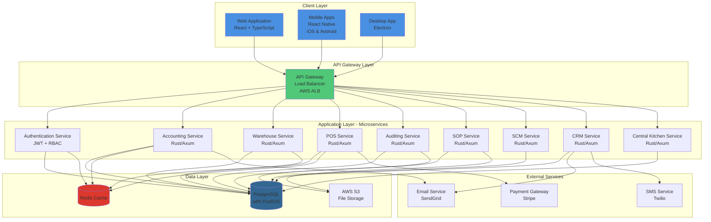

---

### 1.2 Microservices Architecture Detail

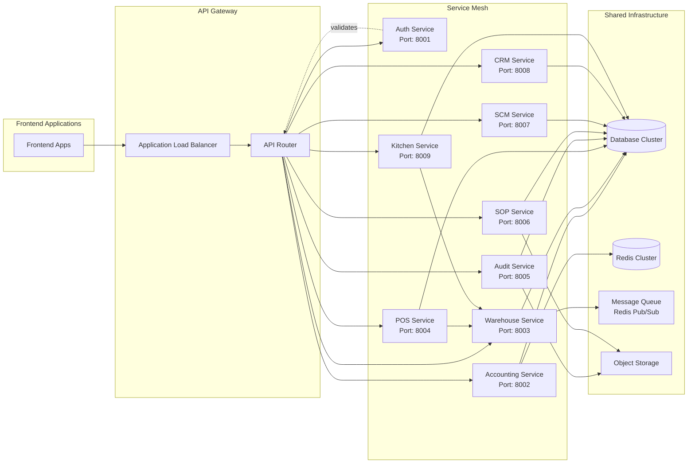

---

### 1.3 Data Flow Architecture

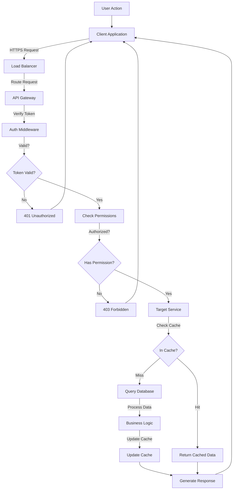

---

## UML Class Diagrams

### 2.1 Core Domain Model - Complete System

```mermaid
classDiagram
    %% User Management
    class User {
        +UUID id
        +String email
        +String password_hash
        +String first_name
        +String last_name
        +UUID role_id
        +DateTime created_at
        +DateTime last_login
        +Boolean is_active
        +login()
        +logout()
        +updateProfile()
    }

    class Role {
        +UUID id
        +String name
        +String description
        +List~Permission~ permissions
        +addPermission()
        +removePermission()
        +hasPermission()
    }

    class Permission {
        +UUID id
        +String resource
        +String action
        +String description
    }

    %% Franchise Management
    class Franchisor {
        +UUID id
        +String company_name
        +String brand_name
        +String contact_email
        +String contact_phone
        +Address headquarters
        +DateTime founded_date
        +addFranchisee()
        +generateNetworkReport()
    }

    class Franchisee {
        +UUID id
        +UUID franchisor_id
        +String location_name
        +Point location
        +Address address
        +String contact_person
        +String phone
        +String email
        +DateTime opened_date
        +String status
        +JSON configuration
        +updateLocation()
        +getPerformanceMetrics()
    }

    class Address {
        +String street
        +String city
        +String state
        +String postal_code
        +String country
        +Point coordinates
    }

    %% Product Management
    class Product {
        +UUID id
        +String sku
        +String name
        +String description
        +Decimal price
        +UUID category_id
        +String unit_of_measure
        +Boolean is_active
        +DateTime created_at
        +updatePrice()
        +deactivate()
    }

    class ProductCategory {
        +UUID id
        +String name
        +String description
        +UUID parent_category_id
    }

    %% Inventory Management
    class InventoryItem {
        +UUID id
        +UUID franchisee_id
        +UUID product_id
        +Integer quantity_on_hand
        +Integer reorder_level
        +Integer max_stock_level
        +String location
        +String batch_number
        +Date expiry_date
        +DateTime last_updated
        +adjustQuantity()
        +needsReorder()
    }

    %% Sales & Transactions
    class SalesTransaction {
        +UUID id
        +UUID franchisee_id
        +UUID employee_id
        +DateTime timestamp
        +Decimal subtotal
        +Decimal discount_applied
        +Decimal tax_amount
        +Decimal total_amount
        +String payment_method
        +String status
        +List~SalesLineItem~ line_items
        +calculateTotal()
        +applyDiscount()
        +void()
    }

    class SalesLineItem {
        +UUID id
        +UUID sales_transaction_id
        +UUID product_id
        +Integer quantity
        +Decimal unit_price
        +Decimal discount
        +Decimal subtotal
        +calculateSubtotal()
    }

    class Discount {
        +UUID id
        +String name
        +String description
        +String type
        +Decimal value
        +Date start_date
        +Date end_date
        +List~UUID~ applicable_products
        +Boolean is_active
        +apply()
        +isValid()
    }

    %% Warehouse & Stock Transfer
    class StockTransfer {
        +UUID id
        +UUID from_franchisee_id
        +UUID to_franchisee_id
        +UUID initiated_by_user_id
        +DateTime timestamp
        +String status
        +String tracking_number
        +DateTime shipped_date
        +DateTime received_date
        +List~StockTransferLineItem~ items
        +ship()
        +receive()
        +cancel()
    }

    class StockTransferLineItem {
        +UUID id
        +UUID stock_transfer_id
        +UUID product_id
        +Integer quantity_requested
        +Integer quantity_shipped
        +Integer quantity_received
    }

    %% Financial Management
    class RoyaltyInvoice {
        +UUID id
        +UUID franchisee_id
        +Date period_start
        +Date period_end
        +Decimal sales_amount
        +Decimal royalty_rate
        +Decimal amount_due
        +String status
        +Date due_date
        +Date paid_date
        +generate()
        +markPaid()
    }

    class Expense {
        +UUID id
        +UUID franchisee_id
        +UUID category_id
        +Decimal amount
        +String description
        +Date date
        +String receipt_url
        +UUID approved_by_user_id
        +approve()
        +reject()
    }

    class ExpenseCategory {
        +UUID id
        +String name
        +String description
        +Boolean requires_approval
    }

    %% Auditing
    class AuditChecklist {
        +UUID id
        +String name
        +String description
        +String type
        +List~ChecklistItem~ items
        +Boolean is_active
        +addItem()
        +removeItem()
    }

    class ChecklistItem {
        +UUID id
        +String question
        +String expected_response
        +Boolean is_critical
        +Integer order
    }

    class Inspection {
        +UUID id
        +UUID checklist_id
        +UUID franchisee_id
        +UUID auditor_id
        +DateTime scheduled_date
        +DateTime completed_date
        +JSON results
        +Decimal score
        +String status
        +List~String~ media_urls
        +complete()
        +generateReport()
    }

    class CorrectiveAction {
        +UUID id
        +UUID inspection_id
        +String description
        +UUID assigned_to_franchisee_id
        +Date due_date
        +String status
        +String resolution_notes
        +DateTime completed_date
        +complete()
    }

    %% SOP Management
    class SOPDocument {
        +UUID id
        +String title
        +String content
        +Integer version
        +UUID category_id
        +Date published_date
        +UUID created_by_user_id
        +UUID last_updated_by_user_id
        +Boolean is_current
        +publish()
        +archive()
        +createNewVersion()
    }

    class SOPCategory {
        +UUID id
        +String name
        +String description
    }

    class SOPTask {
        +UUID id
        +UUID sop_id
        +UUID assigned_to_user_id
        +Date due_date
        +String status
        +String description
        +DateTime completed_date
        +complete()
    }

    %% Supply Chain
    class Vendor {
        +UUID id
        +String name
        +String contact_person
        +String email
        +String phone
        +Address address
        +List~Product~ products_supplied
        +String payment_terms
        +Boolean is_approved
    }

    class PurchaseOrder {
        +UUID id
        +UUID franchisee_id
        +UUID vendor_id
        +DateTime order_date
        +Date expected_delivery
        +String status
        +Decimal total_amount
        +List~PurchaseOrderItem~ items
        +submit()
        +approve()
        +receive()
    }

    class PurchaseOrderItem {
        +UUID id
        +UUID purchase_order_id
        +UUID product_id
        +Integer quantity_ordered
        +Integer quantity_received
        +Decimal unit_price
        +Decimal subtotal
    }

    %% CRM
    class Customer {
        +UUID id
        +UUID franchisee_id
        +String first_name
        +String last_name
        +String email
        +String phone
        +Address address
        +Date birth_date
        +Integer loyalty_points
        +JSON preferences
        +addLoyaltyPoints()
        +redeemPoints()
    }

    class FranchiseeLead {
        +UUID id
        +String name
        +String contact_email
        +String contact_phone
        +String source
        +String status
        +String pipeline_stage
        +DateTime created_at
        +UUID assigned_to_user_id
        +advance()
        +convert()
    }

    class SupportTicket {
        +UUID id
        +UUID customer_id
        +UUID franchisee_id
        +String subject
        +String description
        +String priority
        +String status
        +UUID assigned_to_user_id
        +DateTime created_at
        +DateTime resolved_at
        +assign()
        +resolve()
    }

    %% Central Kitchen
    class Recipe {
        +UUID id
        +String name
        +String description
        +List~RecipeIngredient~ ingredients
        +String instructions
        +Integer prep_time_minutes
        +Integer cook_time_minutes
        +Decimal yield_quantity
        +String yield_unit
    }

    class RecipeIngredient {
        +UUID id
        +UUID recipe_id
        +UUID product_id
        +Decimal quantity
        +String unit
    }

    class ProductionPlan {
        +UUID id
        +Date production_date
        +List~ProductionItem~ items
        +String status
        +UUID created_by_user_id
        +execute()
        +complete()
    }

    class ProductionItem {
        +UUID id
        +UUID production_plan_id
        +UUID recipe_id
        +Integer quantity_to_produce
        +Integer quantity_produced
        +String status
    }

    class WastageRecord {
        +UUID id
        +Date date
        +UUID product_id
        +Decimal quantity
        +String reason
        +Decimal cost_impact
        +UUID recorded_by_user_id
    }

    %% Relationships
    User "1" --> "1" Role
    Role "1" --> "*" Permission

    Franchisor "1" --> "*" Franchisee
    Franchisee "1" --> "1" Address

    Product "1" --> "1" ProductCategory
    ProductCategory "1" --> "*" ProductCategory : parent

    InventoryItem "*" --> "1" Franchisee
    InventoryItem "*" --> "1" Product

    SalesTransaction "*" --> "1" Franchisee
    SalesTransaction "*" --> "1" User : employee
    SalesTransaction "1" --> "*" SalesLineItem
    SalesLineItem "*" --> "1" Product
    SalesTransaction "*" --> "*" Discount

    StockTransfer "1" --> "*" StockTransferLineItem
    StockTransferLineItem "*" --> "1" Product
    StockTransfer "*" --> "1" Franchisee : from
    StockTransfer "*" --> "1" Franchisee : to

    RoyaltyInvoice "*" --> "1" Franchisee
    Expense "*" --> "1" Franchisee
    Expense "*" --> "1" ExpenseCategory

    Inspection "*" --> "1" AuditChecklist
    Inspection "*" --> "1" Franchisee
    Inspection "*" --> "1" User : auditor
    Inspection "1" --> "*" CorrectiveAction
    AuditChecklist "1" --> "*" ChecklistItem

    SOPDocument "*" --> "1" SOPCategory
    SOPTask "*" --> "1" SOPDocument
    SOPTask "*" --> "1" User : assigned_to

    PurchaseOrder "*" --> "1" Vendor
    PurchaseOrder "*" --> "1" Franchisee
    PurchaseOrder "1" --> "*" PurchaseOrderItem
    PurchaseOrderItem "*" --> "1" Product
    Vendor "*" --> "*" Product

    Customer "*" --> "1" Franchisee
    SupportTicket "*" --> "1" Customer
    SupportTicket "*" --> "1" Franchisee

    Recipe "1" --> "*" RecipeIngredient
    RecipeIngredient "*" --> "1" Product
    ProductionPlan "1" --> "*" ProductionItem
    ProductionItem "*" --> "1" Recipe
    WastageRecord "*" --> "1" Product
```

---

### 2.2 Authentication & Authorization Class Diagram

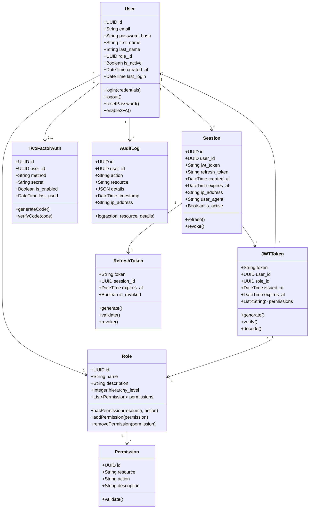

---

### 2.3 Accounting Module Class Diagram

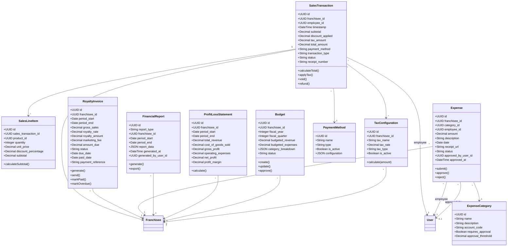

---

## Sequence Diagrams

### 3.1 User Authentication Flow

```mermaid
sequenceDiagram
    actor User
    participant Client as Client App
    participant API as API Gateway
    participant Auth as Auth Service
    participant DB as Database
    participant Cache as Redis Cache

    User->>Client: Enter credentials
    Client->>API: POST /api/v1/auth/login
    activate API
    API->>Auth: Forward login request
    activate Auth

    Auth->>Cache: Check for rate limiting
    activate Cache
    Cache-->>Auth: Rate limit OK
    deactivate Cache

    Auth->>DB: Query user by email
    activate DB
    DB-->>Auth: User record
    deactivate DB

    Auth->>Auth: Verify password hash

    alt Password Valid
        Auth->>DB: Get user roles & permissions
        activate DB
        DB-->>Auth: Role and permissions
        deactivate DB

        Auth->>Auth: Generate JWT token
        Auth->>Auth: Generate refresh token

        Auth->>DB: Create session record
        activate DB
        DB-->>Auth: Session created
        deactivate DB

        Auth->>Cache: Store session (TTL: 1 hour)
        activate Cache
        Cache-->>Auth: Cached
        deactivate Cache

        Auth->>DB: Update last_login timestamp
        activate DB
        DB-->>Auth: Updated
        deactivate DB

        Auth-->>API: 200 OK + JWT + Refresh Token
        deactivate Auth
        API-->>Client: Authentication successful
        deactivate API
        Client->>Client: Store JWT in secure storage
        Client-->>User: Redirect to dashboard

    else Password Invalid
        Auth->>DB: Log failed attempt
        activate DB
        DB-->>Auth: Logged
        deactivate DB

        Auth-->>API: 401 Unauthorized
        deactivate Auth
        API-->>Client: Login failed
        deactivate API
        Client-->>User: Show error message
    end
```

---

### 3.2 POS Transaction Processing

```mermaid
sequenceDiagram
    actor Cashier
    participant POS as POS Client
    participant API as API Gateway
    participant POS_SVC as POS Service
    participant INV_SVC as Inventory Service
    participant ACC_SVC as Accounting Service
    participant DB as Database
    participant Cache as Redis Cache

    Cashier->>POS: Scan items
    POS->>API: GET /api/v1/products/{sku}
    API->>POS_SVC: Fetch product details
    POS_SVC->>Cache: Check product cache

    alt Cache Hit
        Cache-->>POS_SVC: Product data
    else Cache Miss
        POS_SVC->>DB: Query product
        DB-->>POS_SVC: Product data
        POS_SVC->>Cache: Update cache
    end

    POS_SVC-->>API: Product details
    API-->>POS: Display product info

    Cashier->>POS: Apply discount
    POS->>POS: Calculate total

    Cashier->>POS: Process payment
    POS->>API: POST /api/v1/pos/transactions
    activate API
    API->>POS_SVC: Create transaction
    activate POS_SVC

    POS_SVC->>POS_SVC: Validate request
    POS_SVC->>POS_SVC: Apply discounts & taxes

    %% Check inventory availability
    POS_SVC->>INV_SVC: Check inventory availability
    activate INV_SVC
    INV_SVC->>DB: Query inventory levels
    activate DB
    DB-->>INV_SVC: Inventory data
    deactivate DB

    alt Sufficient Stock
        INV_SVC-->>POS_SVC: Stock available
        deactivate INV_SVC

        %% Begin transaction
        POS_SVC->>DB: BEGIN TRANSACTION
        activate DB

        %% Create sales transaction
        POS_SVC->>DB: INSERT SalesTransaction
        DB-->>POS_SVC: Transaction ID

        POS_SVC->>DB: INSERT SalesLineItems
        DB-->>POS_SVC: Line items created

        %% Update inventory
        POS_SVC->>DB: UPDATE InventoryItem quantities
        DB-->>POS_SVC: Inventory updated

        %% Record accounting entry
        POS_SVC->>ACC_SVC: Record revenue
        activate ACC_SVC
        ACC_SVC->>DB: INSERT accounting entry
        DB-->>ACC_SVC: Entry created
        ACC_SVC-->>POS_SVC: Recorded
        deactivate ACC_SVC

        POS_SVC->>DB: COMMIT TRANSACTION
        DB-->>POS_SVC: Committed
        deactivate DB

        %% Clear relevant caches
        POS_SVC->>Cache: Invalidate inventory cache
        Cache-->>POS_SVC: Cleared

        POS_SVC->>POS_SVC: Generate receipt

        POS_SVC-->>API: 201 Created + Receipt
        deactivate POS_SVC
        API-->>POS: Transaction successful
        deactivate API

        POS->>POS: Print receipt
        POS-->>Cashier: Show success message

    else Insufficient Stock
        INV_SVC-->>POS_SVC: Stock unavailable
        deactivate INV_SVC
        POS_SVC-->>API: 400 Bad Request
        deactivate POS_SVC
        API-->>POS: Insufficient inventory
        deactivate API
        POS-->>Cashier: Show error: Out of stock
    end
```

---

### 3.3 Stock Transfer Request and Fulfillment

```mermaid
sequenceDiagram
    actor RF as Requesting Franchisee
    participant RF_Client as Requesting Client
    participant API as API Gateway
    participant WH_SVC as Warehouse Service
    participant DB as Database
    participant QUEUE as Message Queue
    actor FL as Fulfilling Location
    participant FL_Client as Fulfilling Client

    %% Request initiation
    RF->>RF_Client: Request stock transfer
    RF_Client->>API: POST /api/v1/stock-transfers
    activate API
    API->>WH_SVC: Create stock transfer
    activate WH_SVC

    WH_SVC->>WH_SVC: Validate request
    WH_SVC->>DB: Check source inventory
    activate DB
    DB-->>WH_SVC: Inventory levels
    deactivate DB

    alt Sufficient Stock at Source
        WH_SVC->>DB: BEGIN TRANSACTION
        activate DB

        WH_SVC->>DB: INSERT StockTransfer (status: pending)
        DB-->>WH_SVC: Transfer ID

        WH_SVC->>DB: INSERT StockTransferLineItems
        DB-->>WH_SVC: Line items created

        WH_SVC->>DB: COMMIT TRANSACTION
        DB-->>WH_SVC: Committed
        deactivate DB

        %% Notify fulfilling location
        WH_SVC->>QUEUE: Publish transfer request event
        activate QUEUE
        QUEUE-->>WH_SVC: Published
        deactivate QUEUE

        WH_SVC-->>API: 201 Created + Transfer ID
        deactivate WH_SVC
        API-->>RF_Client: Transfer created
        deactivate API
        RF_Client-->>RF: Show confirmation

        %% Fulfilling location receives notification
        QUEUE->>FL_Client: Transfer request notification
        FL_Client-->>FL: Alert: New transfer request

        %% Fulfilling location processes
        FL->>FL_Client: View transfer details
        FL_Client->>API: GET /api/v1/stock-transfers/{id}
        API->>WH_SVC: Fetch transfer
        WH_SVC->>DB: Query transfer details
        DB-->>WH_SVC: Transfer data
        WH_SVC-->>API: Transfer details
        API-->>FL_Client: Display transfer
        FL_Client-->>FL: Show items to pick

        %% Pick and pack
        FL->>FL_Client: Mark items picked
        FL->>FL_Client: Confirm shipment
        FL_Client->>API: PUT /api/v1/stock-transfers/{id}/ship
        activate API
        API->>WH_SVC: Update status to shipped
        activate WH_SVC

        WH_SVC->>DB: BEGIN TRANSACTION
        activate DB
        WH_SVC->>DB: UPDATE StockTransfer status=shipped
        WH_SVC->>DB: UPDATE InventoryItem (reduce quantity at source)
        WH_SVC->>DB: INSERT StockTransferLog
        WH_SVC->>DB: COMMIT TRANSACTION
        DB-->>WH_SVC: Updated
        deactivate DB

        WH_SVC->>QUEUE: Publish shipment event
        QUEUE-->>WH_SVC: Published

        WH_SVC-->>API: 200 OK
        deactivate WH_SVC
        API-->>FL_Client: Shipment confirmed
        deactivate API
        FL_Client-->>FL: Show success

        %% Notify requesting franchisee
        QUEUE->>RF_Client: Shipment notification
        RF_Client-->>RF: Alert: Items shipped

        %% Receiving
        RF->>RF_Client: Confirm receipt
        RF_Client->>API: PUT /api/v1/stock-transfers/{id}/receive
        activate API
        API->>WH_SVC: Mark as received
        activate WH_SVC

        WH_SVC->>DB: BEGIN TRANSACTION
        activate DB
        WH_SVC->>DB: UPDATE StockTransfer status=received
        WH_SVC->>DB: UPDATE InventoryItem (increase quantity at destination)
        WH_SVC->>DB: INSERT ReceivingRecord
        WH_SVC->>DB: COMMIT TRANSACTION
        DB-->>WH_SVC: Updated
        deactivate DB

        WH_SVC-->>API: 200 OK
        deactivate WH_SVC
        API-->>RF_Client: Receipt confirmed
        deactivate API
        RF_Client-->>RF: Transfer complete

    else Insufficient Stock
        WH_SVC-->>API: 400 Bad Request
        deactivate WH_SVC
        API-->>RF_Client: Insufficient stock
        deactivate API
        RF_Client-->>RF: Show error
    end
```

---

### 3.4 Audit Inspection Process

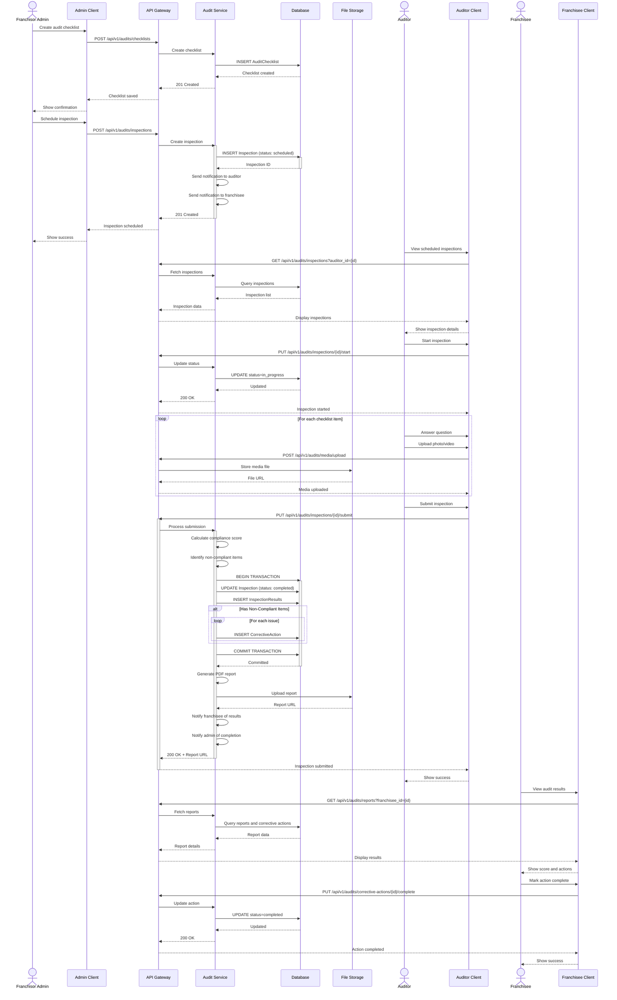

---

### 3.5 Royalty Invoice Generation

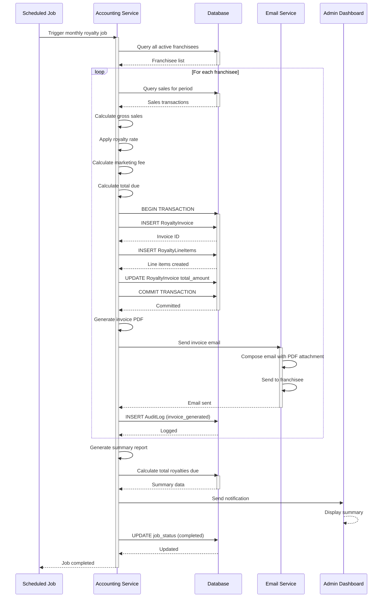

---

## Flowcharts and Process Flows

### 4.1 Complete Sales Transaction Flow

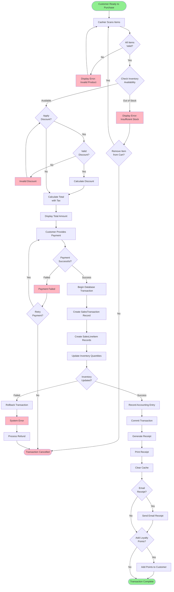

---

### 4.2 Customer Onboarding Workflow

```mermaid
flowchart TD
    START([Contract Signed]) --> AUTO[Automated Workflow Triggered]
    AUTO --> CREATE_REC[Create Customer Record in CRM]
    CREATE_REC --> ASSIGN_IMP[Assign Implementation Specialist]
    ASSIGN_IMP --> ASSIGN_CSM[Assign Customer Success Manager]
    ASSIGN_CSM --> SEND_WELCOME[Send Welcome Email]

    SEND_WELCOME --> SCHED_KICK[Schedule Kickoff Call]
    SCHED_KICK --> WAIT1[Wait for Kickoff Call]

    WAIT1 --> KICKOFF[Kickoff Call Conducted]
    KICKOFF --> REVIEW_GOALS[Review Goals & Timeline]
    REVIEW_GOALS --> DATA_REQ[Discuss Data Requirements]
    DATA_REQ --> SEND_TEMPLATE[Send Data Collection Template]

    SEND_TEMPLATE --> WAIT2[Wait for Customer Data]

    WAIT2 --> DATA_REC{Data<br/>Received?}
    DATA_REC -->|No, Overdue| REMIND[Send Reminder]
    REMIND --> WAIT2

    DATA_REC -->|Yes| VALIDATE_DATA{Data<br/>Valid?}

    VALIDATE_DATA -->|No| REQUEST_FIX[Request Corrections]
    REQUEST_FIX --> WAIT2

    VALIDATE_DATA -->|Yes| MIGRATE[Migrate Data to System]
    MIGRATE --> CONFIGURE[Configure System Settings]
    CONFIGURE --> SETUP_USERS[Create User Accounts]
    SETUP_USERS --> SETUP_INT[Configure Integrations]

    SETUP_INT --> INT_TEST{Integrations<br/>Working?}
    INT_TEST -->|No| TROUBLESHOOT[Troubleshoot Issues]
    TROUBLESHOOT --> SETUP_INT

    INT_TEST -->|Yes| CUSTOM[Customize Dashboards]
    CUSTOM --> PREVIEW[Customer Preview & Approval]

    PREVIEW --> APPROVE{Customer<br/>Approves?}
    APPROVE -->|No| ADJUST[Make Adjustments]
    ADJUST --> PREVIEW

    APPROVE -->|Yes| SCHED_TRAIN[Schedule Training Sessions]
    SCHED_TRAIN --> ADMIN_TRAIN[Conduct Admin Training]
    ADMIN_TRAIN --> USER_TRAIN[Conduct User Training]
    USER_TRAIN --> RECORD[Record Training Sessions]
    RECORD --> MATERIALS[Provide Training Materials]

    MATERIALS --> PRE_LIVE[Pre-Go-Live Checklist]
    PRE_LIVE --> CHECK1{All Data<br/>Migrated?}
    CHECK1 -->|No| FIX1[Complete Migration]
    FIX1 --> PRE_LIVE

    CHECK1 -->|Yes| CHECK2{All Users<br/>Trained?}
    CHECK2 -->|No| FIX2[Complete Training]
    FIX2 --> PRE_LIVE

    CHECK2 -->|Yes| CHECK3{Integrations<br/>Working?}
    CHECK3 -->|No| FIX3[Fix Integrations]
    FIX3 --> PRE_LIVE

    CHECK3 -->|Yes| CHECK4{Customer<br/>Sign-off?}
    CHECK4 -->|No| REVIEW[Review Concerns]
    REVIEW --> PRE_LIVE

    CHECK4 -->|Yes| GO_LIVE[Go-Live Day]
    GO_LIVE --> MONITOR1[Monitor System - Day 1]
    MONITOR1 --> CHECKIN1[End of Day Check-in]
    CHECKIN1 --> MONITOR2[Monitor - Days 2-7]
    MONITOR2 --> WEEKLY1[Weekly Check-in Week 1]
    WEEKLY1 --> MONITOR3[Monitor - Weeks 2-4]
    MONITOR3 --> WEEKLY2[Weekly Check-ins]

    WEEKLY2 --> ADOPTION{User Adoption<br/>>90%?}
    ADOPTION -->|No| SUPPORT[Additional Support & Training]
    SUPPORT --> MONITOR3

    ADOPTION -->|Yes| MEASURE{Critical<br/>Issues?}
    MEASURE -->|Yes| RESOLVE[Resolve Issues]
    RESOLVE --> MONITOR3

    MEASURE -->|No| HANDOFF[Handoff to CSM]
    HANDOFF --> COMPLETE_CHECK[Complete Onboarding Checklist]
    COMPLETE_CHECK --> SCHED_30[Schedule 30-Day Check-in]
    SCHED_30 --> REQUEST_TEST[Request Testimonial]
    REQUEST_TEST --> MARK_ACTIVE[Mark Customer as Active]

    MARK_ACTIVE --> END([Onboarding Complete])

    style START fill:#90EE90
    style END fill:#90EE90
    style GO_LIVE fill:#FFD700
```

---

### 4.3 Purchase Order Process Flow

```mermaid
flowchart TD
    START([Need to Reorder Inventory]) --> CHECK{Automated<br/>Reorder?}

    CHECK -->|Yes, Auto| AUTO_CHECK[System Checks Reorder Levels]
    AUTO_CHECK --> BELOW{Stock Below<br/>Reorder Level?}
    BELOW -->|No| END1([No Action Needed])
    BELOW -->|Yes| CALC[Calculate Order Quantity]
    CALC --> CREATE_AUTO[Auto-Create Draft PO]
    CREATE_AUTO --> NOTIFY[Notify Manager for Approval]
    NOTIFY --> APPROVE

    CHECK -->|No, Manual| MANUAL[Manager Initiates PO]
    MANUAL --> SELECT_VEN[Select Vendor]
    SELECT_VEN --> SELECT_PROD[Select Products & Quantities]
    SELECT_PROD --> CREATE_MAN[Create Draft PO]
    CREATE_MAN --> APPROVE{Approval<br/>Required?}

    APPROVE -->|Yes| CHECK_AMT{Amount Above<br/>Threshold?}
    CHECK_AMT -->|No| AUTO_APPROVE[Auto-Approve]
    AUTO_APPROVE --> SUBMIT

    CHECK_AMT -->|Yes| REQ_APP[Request Manager Approval]
    REQ_APP --> WAIT[Wait for Approval]
    WAIT --> APPROVED{Approved?}

    APPROVED -->|No| REJECT[PO Rejected]
    REJECT --> NOTIFY_REJ[Notify Requester]
    NOTIFY_REJ --> END2([PO Cancelled])

    APPROVED -->|Yes| SUBMIT[Submit PO to Vendor]

    APPROVE -->|No| SUBMIT

    SUBMIT --> UPDATE_STATUS[Update Status: Submitted]
    UPDATE_STATUS --> SEND_EMAIL[Email PO to Vendor]
    SEND_EMAIL --> LOG[Log PO in System]
    LOG --> WAIT_CONF[Wait for Vendor Confirmation]

    WAIT_CONF --> CONFIRMED{Vendor<br/>Confirms?}

    CONFIRMED -->|No, After 48h| FOLLOW[Follow Up with Vendor]
    FOLLOW --> WAIT_CONF

    CONFIRMED -->|Yes| UPDATE_CONF[Update Status: Confirmed]
    UPDATE_CONF --> WAIT_SHIP[Wait for Shipment]

    WAIT_SHIP --> SHIPPED{Vendor<br/>Ships?}
    SHIPPED -->|Yes| UPDATE_SHIP[Update Status: Shipped]
    UPDATE_SHIP --> TRACK[Track Shipment]
    TRACK --> ARRIVE{Goods<br/>Arrived?}

    ARRIVE -->|Yes| RECEIVE[Receive & Inspect Goods]
    RECEIVE --> MATCH{Quantity<br/>Matches PO?}

    MATCH -->|No| DISCREPANCY[Record Discrepancy]
    DISCREPANCY --> CONTACT_VEN[Contact Vendor]
    CONTACT_VEN --> RESOLVE{Issue<br/>Resolved?}
    RESOLVE -->|No| PARTIAL[Record Partial Receipt]
    PARTIAL --> UPDATE_INV
    RESOLVE -->|Yes| UPDATE_INV

    MATCH -->|Yes| QUALITY{Quality<br/>Acceptable?}

    QUALITY -->|No| REJECT_GOODS[Reject Goods]
    REJECT_GOODS --> RETURN[Arrange Return/Credit]
    RETURN --> CONTACT_VEN

    QUALITY -->|Yes| UPDATE_INV[Update Inventory Levels]
    UPDATE_INV --> CREATE_REC[Create Receiving Record]
    CREATE_REC --> UPDATE_PO[Update PO Status: Received]
    UPDATE_PO --> INVOICE{Invoice<br/>Received?}

    INVOICE -->|Yes| MATCH_INV{Invoice Matches<br/>PO & Receipt?}
    MATCH_INV -->|No| DISPUTE[Dispute Invoice]
    DISPUTE --> CONTACT_VEN

    MATCH_INV -->|Yes| APPROVE_PAY[Approve for Payment]
    APPROVE_PAY --> PROCESS_PAY[Process Payment]
    PROCESS_PAY --> UPDATE_PAID[Update Status: Paid]
    UPDATE_PAID --> CLOSE[Close PO]

    INVOICE -->|No| WAIT_INV[Wait for Invoice]
    WAIT_INV --> INVOICE

    CLOSE --> END3([PO Complete])

    style START fill:#90EE90
    style END1 fill:#D3D3D3
    style END2 fill:#FFB6C1
    style END3 fill:#90EE90
```

---

### 4.4 Support Ticket Lifecycle

```mermaid
flowchart TD
    START([Customer Reports Issue]) --> CHANNEL{Channel?}

    CHANNEL -->|Email| EMAIL[Email Received]
    CHANNEL -->|In-App| CHAT[Chat Message]
    CHANNEL -->|Phone| PHONE[Phone Call]

    EMAIL --> CREATE[Auto-Create Ticket]
    CHAT --> CREATE
    PHONE --> MANUAL[Agent Creates Ticket]
    MANUAL --> CREATE

    CREATE --> AUTO_ASSIGN[Auto-Assign to Tier 1]
    AUTO_ASSIGN --> CLASSIFY[Agent Reviews & Classifies]
    CLASSIFY --> SEVERITY{Severity?}

    SEVERITY -->|P1 Critical| ESCALATE_IMM[Immediate Escalation]
    ESCALATE_IMM --> NOTIFY_ON[Notify On-Call Engineer]
    NOTIFY_ON --> NOTIFY_CSM[Notify CSM]
    NOTIFY_CSM --> TIER3

    SEVERITY -->|P2 High| TIER1[Tier 1 Assessment]
    SEVERITY -->|P3 Medium| TIER1
    SEVERITY -->|P4 Low| TIER1

    TIER1 --> KB_CHECK{Known<br/>Issue?}

    KB_CHECK -->|Yes| APPLY_SOL[Apply Known Solution]
    APPLY_SOL --> TEST{Issue<br/>Resolved?}

    TEST -->|Yes| UPDATE_KB[Update KB if Needed]
    UPDATE_KB --> NOTIFY_CUST[Notify Customer]
    NOTIFY_CUST --> CUST_CONF{Customer<br/>Confirms?}

    CUST_CONF -->|Yes| CSAT[Request CSAT Rating]
    CSAT --> CLOSE[Close Ticket]
    CLOSE --> END([Ticket Closed])

    CUST_CONF -->|No| REOPEN[Reopen Ticket]
    REOPEN --> TIER1

    TEST -->|No| KB_CHECK

    KB_CHECK -->|No| COMPLEX{Complex<br/>Issue?}

    COMPLEX -->|No| TROUBLESHOOT1[Tier 1 Troubleshoots]
    TROUBLESHOOT1 --> RESOLVED1{Resolved?}
    RESOLVED1 -->|Yes| NOTIFY_CUST
    RESOLVED1 -->|No| ESCALATE_T2[Escalate to Tier 2]

    COMPLEX -->|Yes| ESCALATE_T2
    ESCALATE_T2 --> TIER2[Tier 2 Advanced Support]

    TIER2 --> INVESTIGATE[Investigate Logs & System]
    INVESTIGATE --> TEST_STAGING[Test in Staging]
    TEST_STAGING --> RESOLVED2{Resolved?}

    RESOLVED2 -->|Yes| IMPLEMENT[Implement Solution]
    IMPLEMENT --> VERIFY[Verify in Production]
    VERIFY --> DOCUMENT[Document in KB]
    DOCUMENT --> NOTIFY_CUST

    RESOLVED2 -->|No| BUG{System<br/>Bug?}

    BUG -->|Yes| ESCALATE_T3[Escalate to Engineering]
    BUG -->|No| WORKAROUND{Workaround<br/>Available?}

    WORKAROUND -->|Yes| PROVIDE[Provide Workaround]
    PROVIDE --> ESCALATE_T3

    WORKAROUND -->|No| ESCALATE_T3

    ESCALATE_T3 --> TIER3[Tier 3 Engineering]
    TIER3 --> REPRODUCE[Reproduce Issue]
    REPRODUCE --> ROOT_CAUSE[Identify Root Cause]
    ROOT_CAUSE --> FIX{Fix Type?}

    FIX -->|Hotfix| DEVELOP_HOT[Develop Hotfix]
    DEVELOP_HOT --> TEST_HOT[Test Hotfix]
    TEST_HOT --> DEPLOY_HOT[Deploy Hotfix]
    DEPLOY_HOT --> UPDATE_COMM1[Update Customer Every 2h]
    UPDATE_COMM1 --> MONITOR[Monitor]
    MONITOR --> VERIFY_FIX{Fix<br/>Verified?}

    FIX -->|Regular Release| PLAN[Plan for Next Release]
    PLAN --> PROVIDE2[Provide Workaround]
    PROVIDE2 --> NOTIFY_TIMELINE[Notify Customer of Timeline]
    NOTIFY_TIMELINE --> WAIT_REL[Wait for Release]
    WAIT_REL --> DEPLOY_REL[Deploy in Release]
    DEPLOY_REL --> VERIFY_FIX

    VERIFY_FIX -->|No| ROOT_CAUSE
    VERIFY_FIX -->|Yes| POST_MORT[Conduct Post-Mortem]
    POST_MORT --> DOCUMENT2[Update Documentation]
    DOCUMENT2 --> NOTIFY_CUST

    style START fill:#90EE90
    style END fill:#90EE90
    style ESCALATE_IMM fill:#FF6B6B
    style TIER3 fill:#FFD93D
```

---

## Entity Relationship Diagrams

### 5.1 Complete Database ERD

```mermaid
erDiagram
    %% User Management
    USER ||--o{ SESSION : has
    USER }o--|| ROLE : has
    ROLE ||--o{ ROLE_PERMISSION : has
    PERMISSION ||--o{ ROLE_PERMISSION : assigned_to
    USER ||--o{ AUDIT_LOG : generates
    USER ||--o| TWO_FACTOR_AUTH : has

    %% Franchise Structure
    FRANCHISOR ||--o{ FRANCHISEE : owns
    FRANCHISEE ||--o{ USER : employs
    FRANCHISEE ||--|| ADDRESS : located_at
    FRANCHISEE ||--o{ CONTRACT : has

    %% Product Management
    PRODUCT_CATEGORY ||--o{ PRODUCT_CATEGORY : parent_of
    PRODUCT_CATEGORY ||--o{ PRODUCT : contains
    PRODUCT ||--o{ INVENTORY_ITEM : tracked_in
    PRODUCT ||--o{ SALES_LINE_ITEM : sold_in
    PRODUCT ||--o{ STOCK_TRANSFER_LINE_ITEM : transferred_in
    PRODUCT ||--o{ PURCHASE_ORDER_ITEM : ordered_in
    PRODUCT ||--o{ RECIPE_INGREDIENT : used_in

    %% Inventory
    FRANCHISEE ||--o{ INVENTORY_ITEM : has
    INVENTORY_ITEM }o--|| PRODUCT : tracks

    %% Sales Transactions
    FRANCHISEE ||--o{ SALES_TRANSACTION : processes
    USER ||--o{ SALES_TRANSACTION : creates
    SALES_TRANSACTION ||--o{ SALES_LINE_ITEM : contains
    SALES_TRANSACTION }o--o{ DISCOUNT : applies
    SALES_TRANSACTION }o--|| PAYMENT_METHOD : uses
    SALES_TRANSACTION }o--o{ TAX_CONFIGURATION : applies

    %% Stock Transfers
    FRANCHISEE ||--o{ STOCK_TRANSFER : sends
    FRANCHISEE ||--o{ STOCK_TRANSFER : receives
    USER ||--o{ STOCK_TRANSFER : initiates
    STOCK_TRANSFER ||--o{ STOCK_TRANSFER_LINE_ITEM : contains

    %% Financial
    FRANCHISEE ||--o{ ROYALTY_INVOICE : receives
    FRANCHISEE ||--o{ EXPENSE : incurs
    EXPENSE }o--|| EXPENSE_CATEGORY : categorized_as
    EXPENSE }o--|| USER : submitted_by
    EXPENSE }o--o| USER : approved_by
    FRANCHISEE ||--o{ BUDGET : has
    FRANCHISEE ||--o{ TAX_CONFIGURATION : has

    %% Auditing
    AUDIT_CHECKLIST ||--o{ CHECKLIST_ITEM : contains
    AUDIT_CHECKLIST ||--o{ INSPECTION : uses
    FRANCHISEE ||--o{ INSPECTION : inspected_at
    USER ||--o{ INSPECTION : conducted_by
    INSPECTION ||--o{ CORRECTIVE_ACTION : generates

    %% SOP
    SOP_CATEGORY ||--o{ SOP_DOCUMENT : contains
    USER ||--o{ SOP_DOCUMENT : authors
    SOP_DOCUMENT ||--o{ SOP_TASK : generates
    USER ||--o{ SOP_TASK : assigned_to
    USER ||--o{ SOP_TRAINING_RECORD : completes

    %% Supply Chain
    VENDOR ||--o{ PURCHASE_ORDER : receives
    VENDOR }o--o{ PRODUCT : supplies
    FRANCHISEE ||--o{ PURCHASE_ORDER : creates
    PURCHASE_ORDER ||--o{ PURCHASE_ORDER_ITEM : contains
    FRANCHISEE ||--o{ RECEIVING_RECORD : receives

    %% CRM
    FRANCHISEE ||--o{ CUSTOMER : has
    CUSTOMER ||--o{ SUPPORT_TICKET : submits
    FRANCHISEE ||--o{ SUPPORT_TICKET : handles
    USER ||--o{ SUPPORT_TICKET : assigned_to
    FRANCHISOR ||--o{ FRANCHISEE_LEAD : has
    USER ||--o{ FRANCHISEE_LEAD : manages
    MARKETING_CAMPAIGN ||--o{ CUSTOMER : targets

    %% Central Kitchen
    RECIPE ||--o{ RECIPE_INGREDIENT : contains
    RECIPE ||--o{ PRODUCTION_ITEM : produces
    PRODUCTION_PLAN ||--o{ PRODUCTION_ITEM : contains
    USER ||--o{ PRODUCTION_PLAN : creates
    PRODUCT ||--o{ WASTAGE_RECORD : wasted
    USER ||--o{ WASTAGE_RECORD : records
    FRANCHISEE ||--o{ DELIVERY_SCHEDULE : receives_from

    %% Core Entities Detail
    USER {
        uuid id PK
        string email UK
        string password_hash
        string first_name
        string last_name
        uuid role_id FK
        boolean is_active
        timestamp created_at
        timestamp last_login
    }

    ROLE {
        uuid id PK
        string name UK
        string description
        int hierarchy_level
    }

    PERMISSION {
        uuid id PK
        string resource
        string action
        string description
    }

    ROLE_PERMISSION {
        uuid role_id FK
        uuid permission_id FK
    }

    FRANCHISOR {
        uuid id PK
        string company_name
        string brand_name
        string contact_email
        string contact_phone
        timestamp founded_date
    }

    FRANCHISEE {
        uuid id PK
        uuid franchisor_id FK
        string location_name
        geography location
        uuid address_id FK
        string contact_person
        string phone
        string email
        date opened_date
        string status
        jsonb configuration
    }

    ADDRESS {
        uuid id PK
        string street
        string city
        string state
        string postal_code
        string country
        geography coordinates
    }

    PRODUCT {
        uuid id PK
        string sku UK
        string name
        text description
        decimal price
        uuid category_id FK
        string unit_of_measure
        boolean is_active
        timestamp created_at
    }

    PRODUCT_CATEGORY {
        uuid id PK
        string name
        text description
        uuid parent_category_id FK
    }

    INVENTORY_ITEM {
        uuid id PK
        uuid franchisee_id FK
        uuid product_id FK
        int quantity_on_hand
        int reorder_level
        int max_stock_level
        string location
        string batch_number
        date expiry_date
        timestamp last_updated
    }

    SALES_TRANSACTION {
        uuid id PK
        uuid franchisee_id FK
        uuid employee_id FK
        timestamp timestamp
        decimal subtotal
        decimal discount_applied
        decimal tax_amount
        decimal total_amount
        string payment_method
        string status
        string receipt_number
    }

    SALES_LINE_ITEM {
        uuid id PK
        uuid sales_transaction_id FK
        uuid product_id FK
        int quantity
        decimal unit_price
        decimal discount_percentage
        decimal subtotal
    }

    DISCOUNT {
        uuid id PK
        string name
        text description
        string type
        decimal value
        date start_date
        date end_date
        jsonb applicable_products
        boolean is_active
    }

    STOCK_TRANSFER {
        uuid id PK
        uuid from_franchisee_id FK
        uuid to_franchisee_id FK
        uuid initiated_by_user_id FK
        timestamp timestamp
        string status
        string tracking_number
        timestamp shipped_date
        timestamp received_date
    }

    STOCK_TRANSFER_LINE_ITEM {
        uuid id PK
        uuid stock_transfer_id FK
        uuid product_id FK
        int quantity_requested
        int quantity_shipped
        int quantity_received
    }

    ROYALTY_INVOICE {
        uuid id PK
        uuid franchisee_id FK
        date period_start
        date period_end
        decimal sales_amount
        decimal royalty_rate
        decimal amount_due
        string status
        date due_date
        date paid_date
    }

    EXPENSE {
        uuid id PK
        uuid franchisee_id FK
        uuid category_id FK
        uuid employee_id FK
        decimal amount
        text description
        date date
        string receipt_url
        string status
        uuid approved_by_user_id FK
        timestamp approved_at
    }

    EXPENSE_CATEGORY {
        uuid id PK
        string name
        text description
        string account_code
        boolean requires_approval
        decimal approval_threshold
    }

    AUDIT_CHECKLIST {
        uuid id PK
        string name
        text description
        string type
        boolean is_active
    }

    CHECKLIST_ITEM {
        uuid id PK
        uuid checklist_id FK
        text question
        string expected_response
        boolean is_critical
        int order
    }

    INSPECTION {
        uuid id PK
        uuid checklist_id FK
        uuid franchisee_id FK
        uuid auditor_id FK
        timestamp scheduled_date
        timestamp completed_date
        jsonb results
        decimal score
        string status
        jsonb media_urls
    }

    CORRECTIVE_ACTION {
        uuid id PK
        uuid inspection_id FK
        text description
        uuid assigned_to_franchisee_id FK
        date due_date
        string status
        text resolution_notes
        timestamp completed_date
    }

    SOP_DOCUMENT {
        uuid id PK
        string title
        text content
        int version
        uuid category_id FK
        date published_date
        uuid created_by_user_id FK
        boolean is_current
    }

    SOP_CATEGORY {
        uuid id PK
        string name
        text description
    }

    SOP_TASK {
        uuid id PK
        uuid sop_id FK
        uuid assigned_to_user_id FK
        date due_date
        string status
        text description
        timestamp completed_date
    }

    VENDOR {
        uuid id PK
        string name
        string contact_person
        string email
        string phone
        uuid address_id FK
        string payment_terms
        boolean is_approved
    }

    PURCHASE_ORDER {
        uuid id PK
        uuid franchisee_id FK
        uuid vendor_id FK
        timestamp order_date
        date expected_delivery
        string status
        decimal total_amount
    }

    PURCHASE_ORDER_ITEM {
        uuid id PK
        uuid purchase_order_id FK
        uuid product_id FK
        int quantity_ordered
        int quantity_received
        decimal unit_price
        decimal subtotal
    }

    CUSTOMER {
        uuid id PK
        uuid franchisee_id FK
        string first_name
        string last_name
        string email
        string phone
        uuid address_id FK
        date birth_date
        int loyalty_points
        jsonb preferences
    }

    SUPPORT_TICKET {
        uuid id PK
        uuid customer_id FK
        uuid franchisee_id FK
        string subject
        text description
        string priority
        string status
        uuid assigned_to_user_id FK
        timestamp created_at
        timestamp resolved_at
    }

    FRANCHISEE_LEAD {
        uuid id PK
        string name
        string contact_email
        string contact_phone
        string source
        string status
        string pipeline_stage
        timestamp created_at
        uuid assigned_to_user_id FK
    }

    RECIPE {
        uuid id PK
        string name
        text description
        text instructions
        int prep_time_minutes
        int cook_time_minutes
        decimal yield_quantity
        string yield_unit
    }

    RECIPE_INGREDIENT {
        uuid id PK
        uuid recipe_id FK
        uuid product_id FK
        decimal quantity
        string unit
    }

    PRODUCTION_PLAN {
        uuid id PK
        date production_date
        string status
        uuid created_by_user_id FK
    }

    PRODUCTION_ITEM {
        uuid id PK
        uuid production_plan_id FK
        uuid recipe_id FK
        int quantity_to_produce
        int quantity_produced
        string status
    }

    WASTAGE_RECORD {
        uuid id PK
        date date
        uuid product_id FK
        decimal quantity
        text reason
        decimal cost_impact
        uuid recorded_by_user_id FK
    }

    SESSION {
        uuid id PK
        uuid user_id FK
        string jwt_token
        string refresh_token
        timestamp created_at
        timestamp expires_at
        string ip_address
        boolean is_active
    }

    TWO_FACTOR_AUTH {
        uuid id PK
        uuid user_id FK
        string method
        string secret
        boolean is_enabled
        timestamp last_used
    }

    AUDIT_LOG {
        uuid id PK
        uuid user_id FK
        string action
        string resource
        jsonb details
        timestamp timestamp
        string ip_address
    }

    CONTRACT {
        uuid id PK
        string type
        string document_url
        date start_date
        date end_date
        date renewal_date
        uuid franchisee_id FK
    }

    PAYMENT_METHOD {
        uuid id PK
        string name
        string type
        boolean is_active
        jsonb configuration
    }

    TAX_CONFIGURATION {
        uuid id PK
        uuid franchisee_id FK
        string tax_name
        decimal tax_rate
        string tax_type
        boolean is_active
    }

    MARKETING_CAMPAIGN {
        uuid id PK
        string name
        string type
        date start_date
        date end_date
        jsonb target_audience
    }

    RECEIVING_RECORD {
        uuid id PK
        uuid franchisee_id FK
        uuid supplier_id FK
        timestamp timestamp
        jsonb items_received
    }

    DELIVERY_SCHEDULE {
        uuid id PK
        date delivery_date
        uuid from_location_id FK
        uuid to_franchisee_id FK
        jsonb items_delivered
        string status
    }

    SOP_TRAINING_RECORD {
        uuid id PK
        uuid sop_id FK
        uuid user_id FK
        date completion_date
    }
```

---

### 5.2 User Management & Authentication ERD

```mermaid
erDiagram
    USER ||--o{ SESSION : has
    USER }o--|| ROLE : assigned
    ROLE ||--o{ ROLE_PERMISSION : has
    PERMISSION ||--o{ ROLE_PERMISSION : granted_in
    USER ||--o| TWO_FACTOR_AUTH : enabled
    USER ||--o{ AUDIT_LOG : generates
    USER ||--o{ PASSWORD_RESET : requests
    USER ||--o{ LOGIN_ATTEMPT : makes
    FRANCHISEE ||--o{ USER : employs

    USER {
        uuid id PK
        string email UK "Unique user email"
        string password_hash "Bcrypt hashed password"
        string first_name
        string last_name
        uuid role_id FK "Links to ROLE"
        uuid franchisee_id FK "Optional, for franchisee users"
        boolean is_active "Account status"
        timestamp created_at
        timestamp last_login
        timestamp password_changed_at
    }

    ROLE {
        uuid id PK
        string name UK "Admin, Manager, Cashier, etc"
        text description
        int hierarchy_level "For role hierarchy"
        boolean is_system "System-defined role"
        timestamp created_at
    }

    PERMISSION {
        uuid id PK
        string resource "sales, inventory, reports"
        string action "create, read, update, delete"
        text description
        string scope "all, own_franchisee, own"
    }

    ROLE_PERMISSION {
        uuid id PK
        uuid role_id FK
        uuid permission_id FK
        timestamp granted_at
    }

    SESSION {
        uuid id PK
        uuid user_id FK
        string jwt_token UK "Unique token"
        string refresh_token UK "Unique refresh token"
        timestamp created_at
        timestamp expires_at
        string ip_address
        string user_agent
        boolean is_active
        timestamp last_activity
    }

    TWO_FACTOR_AUTH {
        uuid id PK
        uuid user_id FK UK "One per user"
        string method "totp, sms, email"
        string secret "Encrypted secret"
        boolean is_enabled
        timestamp enabled_at
        timestamp last_used
        int backup_codes_remaining
    }

    AUDIT_LOG {
        uuid id PK
        uuid user_id FK
        string action "login, logout, create, update, delete"
        string resource "users, sales, inventory"
        uuid resource_id "ID of affected resource"
        jsonb details "Additional context"
        timestamp timestamp
        string ip_address
        string user_agent
    }

    PASSWORD_RESET {
        uuid id PK
        uuid user_id FK
        string reset_token UK
        timestamp created_at
        timestamp expires_at
        boolean is_used
        timestamp used_at
        string ip_address
    }

    LOGIN_ATTEMPT {
        uuid id PK
        uuid user_id FK "Nullable, if user found"
        string email "Email attempted"
        boolean success
        string failure_reason
        timestamp timestamp
        string ip_address
        string user_agent
    }

    FRANCHISEE {
        uuid id PK
        string location_name
    }
```

---

## Deployment Diagrams

### 6.1 AWS Cloud Deployment Architecture

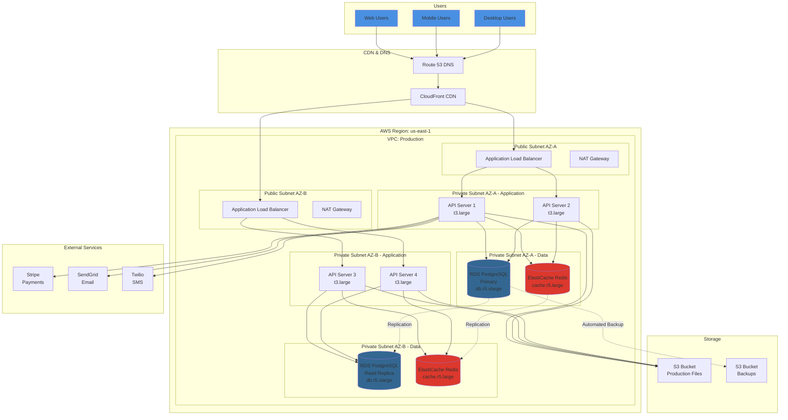

---

### 6.2 Docker Container Deployment

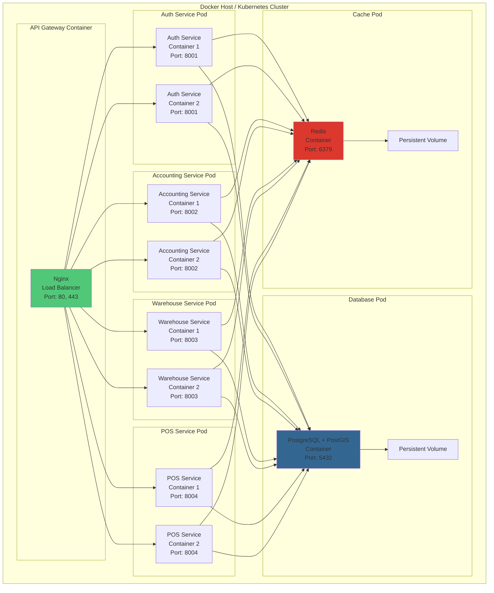

---

## State Diagrams

### 7.1 Sales Transaction State Machine

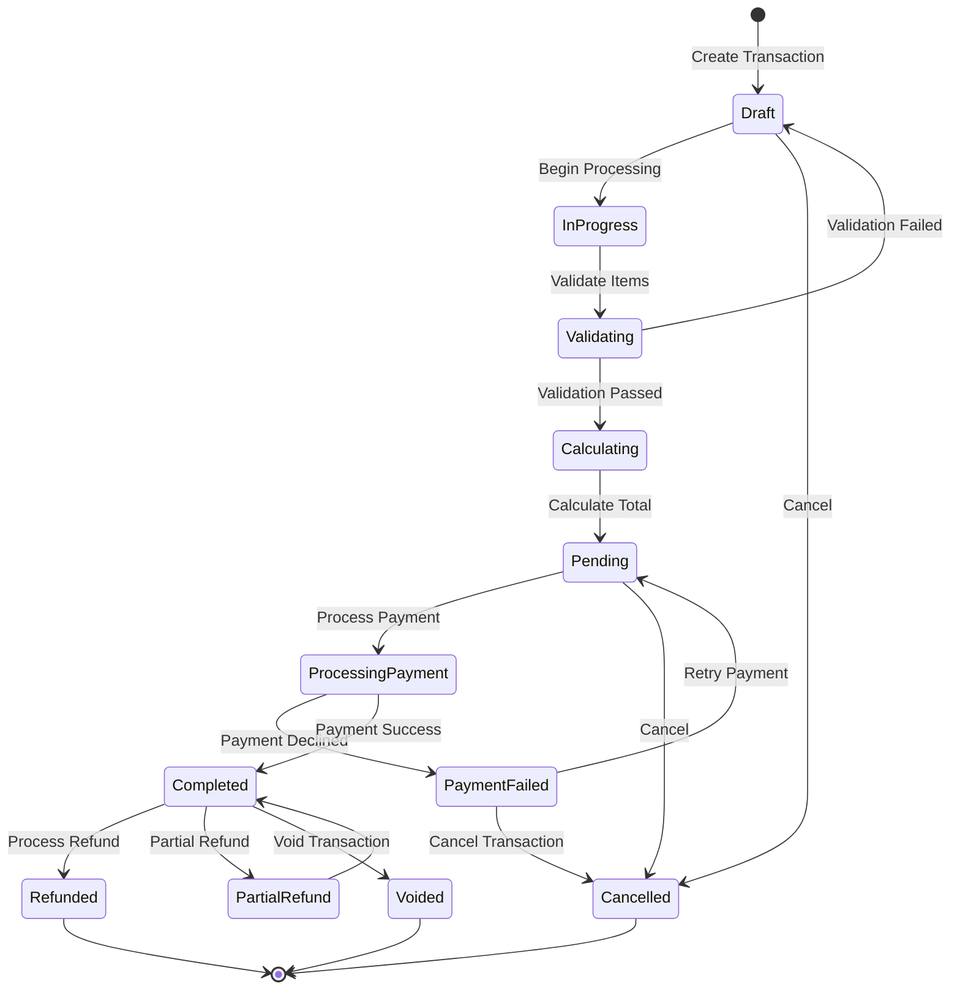

---

### 7.2 Stock Transfer State Machine

```mermaid
stateDiagram-v2
    [*] --> Requested: Initiate Transfer

    Requested --> PendingApproval: Submit for Approval

    PendingApproval --> Approved: Approve
    PendingApproval --> Rejected: Reject

    Rejected --> [*]

    Approved --> Picking: Begin Picking

    Picking --> PickingComplete: All Items Picked
    PickingComplete --> Packing: Begin Packing

    Packing --> ReadyToShip: Packing Complete

    ReadyToShip --> InTransit: Ship Items

    InTransit --> Delivered: Arrive at Destination

    Delivered --> Receiving: Begin Receiving

    Receiving --> PartiallyReceived: Some Items Received
    PartiallyReceived --> Receiving: Continue Receiving

    Receiving --> Completed: All Items Received

    Completed --> [*]

    Requested --> Cancelled: Cancel
    Approved --> Cancelled: Cancel
    Picking --> Cancelled: Cancel
    Cancelled --> [*]
```

---

### 7.3 Support Ticket State Machine

```mermaid
stateDiagram-v2
    [*] --> New: Create Ticket

    New --> Open: Assign to Agent

    Open --> InProgress: Agent Begins Work

    InProgress --> PendingCustomer: Waiting for Customer Response
    InProgress --> PendingInternal: Escalated / Waiting Internal
    InProgress --> Resolved: Issue Resolved

    PendingCustomer --> InProgress: Customer Responds
    PendingCustomer --> AutoClosed: No Response (7 days)

    PendingInternal --> InProgress: Internal Response

    Resolved --> Closed: Customer Confirms
    Resolved --> Reopened: Customer Reports Issue

    Reopened --> InProgress: Agent Reviews

    AutoClosed --> [*]
    Closed --> [*]

    New --> Cancelled: Duplicate / Invalid
    Open --> Cancelled: Duplicate / Invalid
    Cancelled --> [*]
```

---

### 7.4 Purchase Order State Machine

```mermaid
stateDiagram-v2
    [*] --> Draft: Create PO

    Draft --> PendingApproval: Submit for Approval
    Draft --> Submitted: Auto-Approved

    PendingApproval --> Approved: Manager Approves
    PendingApproval --> Rejected: Manager Rejects

    Rejected --> Draft: Revise and Resubmit
    Rejected --> Cancelled: Abandon PO

    Approved --> Submitted: Send to Vendor

    Submitted --> Confirmed: Vendor Confirms
    Submitted --> VendorRejected: Vendor Rejects

    VendorRejected --> Draft: Revise
    VendorRejected --> Cancelled: Cancel

    Confirmed --> Shipped: Vendor Ships

    Shipped --> PartiallyReceived: Partial Delivery
    PartiallyReceived --> Shipped: Awaiting Remainder
    PartiallyReceived --> Completed: Accept Partial

    Shipped --> Received: Full Delivery Received

    Received --> InvoiceReceived: Invoice Arrives

    InvoiceReceived --> PendingPayment: Approve Invoice
    InvoiceReceived --> InvoiceDispute: Dispute Invoice

    InvoiceDispute --> InvoiceReceived: Resolved

    PendingPayment --> Paid: Payment Processed

    Paid --> Completed: Close PO

    Completed --> [*]
    Cancelled --> [*]
```

---

## Component Diagrams

### 8.1 Backend Service Components

```mermaid
graph TB
    subgraph "API Gateway Component"
        ROUTER[Request Router]
        AUTH_MW[Auth Middleware]
        RATE_LIMIT[Rate Limiter]
        LOGGER[Request Logger]
    end

    subgraph "Authentication Service"
        AUTH_CTL[Auth Controller]
        JWT_SVC[JWT Service]
        PWD_SVC[Password Service]
        2FA_SVC[2FA Service]
        AUTH_REPO[Auth Repository]
    end

    subgraph "Accounting Service"
        ACC_CTL[Accounting Controller]
        SALES_SVC[Sales Service]
        ROYALTY_SVC[Royalty Service]
        EXPENSE_SVC[Expense Service]
        REPORT_SVC[Reporting Service]
        ACC_REPO[Accounting Repository]
    end

    subgraph "Warehouse Service"
        WH_CTL[Warehouse Controller]
        INV_SVC[Inventory Service]
        TRANSFER_SVC[Transfer Service]
        RECEIVING_SVC[Receiving Service]
        WH_REPO[Warehouse Repository]
    end

    subgraph "POS Service"
        POS_CTL[POS Controller]
        TXN_SVC[Transaction Service]
        DISCOUNT_SVC[Discount Service]
        PAYMENT_SVC[Payment Service]
        POS_REPO[POS Repository]
    end

    subgraph "Shared Components"
        DB_POOL[(Database Connection Pool)]
        CACHE_MGR[Cache Manager]
        EVENT_BUS[Event Bus]
        FILE_MGR[File Manager]
        NOTIFICATION[Notification Service]
    end

    ROUTER --> AUTH_MW
    AUTH_MW --> RATE_LIMIT
    RATE_LIMIT --> LOGGER

    LOGGER --> AUTH_CTL
    LOGGER --> ACC_CTL
    LOGGER --> WH_CTL
    LOGGER --> POS_CTL

    AUTH_CTL --> JWT_SVC
    AUTH_CTL --> PWD_SVC
    AUTH_CTL --> 2FA_SVC
    JWT_SVC --> AUTH_REPO
    PWD_SVC --> AUTH_REPO
    2FA_SVC --> AUTH_REPO

    ACC_CTL --> SALES_SVC
    ACC_CTL --> ROYALTY_SVC
    ACC_CTL --> EXPENSE_SVC
    ACC_CTL --> REPORT_SVC
    SALES_SVC --> ACC_REPO
    ROYALTY_SVC --> ACC_REPO
    EXPENSE_SVC --> ACC_REPO
    REPORT_SVC --> ACC_REPO

    WH_CTL --> INV_SVC
    WH_CTL --> TRANSFER_SVC
    WH_CTL --> RECEIVING_SVC
    INV_SVC --> WH_REPO
    TRANSFER_SVC --> WH_REPO
    RECEIVING_SVC --> WH_REPO

    POS_CTL --> TXN_SVC
    POS_CTL --> DISCOUNT_SVC
    POS_CTL --> PAYMENT_SVC
    TXN_SVC --> POS_REPO
    DISCOUNT_SVC --> POS_REPO
    PAYMENT_SVC --> POS_REPO

    AUTH_REPO --> DB_POOL
    ACC_REPO --> DB_POOL
    WH_REPO --> DB_POOL
    POS_REPO --> DB_POOL

    JWT_SVC --> CACHE_MGR
    INV_SVC --> CACHE_MGR
    TXN_SVC --> CACHE_MGR

    TRANSFER_SVC --> EVENT_BUS
    ROYALTY_SVC --> EVENT_BUS

    REPORT_SVC --> FILE_MGR
    EXPENSE_SVC --> FILE_MGR

    ROYALTY_SVC --> NOTIFICATION
    TRANSFER_SVC --> NOTIFICATION
```

---

### 8.2 Frontend Application Components

```mermaid
graph TB
    subgraph "Web Application"
        subgraph "Core Layer"
            APP[App Root]
            ROUTER_WEB[React Router]
            STORE[Redux Store]
            AUTH_CTX[Auth Context]
        end

        subgraph "Feature Modules"
            DASHBOARD[Dashboard Module]
            SALES[Sales Module]
            INVENTORY[Inventory Module]
            REPORTS[Reports Module]
            SETTINGS[Settings Module]
        end

        subgraph "Shared Components"
            LAYOUT[Layout Components]
            FORMS[Form Components]
            TABLES[Table Components]
            CHARTS[Chart Components]
            MODALS[Modal Components]
        end

        subgraph "Services"
            API_CLIENT[API Client]
            AUTH_SVC_F[Auth Service]
            STORAGE_SVC[Storage Service]
            NOTIFICATION_SVC[Notification Service]
        end
    end

    APP --> ROUTER_WEB
    APP --> STORE
    APP --> AUTH_CTX

    ROUTER_WEB --> DASHBOARD
    ROUTER_WEB --> SALES
    ROUTER_WEB --> INVENTORY
    ROUTER_WEB --> REPORTS
    ROUTER_WEB --> SETTINGS

    DASHBOARD --> LAYOUT
    SALES --> LAYOUT
    INVENTORY --> LAYOUT
    REPORTS --> LAYOUT
    SETTINGS --> LAYOUT

    DASHBOARD --> CHARTS
    SALES --> FORMS
    SALES --> TABLES
    INVENTORY --> TABLES
    REPORTS --> CHARTS
    SETTINGS --> FORMS

    SALES --> MODALS
    INVENTORY --> MODALS

    DASHBOARD --> API_CLIENT
    SALES --> API_CLIENT
    INVENTORY --> API_CLIENT
    REPORTS --> API_CLIENT
    SETTINGS --> API_CLIENT

    API_CLIENT --> AUTH_SVC_F
    AUTH_SVC_F --> STORAGE_SVC
    AUTH_CTX --> AUTH_SVC_F

    SALES --> NOTIFICATION_SVC
    INVENTORY --> NOTIFICATION_SVC
    SETTINGS --> NOTIFICATION_SVC
```

---

## Conclusion

This comprehensive visualization document provides complete technical documentation for the LazyFranchisor system including:

✅ **System Architecture Diagrams** - High-level, microservices, and data flow architecture
✅ **UML Class Diagrams** - Complete domain model with all entities and relationships
✅ **Sequence Diagrams** - Detailed interaction flows for key processes
✅ **Flowcharts** - Business process flows for operations
✅ **Entity Relationship Diagrams** - Complete database schema with relationships
✅ **Deployment Diagrams** - AWS cloud and Docker container deployment
✅ **State Diagrams** - State machines for key entities
✅ **Component Diagrams** - Backend services and frontend application structure

### Usage Guidelines

- **For Developers**: Use UML class diagrams and sequence diagrams for implementation
- **For Database Designers**: Refer to ERD for schema design
- **For DevOps**: Use deployment diagrams for infrastructure setup
- **For Business Analysts**: Review flowcharts and process flows
- **For Project Managers**: Use state diagrams to understand entity lifecycles

### Diagram Format

All diagrams use **Mermaid syntax** which can be:
- Rendered in GitHub, GitLab, and most modern documentation platforms
- Exported to PNG/SVG using Mermaid CLI or online tools
- Edited easily as they are text-based

### Maintenance

This document should be updated whenever:
- New features are added
- Database schema changes
- Architecture evolves
- New services are introduced
- Deployment topology changes

---

**Document Control:**
- **Version**: 1.0
- **Last Updated**: October 28, 2025
- **Next Review**: November 28, 2025
- **Owner**: Technical Architecture Team

*End of Visualization Document*
