# LazyFranchisor: Comprehensive Development, Business & Operational Plan

**Document Version:** 1.0
**Date:** October 28, 2025
**Status:** Planning Phase

---

## Table of Contents

1. [Executive Summary](#executive-summary)
2. [Software Development Plan](#software-development-plan)
3. [Business Development Plan](#business-development-plan)
4. [Operational Plan with SOPs](#operational-plan-with-sops)
5. [Process Flows and Diagrams](#process-flows-and-diagrams)
6. [Risk Management](#risk-management)
7. [Success Metrics and KPIs](#success-metrics-and-kpis)

---

## Executive Summary

LazyFranchisor is positioned to revolutionize franchise management through a comprehensive, multi-platform solution. This document outlines our strategic approach across three critical domains:

- **Software Development**: 18-month phased implementation with MVP in 6 months
- **Business Development**: Multi-channel go-to-market strategy targeting $5M ARR by Year 3
- **Operations**: Scalable processes with documented SOPs ensuring consistent quality

### Strategic Objectives

1. **Q1-Q2 2026**: Launch MVP with core features (Accounting, Warehouse, POS)
2. **Q3-Q4 2026**: Onboard first 10 pilot franchisors (50-200 locations total)
3. **2027**: Scale to 50 franchisor clients with expanded feature set
4. **2028**: Achieve market leadership position in franchise management software

---

## Software Development Plan

### 1. Development Phases and Timeline

#### Phase 1: Foundation (Months 1-3)

**Objectives:**
- Establish development infrastructure
- Set up CI/CD pipelines
- Create core architecture and database schema
- Implement authentication and authorization

**Deliverables:**
```
Week 1-2: Infrastructure Setup
├── Set up Git repository structure
├── Configure Docker environment (PostgreSQL, Redis)
├── Initialize Rust backend with Axum
├── Set up React web frontend project
├── Configure CI/CD pipeline (GitHub Actions)
└── Set up development, staging, production environments

Week 3-6: Core Backend Services
├── User authentication service (JWT implementation)
├── Role-based access control (RBAC) system
├── Database schema implementation (PostgreSQL)
├── API gateway and routing
├── Error handling and logging infrastructure
└── Basic API documentation (OpenAPI/Swagger)

Week 7-12: Frontend Foundation
├── Authentication UI (login, registration, password reset)
├── Main dashboard layout and navigation
├── User management interface
├── Role and permission management
├── Responsive design implementation
└── State management setup (Redux/Context API)
```

**Team Requirements:**
- 2 Backend Engineers (Rust/Axum)
- 2 Frontend Engineers (React/TypeScript)
- 1 DevOps Engineer
- 1 QA Engineer
- 1 Product Manager

**Key Milestones:**
- M1.1: Infrastructure operational (Week 2)
- M1.2: Authentication system complete (Week 6)
- M1.3: Frontend foundation complete (Week 12)

---

#### Phase 2: MVP Development (Months 4-6)

**Objectives:**
- Implement core MVP features
- Complete Accounting, Warehouse, and POS modules
- Conduct internal testing
- Prepare for pilot launch

**Deliverables:**
```
Month 4: Accounting Module
├── Sales tracking and revenue reporting
├── Financial dashboard
├── Basic reporting (P&L, revenue by location)
├── Data export functionality
└── Integration with POS module

Month 5: Warehouse & POS Modules
├── Inventory management (stock tracking)
├── Order fulfillment workflow
├── Stock transfer between locations
├── POS transaction processing
├── Discount and promotion engine
├── Receipt generation
└── Real-time inventory updates

Month 6: Integration & Testing
├── End-to-end module integration
├── API testing and documentation
├── Performance optimization
├── Security audit
├── User acceptance testing (UAT)
├── Bug fixing and refinement
└── Deployment preparation
```

**Key Milestones:**
- M2.1: Accounting module complete (Month 4)
- M2.2: Warehouse & POS complete (Month 5)
- M2.3: MVP ready for pilot (Month 6)

---

#### Phase 3: Pilot Launch (Months 7-9)

**Objectives:**
- Onboard 3-5 pilot franchisor partners
- Gather user feedback
- Iterate based on real-world usage
- Stabilize platform

**Deliverables:**
```
Month 7: Pilot Onboarding
├── Onboarding workflow implementation
├── Data migration tools
├── Training materials creation
├── Support documentation
└── Onboard first 2 pilot partners

Month 8: Feedback & Iteration
├── Monitor pilot usage and performance
├── Collect user feedback
├── Prioritize feature requests and bug fixes
├── Implement critical improvements
└── Onboard additional 1-3 pilot partners

Month 9: Stabilization
├── Performance optimization based on real data
├── Enhanced error handling
├── Improved user experience
├── Documentation updates
└── Preparation for expanded launch
```

**Key Milestones:**
- M3.1: First pilot partners onboarded (Month 7)
- M3.2: Critical feedback implemented (Month 8)
- M3.3: Platform stabilized (Month 9)

---

#### Phase 4: Feature Expansion (Months 10-12)

**Objectives:**
- Implement Phase 2 features
- Launch mobile applications
- Expand pilot program
- Prepare for commercial launch

**Deliverables:**
```
Month 10-11: Enhanced Features
├── Advanced Accounting (royalty invoicing, expense management)
├── SOP Management module
├── Basic Auditing functionality
├── Enhanced reporting and analytics
├── Mobile app development (iOS/Android)
└── Desktop app (Electron) packaging

Month 12: Commercial Readiness
├── Complete mobile app testing
├── App store submission (iOS/Android)
├── Marketing website development
├── Sales materials preparation
├── Pricing model finalization
├── Customer support infrastructure
└── Commercial launch preparation
```

**Key Milestones:**
- M4.1: Enhanced features complete (Month 11)
- M4.2: Mobile apps launched (Month 12)
- M4.3: Commercial launch ready (Month 12)

---

#### Phase 5: Scale & Advanced Features (Months 13-18)

**Objectives:**
- Scale infrastructure for growth
- Implement advanced features (CRM, SCM, Central Kitchen)
- Expand to 30+ franchisor clients
- Achieve operational profitability

**Deliverables:**
```
Month 13-15: Advanced Modules
├── CRM module (lead management, customer tracking)
├── Supply Chain Management (vendor management, purchasing)
├── Central Kitchen Management (production planning, recipes)
├── Enhanced geo-location features
├── Advanced analytics and BI dashboards
└── API for third-party integrations

Month 16-18: Enterprise Features
├── Multi-currency support
├── Multi-language support
├── Advanced security features (2FA, SSO)
├── Automated backup and disaster recovery
├── Performance monitoring and alerting
├── Enterprise SLA guarantees
└── White-label customization options
```

**Key Milestones:**
- M5.1: CRM and SCM complete (Month 15)
- M5.2: Enterprise features complete (Month 18)
- M5.3: 30+ clients onboarded (Month 18)

---

### 2. Technology Stack Rationale

#### Backend: Rust + Axum
**Advantages:**
- **Performance**: Near C-level performance for high-throughput operations
- **Memory Safety**: Prevents common security vulnerabilities
- **Concurrency**: Excellent support for concurrent requests
- **Type Safety**: Compile-time error checking reduces runtime issues
- **Ecosystem**: Growing ecosystem with strong database and web frameworks

**Trade-offs:**
- Steeper learning curve for developers
- Smaller talent pool compared to Node.js/Python
- Longer initial development time

**Decision**: Justified for a platform requiring high performance, reliability, and security for potentially thousands of franchise locations.

#### Frontend: React + TypeScript
**Advantages:**
- **Component Reusability**: Shared components across web and mobile (React Native)
- **Type Safety**: TypeScript catches errors at compile-time
- **Large Ecosystem**: Extensive libraries and tools
- **Developer Availability**: Large talent pool
- **Performance**: Virtual DOM for efficient updates

#### Database: PostgreSQL + PostGIS
**Advantages:**
- **Reliability**: ACID compliance, proven at scale
- **Geo-location**: Native support via PostGIS extension
- **JSON Support**: Flexible data structures when needed
- **Advanced Features**: Window functions, CTEs, full-text search
- **Open Source**: No licensing costs

#### Mobile: React Native
**Advantages:**
- **Code Sharing**: 70-80% code reuse between iOS and Android
- **Hot Reloading**: Faster development cycles
- **Native Performance**: Close to native app performance
- **Cost Effective**: Single codebase for multiple platforms

---

### 3. Development Practices and Standards

#### Agile Methodology

**Sprint Structure:**
- 2-week sprints
- Sprint planning (Monday, Week 1)
- Daily standups (15 minutes)
- Sprint review and demo (Friday, Week 2)
- Sprint retrospective (Friday, Week 2)

**Roles:**
- Product Owner: Prioritizes backlog, defines acceptance criteria
- Scrum Master: Facilitates ceremonies, removes blockers
- Development Team: Self-organizing, cross-functional

#### Code Quality Standards

**Code Review Process:**
1. All code must be reviewed by at least one senior developer
2. Automated checks must pass (linting, tests, security scans)
3. PR description must include:
   - What: Brief description of changes
   - Why: Rationale for changes
   - How: Technical approach
   - Testing: How changes were tested
4. Maximum PR size: 400 lines changed (excluding tests)
5. Review SLA: 24 hours for feedback

**Testing Requirements:**
- **Unit Tests**: Minimum 80% code coverage
- **Integration Tests**: All API endpoints tested
- **E2E Tests**: Critical user flows automated
- **Performance Tests**: Load testing for key operations
- **Security Tests**: OWASP Top 10 automated scanning

**Code Style:**
- Rust: `rustfmt` and `clippy` enforced in CI
- TypeScript: ESLint with Airbnb config
- Commit messages: Conventional Commits specification
- Branch naming: `feature/`, `bugfix/`, `hotfix/` prefixes

#### CI/CD Pipeline

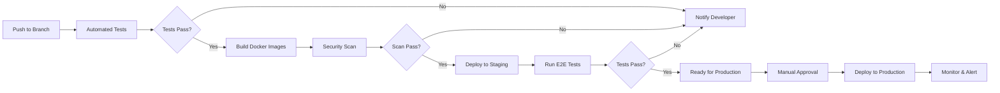

**Environments:**
- **Development**: Local Docker environment
- **Staging**: Automated deployment on merge to `develop` branch
- **Production**: Manual approval required, deployed from `main` branch

---

### 4. Security and Compliance

#### Security Measures

**Authentication & Authorization:**
- JWT tokens with 1-hour expiration
- Refresh tokens with 7-day expiration
- Role-Based Access Control (RBAC)
- Multi-factor authentication (2FA) for admin roles
- Password requirements: minimum 12 characters, complexity rules

**Data Security:**
- Encryption at rest (AES-256)
- Encryption in transit (TLS 1.3)
- Secure credential storage (never in code/logs)
- Database access via least-privilege principles
- Regular security audits and penetration testing

**Compliance:**
- GDPR compliance (data privacy, right to deletion)
- SOC 2 Type II certification (target: Year 2)
- PCI DSS compliance for payment processing
- Regular vulnerability assessments
- Security incident response plan

#### Data Backup and Recovery

**Backup Strategy:**
- **Database**: Automated daily backups with 30-day retention
- **Incremental Backups**: Every 6 hours
- **Geographic Redundancy**: Backups stored in multiple regions
- **Backup Testing**: Monthly restore tests to verify integrity

**Disaster Recovery:**
- **RTO (Recovery Time Objective)**: 4 hours
- **RPO (Recovery Point Objective)**: 6 hours
- **Failover**: Automated failover to secondary region
- **Documentation**: Detailed runbooks for disaster scenarios

---

### 5. Infrastructure and Scaling

#### Initial Architecture (MVP)

```
┌─────────────────────────────────────────┐
│          Load Balancer (AWS ALB)         │
└─────────────────┬───────────────────────┘
                  │
     ┌────────────┴────────────┐
     │                         │
┌────▼─────┐            ┌─────▼────┐
│   API    │            │   API    │
│ Server 1 │            │ Server 2 │
│ (Rust)   │            │ (Rust)   │
└────┬─────┘            └─────┬────┘
     │                        │
     └────────────┬───────────┘
                  │
     ┌────────────┴────────────┐
     │                         │
┌────▼─────┐            ┌─────▼────┐
│PostgreSQL│            │  Redis   │
│ Primary  │            │  Cache   │
└──────────┘            └──────────┘
```

**Specifications:**
- **API Servers**: 2 instances, t3.medium (AWS)
- **Database**: RDS PostgreSQL, db.t3.large
- **Cache**: ElastiCache Redis, cache.t3.medium
- **Storage**: S3 for file uploads
- **CDN**: CloudFront for static assets

#### Scaling Strategy

**Horizontal Scaling Triggers:**
- CPU utilization > 70% for 5 minutes
- Response time > 500ms for 95th percentile
- Active connections > 1000

**Scaling Plan:**
```
Phase 1 (0-10 clients):
├── 2 API servers (t3.medium)
├── 1 DB instance (db.t3.large)
└── 1 Redis instance (cache.t3.medium)

Phase 2 (10-30 clients):
├── 4 API servers (t3.large)
├── 1 DB instance with read replica (db.r5.xlarge)
└── 2 Redis instances (cluster mode)

Phase 3 (30-100 clients):
├── Auto-scaling group: 4-12 API servers (t3.large)
├── Multi-AZ database cluster (db.r5.2xlarge)
├── Redis cluster (3 shards)
└── CloudFront CDN
```

**Cost Projections:**
- Phase 1: ~$800/month
- Phase 2: ~$2,500/month
- Phase 3: ~$8,000/month

---

### 6. Team Structure and Hiring Plan

#### Initial Team (Months 1-6)

```
Product Manager (1)
    │
    ├── Engineering Lead (1)
    │   ├── Backend Engineers (2) - Rust/Axum
    │   ├── Frontend Engineers (2) - React/TypeScript
    │   └── DevOps Engineer (1)
    │
    ├── QA Lead (1)
    │   └── QA Engineer (1)
    │
    └── Designer (1) - UI/UX
```

**Total: 10 people**

#### Expanded Team (Months 7-12)

```
Product Manager (1)
    │
    ├── Engineering Lead (1)
    │   ├── Backend Team Lead (1)
    │   │   └── Backend Engineers (4)
    │   ├── Frontend Team Lead (1)
    │   │   └── Frontend Engineers (4)
    │   ├── Mobile Engineers (2) - React Native
    │   └── DevOps Engineers (2)
    │
    ├── QA Lead (1)
    │   └── QA Engineers (2)
    │
    ├── Design Lead (1)
    │   └── Designers (2)
    │
    └── Technical Writer (1)
```

**Total: 22 people**

#### Hiring Timeline

```
Month 1: Core team (Engineering Lead, 2 Backend, 1 Frontend, 1 DevOps)
Month 2: Add 1 Frontend, 1 QA, 1 Designer
Month 3: Evaluate and adjust
Month 7: Add Team Leads, 2 Backend, 2 Frontend
Month 9: Add 2 Mobile Engineers
Month 10: Add 1 QA, 1 Designer, 1 Technical Writer
Month 12: Add 1 DevOps
```

**Talent Acquisition Strategy:**
- **Rust Engineers**: Target systems programming background (C++, Go)
- **Remote-First**: Access global talent pool
- **Compensation**: Competitive salaries + equity (0.1-2% depending on role/seniority)
- **Culture**: Emphasize impact, autonomy, learning opportunities

---

## Business Development Plan

### 1. Market Analysis

#### Target Market

**Primary Target: Mid-Size Franchisors**
- **Size**: 20-200 locations
- **Industries**: QSR, Retail, Services (fitness, salons, education)
- **Geography**: North America (initial), global expansion (Year 2+)
- **Pain Points**:
  - Fragmented systems (multiple vendors for different functions)
  - Poor visibility into franchisee operations
  - Manual, time-consuming processes
  - Difficulty enforcing brand standards
  - Limited data-driven decision making

**Secondary Target: Growing Franchisors**
- **Size**: 5-20 locations
- **Characteristics**: Rapid growth phase, seeking to professionalize
- **Needs**: Affordable, scalable solution that grows with them

**Market Size:**
- Total addressable market (TAM): ~30,000 franchisors in North America
- Serviceable addressable market (SAM): ~8,000 mid-size franchisors
- Serviceable obtainable market (SOM): ~400 franchisors (5% of SAM, Year 3 target)

**Market Trends:**
- **Digital Transformation**: 78% of franchisors prioritizing technology investments
- **Data Analytics**: Growing demand for actionable insights
- **Multi-Location Complexity**: Average franchise system growing 15% annually
- **Cloud Adoption**: 85% of businesses prefer cloud-based solutions

---

#### Competitive Landscape

**Direct Competitors:**

1. **FranConnect**
   - Strengths: Market leader, comprehensive features, established brand
   - Weaknesses: Expensive ($500-2000/location/month), outdated UI, slow innovation
   - Pricing: Enterprise-level, custom quotes

2. **Zenput (now part of Crunchtime)**
   - Strengths: Strong in operations and auditing
   - Weaknesses: Limited accounting/ERP features, focused on restaurants
   - Pricing: ~$100-300/location/month

3. **Franchise Management Systems (FMS)**
   - Strengths: Full-featured, good support
   - Weaknesses: Dated technology, limited mobile capabilities
   - Pricing: ~$300-800/location/month

**Indirect Competitors:**
- Generic ERP systems (SAP, NetSuite) - too complex/expensive
- Point-of-sale systems with limited franchise features
- Spreadsheets and manual processes

**LazyFranchisor Competitive Advantages:**

| Factor | LazyFranchisor | Competitors |
|--------|----------------|-------------|
| **Pricing** | $50-150/location/month | $300-2000/location/month |
| **Modern UI/UX** | React, mobile-first design | Dated interfaces |
| **Performance** | Rust backend, optimized | Slower, legacy tech |
| **Integration** | Built-in modules, unified | Multiple vendors needed |
| **Mobile** | Native iOS/Android apps | Limited mobile support |
| **Setup Time** | Days to weeks | Weeks to months |
| **Flexibility** | Modular, customizable | Rigid, one-size-fits-all |

**Positioning Statement:**
> "LazyFranchisor delivers enterprise-grade franchise management at SMB prices, combining modern technology, intuitive design, and comprehensive features to help growing franchisors scale with confidence."

---

### 2. Go-to-Market Strategy

#### Customer Acquisition Channels

**Channel 1: Franchise Industry Events and Conferences**

Target Events:
- Franchise Leadership & Development Conference (FLDC)
- International Franchise Expo
- Multi-Unit Franchising Conference
- Franchise Consumer Marketing Conference

**Activities:**
- Exhibition booth with live demos
- Speaking opportunities (thought leadership)
- Networking events and sponsorships
- Lead capture and follow-up system

**Investment:** $50,000-100,000/year
**Expected Results:** 100-200 qualified leads per event, 5-10% conversion

---

**Channel 2: Content Marketing and SEO**

**Content Strategy:**
- Blog posts (2-3 per week): franchise management best practices, industry trends
- Whitepapers and e-books: "Ultimate Guide to Franchise Operations"
- Case studies: Success stories from pilot partners
- Webinars: "How Top Franchisors Scale Efficiently"
- Podcast: Interviews with successful franchisors

**SEO Focus:**
- Target keywords: "franchise management software", "franchisor tools", "multi-unit management"
- Location-specific content: "franchise management software in [city]"
- Long-tail keywords: "how to manage franchise inventory across locations"

**Investment:** $30,000-50,000/year (content creators, SEO tools)
**Expected Results:** 500-1000 organic visitors/month by Month 12, 2% conversion to leads

---

**Channel 3: Paid Advertising**

**Google Ads:**
- Search campaigns targeting high-intent keywords
- Display remarketing to website visitors
- YouTube video ads for product demos

**LinkedIn Ads:**
- Sponsored content targeting franchise executives
- InMail campaigns to decision-makers
- Thought leadership ads featuring company executives

**Budget Allocation:**
- Google Ads: $5,000/month
- LinkedIn Ads: $3,000/month
- Total: $96,000/year

**Expected Results:** 300-500 qualified leads/year, 8-12% conversion

---

**Channel 4: Partnerships and Integrations**

**Target Partners:**
- Franchise consultants and brokers
- POS system providers
- Accounting software companies
- Franchise legal advisors
- Industry associations (IFA, local chambers)

**Partnership Models:**
- **Referral Programs**: 10-15% commission on first-year revenue
- **Technology Partnerships**: API integrations with complementary tools
- **Co-Marketing**: Joint webinars, content, events

**Investment:** $20,000/year (partner onboarding, materials, commissions)
**Expected Results:** 20-30% of leads from partner referrals by Year 2

---

**Channel 5: Direct Sales and Outbound**

**Approach:**
- Build list of target franchisors (research, industry databases)
- Personalized outreach via email and LinkedIn
- Phone follow-ups from sales team
- Custom demos tailored to prospect's needs

**Sales Team:**
- Month 1-6: Founder-led sales
- Month 7: Hire first Sales Executive
- Month 12: Add second Sales Executive + Sales Manager
- Year 2: Build 5-person sales team

**Investment:** $200,000/year (salaries, commissions, tools)
**Expected Results:** 50-100 qualified opportunities/year, 15-20% close rate

---

#### Sales Process and Funnel

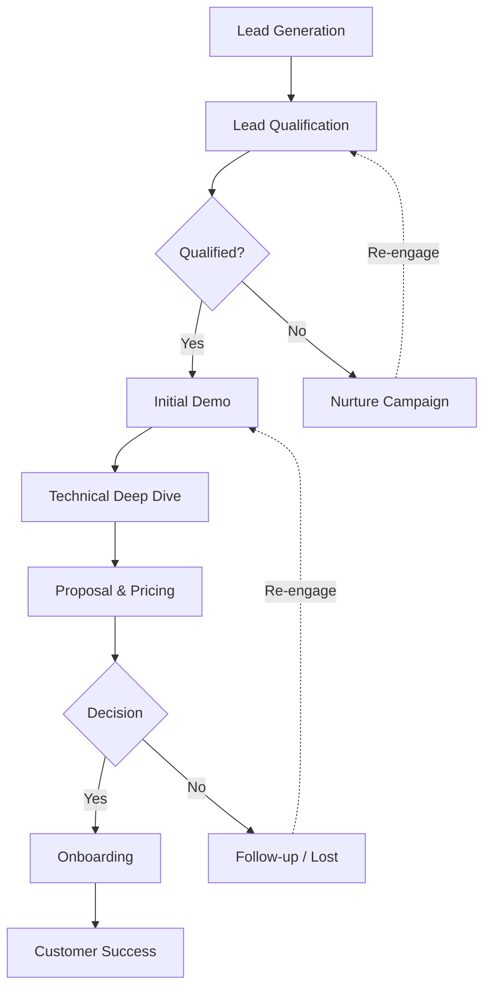

**Stage Details:**

1. **Lead Generation**: Marketing channels drive traffic
   - Target: 2,000 leads/year (Year 1)

2. **Lead Qualification**: BANT criteria (Budget, Authority, Need, Timeline)
   - Target: 30% qualification rate = 600 MQLs

3. **Initial Demo**: 30-minute product overview
   - Target: 50% demo-to-deep-dive rate = 300 opportunities

4. **Technical Deep Dive**: 60-minute session with technical stakeholders
   - Target: 70% move to proposal stage = 210 proposals

5. **Proposal & Pricing**: Custom quote and contract
   - Target: 40% close rate = 84 customers/year

6. **Onboarding**: Implementation and training
   - Target: 95% successful onboarding

**Sales Cycle Length:**
- Average: 60-90 days from first demo to contract
- Range: 30 days (small franchisors) to 180 days (enterprise)

---

#### Pricing Strategy

**Pricing Model: Per-Location, Per-Month (Tiered)**

**Tier 1: Starter (5-20 locations)**
- Price: $150/location/month
- Features: Core modules (Accounting, Warehouse, POS)
- Support: Email support (24-hour response)
- Annual contract: $1,800/location/year
- **Target Segment**: Growing franchisors, limited budget

**Tier 2: Growth (21-100 locations)**
- Price: $100/location/month
- Features: All Starter + SOP Management, Basic Auditing
- Support: Email + phone support (4-hour response)
- Annual contract: $1,200/location/year
- **Target Segment**: Mid-size franchisors, primary target market

**Tier 3: Enterprise (100+ locations)**
- Price: $50-75/location/month (volume discount)
- Features: All Growth + CRM, SCM, Central Kitchen, Advanced Analytics
- Support: Dedicated account manager, 1-hour response SLA
- Custom contract: Annual or multi-year
- **Target Segment**: Large franchisors, highest lifetime value

**Add-Ons:**
- **Additional Users**: $25/user/month (beyond included seats)
- **API Access**: $500/month (for custom integrations)
- **White-Label**: $5,000/month (custom branding)
- **Professional Services**: $150-250/hour (custom development)

**Example Revenue Scenarios:**

| Franchisor Size | Locations | Tier | Monthly Cost | Annual Revenue |
|-----------------|-----------|------|--------------|----------------|
| Small           | 10        | Starter | $1,500      | $18,000        |
| Medium          | 50        | Growth | $5,000       | $60,000        |
| Large           | 200       | Enterprise | $15,000  | $180,000       |

**Free Trial:**
- 30-day free trial (no credit card required)
- Full access to all features in selected tier
- Hands-on onboarding and training included
- Goal: Demonstrate value before payment

**Discounts and Incentives:**
- **Annual Pre-Pay**: 10% discount
- **Multi-Brand**: 15% discount for franchisors with multiple brands
- **Non-Profit**: 20% discount for non-profit organizations
- **Referral**: $500 credit for each successful referral

---

### 3. Revenue Projections

#### Year 1 (Months 1-12)

**Assumptions:**
- MVP launch: Month 6
- Pilot customers: 5 (average 30 locations each)
- Commercial launch: Month 12
- Paying customers by EOY: 10 (average 35 locations)

**Revenue:**
- Q1-Q2: $0 (development phase)
- Q3: $15,000/month (5 pilot customers at 50% discount)
- Q4: $50,000/month average (10 customers, ramp-up)

**Year 1 Total Revenue: ~$250,000**

---

#### Year 2 (Months 13-24)

**Assumptions:**
- Strong sales and marketing execution
- Customer retention: 95%
- New customers: 40 (average 40 locations each)
- Average monthly revenue per customer: $4,000

**Revenue:**
- Starting: $50,000/month (10 customers from Year 1)
- Q1: Add 10 customers → $90,000/month
- Q2: Add 10 customers → $130,000/month
- Q3: Add 10 customers → $170,000/month
- Q4: Add 10 customers → $210,000/month

**Year 2 Total Revenue: ~$1,800,000**

---

#### Year 3 (Months 25-36)

**Assumptions:**
- Market traction and word-of-mouth referrals
- Customer retention: 95%
- New customers: 60 (average 45 locations)
- Average monthly revenue per customer: $4,500
- Enterprise customers: 5 (average 150 locations, $11,250/month)

**Revenue:**
- Starting: $210,000/month (50 customers from Year 2)
- Q1: Add 15 customers → $280,000/month
- Q2: Add 15 customers → $350,000/month
- Q3: Add 15 customers + 2 enterprise → $442,500/month
- Q4: Add 15 customers + 3 enterprise → $535,000/month

**Year 3 Total Revenue: ~$4,800,000**

---

#### Summary

| Metric | Year 1 | Year 2 | Year 3 |
|--------|--------|--------|--------|
| **Total Customers** | 10 | 50 | 110 |
| **Total Locations** | 350 | 2,000 | 5,225 |
| **Annual Revenue** | $250K | $1.8M | $4.8M |
| **MRR (End of Year)** | $50K | $210K | $535K |
| **ARPU (Annual)** | $25K | $36K | $44K |

---

### 4. Customer Success and Retention

#### Onboarding Process

**Goal: Time-to-Value < 30 Days**

**Phase 1: Kickoff (Week 1)**
- Welcome email and introduction to Customer Success Manager
- Kickoff call to review goals, timeline, and expectations
- Gather data for migration (if applicable)
- Configure initial settings and user accounts

**Phase 2: Data Migration & Setup (Weeks 2-3)**
- Import historical data (sales, inventory, franchisee info)
- Configure locations, users, and permissions
- Set up integrations (POS, accounting, etc.)
- Customize dashboards and reports

**Phase 3: Training (Week 3-4)**
- Admin training (2-hour session)
- Franchisee training (1-hour session, recorded)
- Create custom training materials
- Hands-on practice and Q&A

**Phase 4: Go-Live (Week 4)**
- Final checklist review
- Go-live support (on-call for first 48 hours)
- Monitor usage and adoption
- Address any immediate issues

**Success Metrics:**
- 95% of customers complete onboarding within 30 days
- 90% user adoption within first 60 days
- < 5% churn during onboarding

---

#### Customer Success Program

**Structure:**
- **Customer Success Managers (CSMs)**: 1 CSM per 20-30 customers
- **Support Tiers**:
  - Starter: Email support, 24-hour response
  - Growth: Email + phone, 4-hour response
  - Enterprise: Dedicated CSM, 1-hour response

**Quarterly Business Reviews (QBRs):**
- Review usage metrics and ROI
- Identify opportunities for optimization
- Discuss upcoming features and roadmap
- Gather feedback and feature requests

**Health Scoring:**
- **Green (Healthy)**: Regular usage, growing adoption, positive feedback
- **Yellow (At Risk)**: Declining usage, support tickets, lack of engagement
- **Red (Critical)**: Minimal usage, escalations, cancellation risk

**Proactive Interventions:**
- Yellow accounts: CSM outreach, usage review, additional training
- Red accounts: Executive escalation, personalized support plan, consider discounts

---

#### Retention Strategies

**Target Retention Rate: 95% (Year 2+)**

**Strategies:**
1. **Product Excellence**: Continuously improve based on feedback
2. **Regular Engagement**: Monthly check-ins, webinars, user community
3. **Feature Adoption**: Drive usage of underutilized features
4. **ROI Demonstration**: Regular reporting on time/cost savings
5. **Upselling**: Encourage upgrades to higher tiers or add-ons
6. **Annual Contracts**: Incentivize with discounts, reduce monthly churn
7. **Customer Community**: Forum, user groups, annual conference

**Churn Analysis:**
- Track reasons for cancellation
- Conduct exit interviews
- Identify patterns and address root causes
- Win-back campaigns for churned customers

---

### 5. Marketing and Brand Strategy

#### Brand Positioning

**Brand Promise:**
> "Effortless franchise growth through intelligent, integrated technology."

**Brand Values:**
- **Simplicity**: Intuitive design, easy to use
- **Reliability**: Always available, always accurate
- **Innovation**: Modern technology, continuous improvement
- **Partnership**: Success-oriented, customer-focused

**Brand Personality:**
- Approachable yet professional
- Modern and forward-thinking
- Trustworthy and dependable
- Empowering and supportive

---

#### Marketing Campaigns

**Campaign 1: "From Chaos to Control" (Launch Campaign)**
- **Message**: Take control of your franchise operations with LazyFranchisor
- **Channels**: LinkedIn, Google Ads, industry publications
- **Assets**: Video testimonials, before/after case studies
- **Timeline**: Months 10-12 (pre-launch buzz)

**Campaign 2: "Built for Growth" (Mid-Year Push)**
- **Message**: Scale your franchise confidently with modern tools
- **Channels**: Franchise conferences, webinars, content marketing
- **Assets**: Interactive demos, ROI calculator, growth playbooks
- **Timeline**: Months 18-20 (Year 2)

**Campaign 3: "Data-Driven Franchising" (Thought Leadership)**
- **Message**: Make smarter decisions with real-time insights
- **Channels**: Podcast, speaking engagements, whitepapers
- **Assets**: Industry reports, benchmark data, expert interviews
- **Timeline**: Ongoing (Year 2+)

---

#### Thought Leadership

**Goals:**
- Establish LazyFranchisor as industry experts
- Build trust and credibility
- Generate inbound leads through education

**Tactics:**
- **Speaking Engagements**: Present at 4-6 conferences per year
- **Byline Articles**: Contribute to Franchise Times, Entrepreneur, Forbes
- **Research Reports**: Annual "State of Franchise Operations" report
- **Executive Visibility**: CEO and CTO active on LinkedIn, podcasts
- **Industry Partnerships**: Collaborate with IFA and other associations

---

## Operational Plan with SOPs

### 1. Organizational Structure

```
                    CEO / Founder
                         │
        ┌────────────────┼────────────────┐
        │                │                │
   VP Product     VP Engineering    VP Sales & Marketing
        │                │                │
        ├── Product      ├── Backend      ├── Sales Team
        │   Managers     │   Engineers    │   (3-5 reps)
        │                │                │
        ├── Designers    ├── Frontend     ├── Marketing
        │                │   Engineers    │   Manager
        │                │                │
        └── Tech         ├── Mobile       └── Marketing
            Writers      │   Engineers    │   Specialists
                         │                │
                         ├── DevOps       └── Partnerships
                         │   Engineers        Manager
                         │
                         └── QA
                             Engineers

        ┌─────────────────────────────────┐
        │                                 │
    VP Customer Success        VP Finance & Ops
        │                                 │
        ├── Customer Success              ├── Finance
        │   Managers (CSMs)               │   Manager
        │                                 │
        ├── Support Team                  ├── HR Manager
        │   (Tier 1 & 2)                  │
        │                                 └── Operations
        └── Implementation                    Coordinator
            Specialists
```

**Headcount Growth:**
- Year 1: 10-15 people
- Year 2: 25-35 people
- Year 3: 45-60 people

---

### 2. Standard Operating Procedures (SOPs)

#### SOP 001: Customer Onboarding Process

**Purpose:** Ensure consistent, high-quality onboarding experience for all new customers

**Scope:** Applies to all new customer implementations

**Responsibilities:**
- **Implementation Specialist**: Leads onboarding process
- **Customer Success Manager (CSM)**: Provides ongoing support post-onboarding
- **Support Team**: Resolves technical issues during onboarding
- **Customer**: Provides data, attends training, designates key users

**Procedure:**

**Step 1: Contract Signed → Kickoff Scheduled**
1. Sales team marks deal as "Closed-Won" in CRM (Salesforce/HubSpot)
2. Automated workflow:
   - Create customer record in support system (Zendesk)
   - Assign Implementation Specialist (round-robin)
   - Assign CSM based on customer tier
   - Send welcome email with next steps
3. Implementation Specialist reviews customer details and requirements
4. Schedule kickoff call within 2 business days of contract signing

**Duration:** 2 business days
**Owner:** Sales team → Automated → Implementation Specialist

---

**Step 2: Kickoff Call**
1. **Pre-Call Preparation (Implementation Specialist):**
   - Review customer contract and requirements
   - Prepare customized onboarding plan
   - Set up customer account in LazyFranchisor (initial configuration)

2. **Kickoff Call Agenda (60 minutes):**
   - Introductions (10 min)
   - Review onboarding timeline and milestones (10 min)
   - Discuss customer goals and success criteria (15 min)
   - Review data requirements for migration (15 min)
   - Q&A and next steps (10 min)

3. **Post-Call Actions:**
   - Send meeting notes and action items
   - Share data collection template (Excel/CSV)
   - Provide access to customer onboarding portal
   - Schedule weekly check-in calls

**Duration:** Week 1
**Owner:** Implementation Specialist

---

**Step 3: Data Collection and Migration**
1. **Customer Responsibilities:**
   - Complete data collection template
   - Export data from legacy systems (if applicable)
   - Provide sample data for validation

2. **LazyFranchisor Responsibilities:**
   - Validate data format and completeness
   - Develop data migration scripts (if needed)
   - Perform initial data import to staging environment
   - Share preview with customer for verification

3. **Quality Checks:**
   - 100% of locations imported correctly
   - All user accounts created
   - Historical data accuracy verified (sample testing)

**Duration:** Weeks 2-3
**Owner:** Implementation Specialist + Customer

---

**Step 4: Configuration and Setup**
1. Configure locations and hierarchy
2. Set up user accounts and roles/permissions
3. Configure integrations (POS, accounting software, etc.)
4. Customize dashboards and reports based on customer preferences
5. Set up notification preferences
6. Configure workflows and approval processes

**Quality Checks:**
- Customer reviews and approves configuration
- Test transactions processed successfully
- All integrations functioning correctly

**Duration:** Week 3
**Owner:** Implementation Specialist

---

**Step 5: Training**
1. **Admin Training (2-hour session):**
   - System overview and navigation
   - User management and permissions
   - Configuration and settings
   - Reporting and analytics
   - Troubleshooting common issues

2. **Franchisee/End-User Training (1-hour session, recorded):**
   - Logging in and basic navigation
   - Daily workflows (POS, inventory management, etc.)
   - Reporting and viewing data
   - Mobile app usage

3. **Training Materials Provided:**
   - Video recordings of training sessions
   - User guides and quick-start documentation
   - FAQ and troubleshooting resources
   - Access to support portal

**Quality Checks:**
- 80%+ attendees rate training as "Good" or "Excellent"
- All key users complete hands-on exercises

**Duration:** Week 3-4
**Owner:** Implementation Specialist

---

**Step 6: Go-Live**
1. **Pre-Go-Live Checklist:**
   - [ ] All data migrated and verified
   - [ ] All users trained and have access
   - [ ] Integrations tested and working
   - [ ] Customer sign-off on configuration
   - [ ] Support team briefed on new customer

2. **Go-Live Day:**
   - Implementation Specialist on-call for first 48 hours
   - Monitor system usage and errors
   - Rapid response to any issues
   - End-of-day check-in call with customer

3. **Post-Go-Live (Week 5-6):**
   - Daily check-ins (first week)
   - Weekly check-ins (weeks 2-4)
   - Monitor adoption metrics
   - Address any issues or additional training needs
   - Transition to CSM for ongoing support

**Success Criteria:**
- [ ] 90%+ of users actively using system within first week
- [ ] No critical issues preventing daily operations
- [ ] Customer reports satisfaction with onboarding process

**Duration:** Week 4 (+ 2 weeks post-go-live monitoring)
**Owner:** Implementation Specialist → CSM (transition)

---

**Step 7: Onboarding Complete → Customer Success**
1. Implementation Specialist completes onboarding checklist
2. Formal handoff meeting with CSM
3. CSM schedules 30-day check-in
4. Customer marked as "Active" in CRM
5. Request customer testimonial/case study (if successful)

**Metrics Tracked:**
- Time to go-live (target: < 30 days)
- Customer satisfaction score (target: 8+/10)
- User adoption rate (target: 90%+)
- Onboarding issues/escalations (target: < 2 per customer)

**Duration:** End of Week 6
**Owner:** CSM

---

**Documentation:**
- **Onboarding Checklist**: Detailed task list for Implementation Specialist
- **Customer-Facing Timeline**: Visual roadmap shared with customer
- **Data Migration Template**: Excel template for customer data collection
- **Training Slide Decks**: Standardized presentations for admin and user training
- **Go-Live Checklist**: Final verification before launch

**Review and Updates:**
- SOP reviewed quarterly by Customer Success leadership
- Updated based on feedback from Implementation Specialists and customers
- Version controlled in company wiki/documentation system

---

#### SOP 002: Incident Management and Support

**Purpose:** Provide timely, effective resolution to customer issues and incidents

**Scope:** All customer-reported issues, bugs, and incidents

**Support Tiers:**
- **Tier 1**: Basic troubleshooting, common issues (Support Specialists)
- **Tier 2**: Advanced troubleshooting, complex issues (Senior Support Engineers)
- **Tier 3**: Engineering escalation, system-level issues (Engineering Team)

**Severity Levels:**

| Severity | Definition | Response Time | Resolution Time |
|----------|------------|---------------|-----------------|
| **Critical (P1)** | System down, major functionality broken, data loss | 15 minutes | 4 hours |
| **High (P2)** | Significant functionality impaired, workaround exists | 2 hours | 24 hours |
| **Medium (P3)** | Minor functionality issue, low impact | 8 hours | 3 business days |
| **Low (P4)** | Feature request, cosmetic issue, question | 24 hours | 10 business days |

---

**Procedure:**

**Step 1: Issue Reported**
- **Channels**: Email (support@lazyfranchisor.com), in-app chat, phone
- Automated ticket created in support system (Zendesk)
- Acknowledgment sent to customer immediately
- Ticket assigned to next available Tier 1 agent (round-robin)

**Step 2: Initial Assessment (Tier 1)**
1. Review ticket details and customer information
2. Attempt to reproduce issue
3. Check knowledge base for known issues and solutions
4. Classify severity level
5. If issue can be resolved:
   - Provide solution to customer
   - Document resolution in ticket
   - Close ticket
6. If issue cannot be resolved:
   - Gather additional diagnostic information
   - Escalate to Tier 2

**SLA:** Within response time based on severity

---

**Step 3: Advanced Troubleshooting (Tier 2)**
1. Review Tier 1 notes and diagnostic information
2. Investigate system logs and error traces
3. Test potential solutions in staging environment
4. If issue can be resolved:
   - Implement fix (if simple configuration change)
   - Provide detailed solution to customer
   - Update knowledge base with new solution
   - Close ticket
5. If issue requires engineering:
   - Create detailed bug report
   - Escalate to Tier 3 (Engineering)
   - Notify customer of escalation and next steps

---

**Step 4: Engineering Escalation (Tier 3)**
1. Engineering Lead reviews issue and assigns to appropriate engineer
2. Engineer investigates root cause
3. For critical issues (P1):
   - Hotfix developed and deployed ASAP
   - Communication every 2 hours to customer
4. For non-critical issues:
   - Fix planned for next release
   - Workaround provided to customer (if possible)
5. Once fix is deployed:
   - Support team notified
   - Customer notified and asked to verify
   - Ticket closed upon customer confirmation

---

**Step 5: Follow-Up and Closure**
1. Support agent confirms issue is resolved with customer
2. Request customer satisfaction rating (CSAT)
3. Update internal documentation (runbooks, knowledge base)
4. Close ticket with resolution notes
5. For P1/P2 incidents: Post-mortem review within 48 hours

---

**Escalation Path:**
```
Customer → Tier 1 → Tier 2 → Tier 3 (Engineering)
                       ↓
                    CSM (for at-risk accounts)
                       ↓
                VP Customer Success (for critical escalations)
```

**On-Call Rotation:**
- **P1 Incidents**: 24/7 on-call rotation (Tier 2 + Engineering)
- **Rotation**: Weekly rotation among qualified staff
- **On-Call Compensation**: Additional pay or comp time

**Reporting and Metrics:**
- **First Response Time (FRT)**: Time from ticket creation to first response
- **Time to Resolution (TTR)**: Time from ticket creation to closure
- **Customer Satisfaction (CSAT)**: Post-resolution survey (1-5 scale)
- **Ticket Volume**: Track trends by severity, category, customer
- **Escalation Rate**: % of tickets escalated to Tier 2/3

**Monthly Review:**
- Support team reviews metrics and trends
- Identify opportunities for automation or documentation
- Recognize top performers
- Update SOPs based on lessons learned

---

#### SOP 003: Product Development and Release Process

**Purpose:** Ensure high-quality, predictable software releases with minimal customer disruption

**Scope:** All changes to production systems (features, bug fixes, infrastructure)

**Release Schedule:**
- **Major Releases**: Quarterly (Q1, Q2, Q3, Q4)
- **Minor Releases**: Monthly
- **Hotfixes**: As needed (for critical issues)

---

**Procedure:**

**Phase 1: Planning and Prioritization**
1. **Product Manager** gathers input:
   - Customer feedback and feature requests
   - Support ticket trends
   - Competitive analysis
   - Strategic initiatives
2. **Product Manager** creates prioritized roadmap
3. **Monthly Planning Meeting**:
   - Attendees: Product Manager, Engineering Lead, Design Lead
   - Review roadmap and select features for upcoming sprint
   - Estimate effort and dependencies
4. Create detailed user stories with acceptance criteria
5. Add to backlog in project management tool (Jira, Linear, etc.)

**Deliverable:** Prioritized backlog for next sprint

---

**Phase 2: Design and Specification**
1. **Designer** creates mockups and prototypes for new features
2. **Product Manager** reviews and provides feedback
3. **Engineering Lead** reviews for technical feasibility
4. **API Specifications**: Document API changes (if applicable)
5. **Finalized Specifications**: Approved by Product Manager

**Deliverable:** Design files, user stories with detailed specs

---

**Phase 3: Development (2-week sprint)**

**Sprint Kickoff (Monday, Week 1):**
- Review sprint goals and user stories
- Engineers claim tasks and ask clarifying questions
- Commit to sprint deliverables

**Daily Standups (15 minutes):**
- What did you complete yesterday?
- What are you working on today?
- Any blockers or dependencies?

**Development Activities:**
- Write code following coding standards
- Write unit and integration tests
- Create API documentation
- Update user-facing documentation (if applicable)

**Code Review Process:**
1. Developer creates Pull Request (PR)
2. Automated checks run (tests, linting, security scans)
3. At least one senior engineer reviews code
4. Feedback addressed and PR approved
5. Code merged to `develop` branch

**Sprint Demo (Friday, Week 2):**
- Engineers demonstrate completed features
- Attendees: Product team, stakeholders, interested parties
- Gather feedback for future iterations

**Sprint Retrospective (Friday, Week 2):**
- What went well?
- What could be improved?
- Action items for next sprint

**Deliverable:** Completed features on `develop` branch, ready for QA

---

**Phase 4: Quality Assurance**
1. **Automated Testing**:
   - All unit tests pass (80%+ code coverage)
   - Integration tests pass
   - E2E tests for critical flows
2. **Manual Testing** (QA Engineers):
   - Test completed features against acceptance criteria
   - Exploratory testing for edge cases
   - Cross-browser and device testing
   - Performance testing
3. **Bug Triage**:
   - Critical bugs: Must fix before release
   - Major bugs: Fix if time permits, otherwise defer
   - Minor bugs: Log for future sprints
4. **Regression Testing**: Ensure existing functionality not broken
5. **QA Sign-Off**: QA Lead approves release

**Deliverable:** QA-approved features ready for release

---

**Phase 5: Release Preparation**
1. **Merge to Main**: `develop` branch merged to `main`
2. **Create Release Branch**: `release/YYYY-MM-DD`
3. **Build Release Artifacts**: Docker images tagged with version
4. **Release Notes**: Document new features, bug fixes, breaking changes
5. **Database Migrations**: Test and prepare migration scripts
6. **Rollback Plan**: Document how to revert if issues arise
7. **Customer Communication**:
   - Notify customers of upcoming release (3-5 days in advance)
   - Scheduled maintenance window (if downtime required)
   - Highlight new features and improvements

**Deliverable:** Release package ready for deployment

---

**Phase 6: Deployment**

**Staging Deployment (Day 1):**
1. Deploy to staging environment
2. Run full test suite
3. Manual smoke testing
4. Internal team uses staging for 24-48 hours

**Production Deployment (Day 3, off-peak hours):**
1. **Deployment Window**: Typically Sunday 2:00 AM - 5:00 AM (local time)
2. **Pre-Deployment Checklist**:
   - [ ] Backups completed
   - [ ] Database migration tested
   - [ ] Rollback plan ready
   - [ ] On-call team notified
   - [ ] Customer notification sent
3. **Deploy to Production**:
   - Run database migrations
   - Deploy new Docker images (blue-green deployment)
   - Switch traffic to new version
4. **Post-Deployment Verification**:
   - Run smoke tests
   - Monitor logs and error rates
   - Check key metrics (response time, throughput)
   - Test critical user flows manually
5. **Monitor for 2 hours** post-deployment
6. **All Clear**: If no issues, announce successful release

**Hotfix Process (if critical issue found):**
- Assess severity and impact
- If severe: Immediate rollback to previous version
- Fix issue in hotfix branch
- Expedited testing and deploy

**Deliverable:** New version live in production

---

**Phase 7: Post-Release**
1. **Monitor for 48 hours**:
   - Error rates and system performance
   - Customer support ticket volume
   - User feedback
2. **Post-Release Review (within 1 week)**:
   - Did release go smoothly?
   - Any incidents or issues?
   - What can be improved?
3. **Update Documentation**:
   - User guides and help articles
   - API documentation
   - Internal runbooks
4. **Celebrate**: Recognize team's hard work!

**Deliverable:** Stable production system, lessons learned

---

**Rollback Criteria:**
- Critical functionality broken (P1 severity)
- Data integrity issues
- Security vulnerability introduced
- Performance degradation > 50%
- Error rate > 5%

**Post-Mortem (if major incident):**
- Document timeline of events
- Identify root cause
- Action items to prevent recurrence
- Share learnings with entire team

---

#### SOP 004: Customer Renewal Process

**Purpose:** Ensure high customer retention through proactive engagement and renewal management

**Scope:** All customers approaching contract renewal (90 days before expiration)

**Goal:** 95% renewal rate

---

**Procedure:**

**Step 1: Early Warning System (T-90 days)**
1. Automated alert sent to CSM: "Customer ABC renewal in 90 days"
2. CSM reviews customer health score:
   - **Green**: Proceed with standard renewal process
   - **Yellow**: Schedule additional check-in, address concerns
   - **Red**: Escalate to VP Customer Success, create retention plan

---

**Step 2: Usage and Value Analysis (T-75 days)**
1. CSM prepares customer review package:
   - Usage metrics (active users, feature adoption)
   - ROI analysis (time/cost savings)
   - Support ticket history
   - Customer satisfaction scores
2. Identify opportunities:
   - Upsell to higher tier (if underutilizing current tier)
   - Cross-sell add-ons
   - Expansion to additional locations

---

**Step 3: Renewal Preparation Meeting (Internal, T-60 days)**
- **Attendees**: CSM, Account Executive, VP Customer Success
- **Agenda**:
  - Review customer health and usage
  - Discuss renewal strategy (pricing, terms, upsell opportunities)
  - Assign action items
  - Set renewal target date

---

**Step 4: Customer Business Review (T-45 days)**
1. CSM schedules QBR with customer decision-makers
2. **QBR Agenda (60 minutes)**:
   - Review achievements and ROI (15 min)
   - Usage analytics and insights (15 min)
   - Feedback and feature requests (15 min)
   - Roadmap and upcoming features (10 min)
   - Discuss renewal and opportunities (5 min)
3. Gauge customer sentiment and likelihood to renew
4. Address any concerns or objections

---

**Step 5: Renewal Proposal (T-30 days)**
1. Account Executive prepares renewal quote:
   - Same terms (if satisfied customer)
   - Adjusted pricing (if growth or contraction)
   - Upsell opportunities (higher tier, add-ons)
2. Send proposal to customer
3. Schedule follow-up call to discuss (within 3-5 days)

---

**Step 6: Negotiation and Closing (T-30 to T-0 days)**
1. Follow-up call to address questions and objections
2. Negotiate terms if needed (within approved parameters)
3. Obtain verbal commitment
4. Send contract for signature (DocuSign)
5. Follow up until signed

**If at risk:**
- Offer incentives (discounts, extended trial, free add-ons)
- Executive escalation (VP or CEO call)
- Create custom retention offer

---

**Step 7: Renewal Confirmed (T-0 days)**
1. Contract signed and processed
2. Update CRM with new contract details
3. Thank customer (personalized email from CSM)
4. Internal team notified
5. Continue regular check-ins and support

---

**Step 8: Churn Analysis (if customer does not renew)**
1. Conduct exit interview to understand reasons
2. Document feedback in CRM
3. Analyze trends across churned customers
4. Implement improvements to reduce future churn
5. Add to win-back campaign (re-engage in 6 months)

---

**Reporting:**
- **Weekly**: Upcoming renewals in next 90 days
- **Monthly**: Renewal pipeline and forecast
- **Quarterly**: Churn analysis and retention initiatives

**Metrics:**
- **Renewal Rate**: % of customers who renew
- **Net Revenue Retention (NRR)**: Includes upsells, downgrades, churn
- **Time to Renewal**: Days between proposal sent and contract signed
- **Churn Reasons**: Categorized and tracked

---

### 3. Key Operational Workflows

#### Workflow 1: Feature Request Management

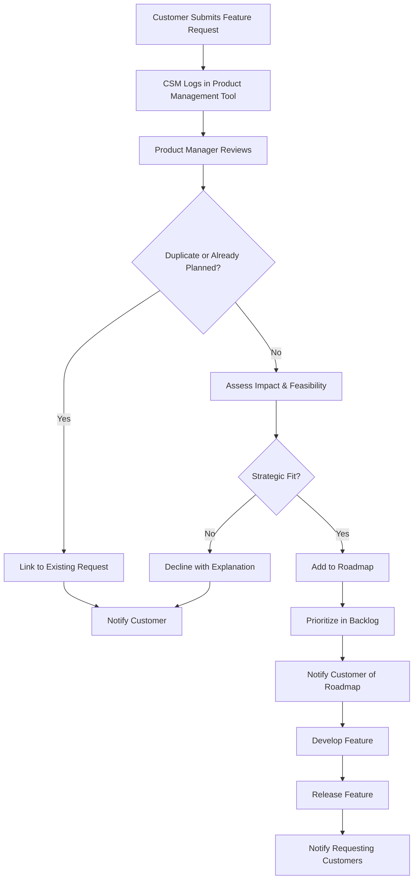

**Frequency:** Ongoing, reviewed monthly

**Owners:**
- CSM: Collect and log requests
- Product Manager: Review and prioritize
- Engineering: Implement features

---

#### Workflow 2: Customer Health Monitoring

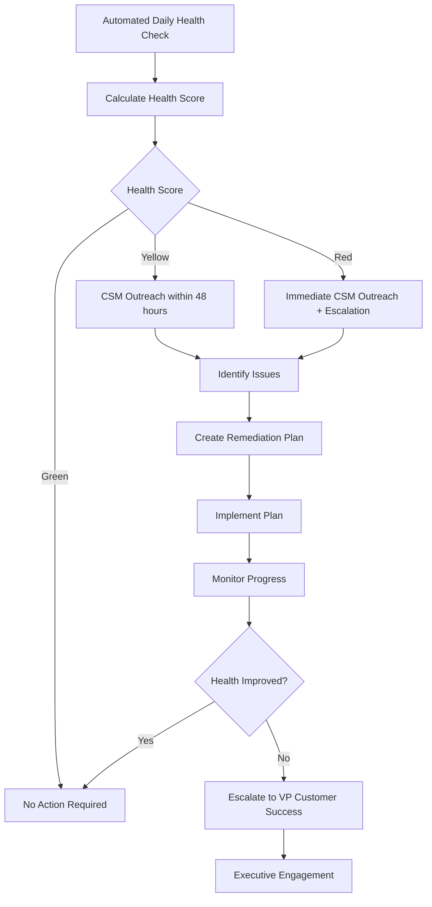

**Health Score Factors:**
- **Usage Frequency**: Daily active users (40% weight)
- **Feature Adoption**: % of features being used (20% weight)
- **Support Tickets**: Volume and severity (15% weight)
- **Customer Feedback**: NPS or CSAT scores (15% weight)
- **Payment History**: On-time payments (10% weight)

**Scoring:**
- **Green (Healthy)**: 75-100
- **Yellow (At Risk)**: 50-74
- **Red (Critical)**: 0-49

**Frequency:** Calculated daily, reviewed weekly by CSMs

---

#### Workflow 3: Escalation Process

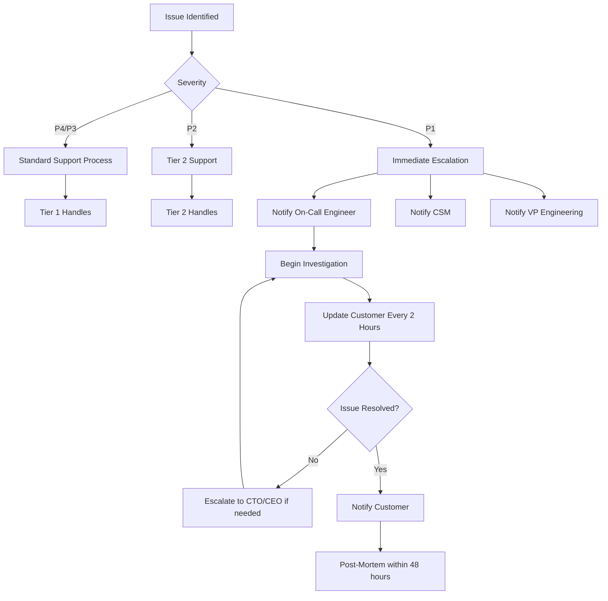

**Escalation Thresholds:**
- **To CSM**: Any P2 ticket open > 24 hours, any P1 ticket
- **To VP Customer Success**: P1 unresolved > 4 hours, customer threatens to churn
- **To CTO**: P1 unresolved > 8 hours, systemic issue
- **To CEO**: Major customer (enterprise tier) at risk of churn

---

#### Workflow 4: Monthly Financial Close

**Purpose:** Accurate, timely financial reporting

**Timeline:** First 5 business days of each month

**Day 1-2: Data Collection**
- Revenue: Export from billing system (Stripe/Chargebee)
- Expenses: Collect invoices and receipts
- Payroll: Finalize payroll with payroll provider

**Day 3: Reconciliation**
- Match bank transactions to accounting records
- Reconcile credit card statements
- Verify all invoices recorded

**Day 4: Financial Statements**
- Generate P&L, Balance Sheet, Cash Flow Statement
- Calculate key metrics (MRR, ARR, CAC, LTV, burn rate)
- Variance analysis (actual vs. budget)

**Day 5: Review and Distribution**
- CFO/Finance Manager reviews for accuracy
- Distribute to leadership team
- Board reporting package (monthly or quarterly)

**Owners:**
- Finance Manager: Leads process
- Accounting Specialist: Data entry and reconciliation
- CFO: Final review and distribution

---

## Process Flows and Diagrams

### 1. Customer Journey Map

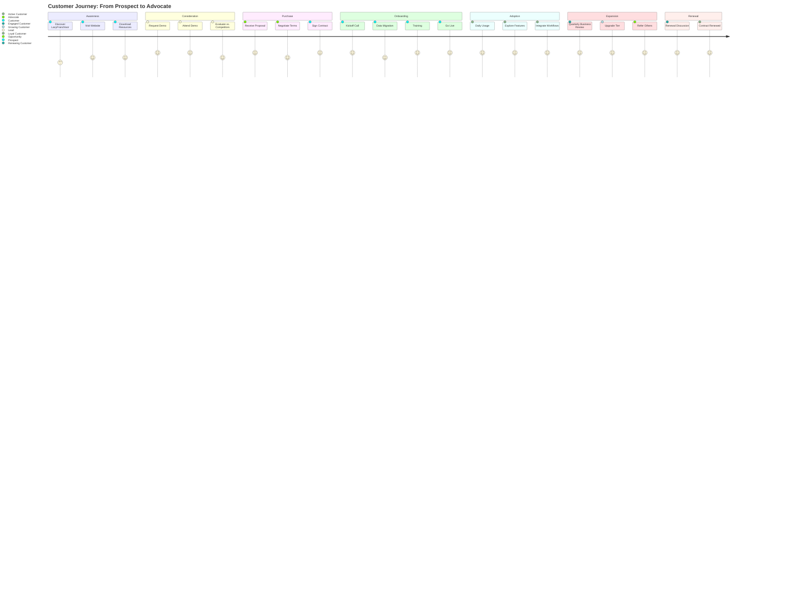

---

### 2. Order Fulfillment Flow (Warehouse Module)

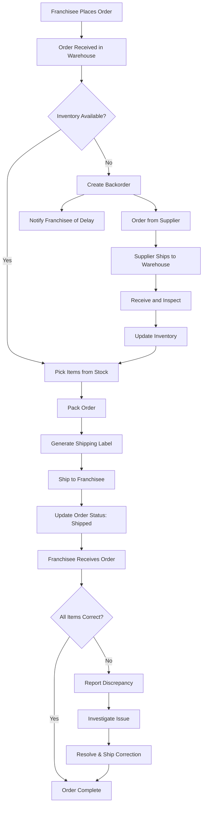

---

### 3. POS Transaction Flow

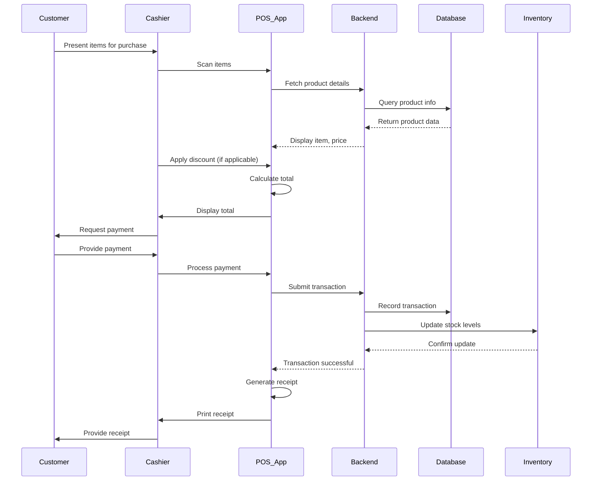

---

### 4. Incident Response Flow

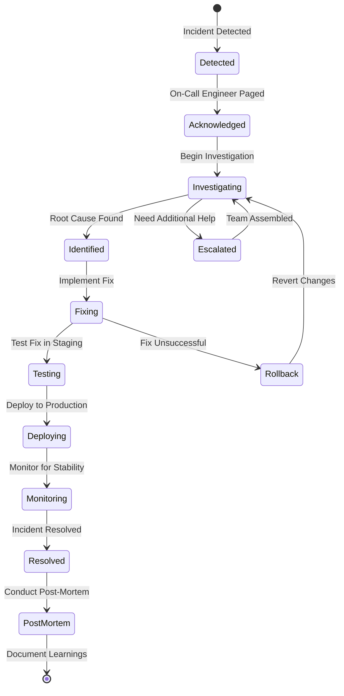

**Incident Severities:**
- **P1 (Critical)**: System down, data loss, security breach
- **P2 (High)**: Major feature unavailable, significant user impact
- **P3 (Medium)**: Minor feature issue, workaround available
- **P4 (Low)**: Cosmetic issue, minimal impact

---

### 5. Product Development Lifecycle

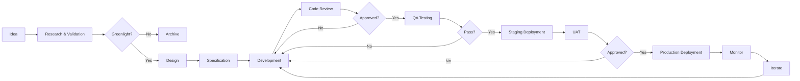

**Key Gates:**
1. **Greenlight**: Product Manager approves based on strategic fit and ROI
2. **Code Review**: Senior engineer approves code quality and architecture
3. **QA Approval**: QA Lead confirms functionality and quality
4. **UAT Approval**: Product Manager confirms feature meets requirements

---

### 6. Sales Pipeline Stages

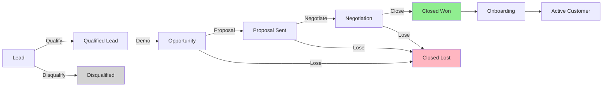

**Stage Definitions:**
- **Lead**: Inbound inquiry or outbound contact
- **Qualified Lead**: Meets BANT criteria (Budget, Authority, Need, Timeline)
- **Opportunity**: Demo completed, active interest
- **Proposal Sent**: Custom quote and contract sent
- **Negotiation**: Discussing terms and pricing
- **Closed Won**: Contract signed 🎉
- **Closed Lost**: Decided not to proceed

**Conversion Rates (Targets):**
- Lead → Qualified Lead: 30%
- Qualified Lead → Opportunity: 50%
- Opportunity → Proposal: 70%
- Proposal → Closed Won: 40%
- **Overall**: Lead → Customer: 4.2%

---

### 7. Customer Onboarding Timeline

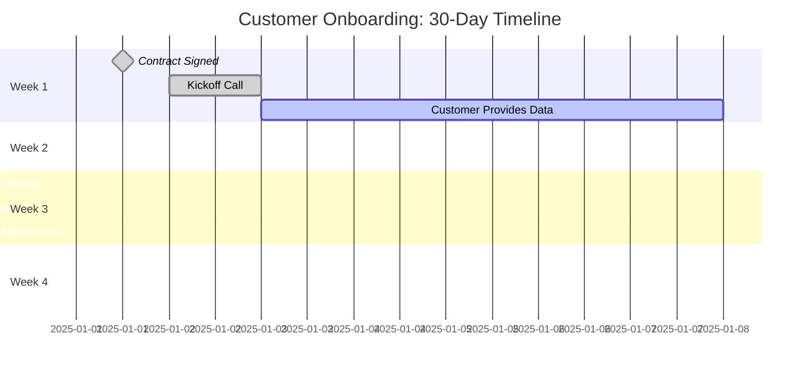

---

## Risk Management

### 1. Key Risks and Mitigation Strategies

#### Risk 1: Development Delays

**Description:** MVP or subsequent releases delayed due to technical complexity, scope creep, or resource constraints

**Likelihood:** Medium
**Impact:** High
**Overall Risk:** High

**Mitigation:**
- Strict scope management for MVP (ruthlessly prioritize)
- Agile methodology with 2-week sprints for early feedback
- Buffer time built into timeline (20% contingency)
- Regular progress reviews and course corrections
- Technical spikes to de-risk complex features early

**Contingency:**
- If 2+ weeks behind: Re-prioritize features, cut non-essentials
- If 4+ weeks behind: Delay launch, communicate to stakeholders
- Consider augmenting team with contractors

---

#### Risk 2: Low Customer Adoption / Poor Product-Market Fit

**Description:** Customers don't see value, low usage, high churn

**Likelihood:** Medium
**Impact:** Critical
**Overall Risk:** High

**Mitigation:**
- Extensive customer discovery before development
- Pilot program with 3-5 design partners for feedback
- Continuous user research and feedback loops
- Data-driven product decisions (analytics on feature usage)
- Customer advisory board for strategic input

**Contingency:**
- If churn > 20% in first year: Conduct exit interviews, pivot features
- If usage low: Enhance onboarding, add in-app guidance
- If feedback negative: Rapid iteration based on feedback

---

#### Risk 3: Security Breach or Data Loss

**Description:** Unauthorized access, data leak, ransomware attack

**Likelihood:** Low
**Impact:** Critical
**Overall Risk:** Medium-High

**Mitigation:**
- Security-first architecture (encryption, RBAC, secure coding)
- Regular security audits and penetration testing
- Automated vulnerability scanning in CI/CD
- Employee security training
- Incident response plan documented and tested
- Cyber insurance coverage

**Contingency:**
- Activate incident response plan
- Engage security firm for forensics
- Transparent communication with affected customers
- Offer credit monitoring services if PII compromised
- Regulatory reporting as required

---

#### Risk 4: Competitive Response

**Description:** Incumbent competitors lower prices or release similar features

**Likelihood:** High
**Impact:** Medium
**Overall Risk:** Medium-High

**Mitigation:**
- Differentiate on user experience and customer service, not just features
- Continuous innovation and fast release cadence
- Build strong customer relationships (high switching costs)
- Focus on underserved mid-market segment
- Maintain cost efficiency to allow price flexibility

**Contingency:**
- If competitor lowers price: Emphasize value and ROI, consider matching for at-risk customers
- If competitor launches similar features: Accelerate roadmap, highlight unique advantages
- If losing deals: Conduct win/loss analysis, adjust positioning

---

#### Risk 5: Key Personnel Turnover

**Description:** Loss of critical team members (founders, lead engineers, key sales)

**Likelihood:** Medium
**Impact:** High
**Overall Risk:** Medium-High

**Mitigation:**
- Competitive compensation (salary + equity)
- Positive company culture and work-life balance
- Career growth opportunities
- Knowledge sharing and documentation (no single point of failure)
- Vesting schedules to incentivize retention

**Contingency:**
- Cross-train team members on critical systems
- Maintain relationships with recruiters for quick backfills
- Offer counter-offers or retention bonuses for critical roles
- Knowledge transfer period before departures

---

#### Risk 6: Insufficient Funding / Burn Rate Too High

**Description:** Run out of cash before achieving profitability or next funding round

**Likelihood:** Low-Medium
**Impact:** Critical
**Overall Risk:** Medium

**Mitigation:**
- Conservative financial planning with 6-month runway buffer
- Monthly financial reviews and forecasting
- Milestone-based hiring (don't hire ahead of revenue)
- Monitor burn rate and extend runway as needed
- Diversify revenue (different customer sizes and industries)

**Contingency:**
- If runway < 9 months: Cut discretionary spending, delay non-essential hires
- If runway < 6 months: Initiate fundraising process, explore bridge financing
- If runway < 3 months: Consider strategic alternatives (acquisition, down round)

---

### 2. Risk Register

| Risk ID | Risk Description | Likelihood | Impact | Overall | Mitigation Owner | Status |
|---------|-----------------|------------|--------|---------|------------------|--------|
| R1 | Development delays | Medium | High | High | VP Engineering | Active |
| R2 | Poor product-market fit | Medium | Critical | High | VP Product | Active |
| R3 | Security breach | Low | Critical | Medium | VP Engineering | Active |
| R4 | Competitive response | High | Medium | Medium | CEO | Active |
| R5 | Key personnel turnover | Medium | High | Medium | CEO / HR | Active |
| R6 | Insufficient funding | Low | Critical | Medium | CFO | Active |
| R7 | Infrastructure outage | Low | High | Medium | VP Engineering | Active |
| R8 | Regulatory changes | Low | Medium | Low | CFO / Legal | Monitoring |

**Risk Review Frequency:**
- **Monthly**: Update risk register, assess status
- **Quarterly**: Deep dive review with leadership team
- **Ad-hoc**: If major risk materializes or new risk identified

---

## Success Metrics and KPIs

### 1. Product and Engineering Metrics

#### Development Velocity
- **Sprint Velocity**: Story points completed per sprint (target: consistent ±10%)
- **Cycle Time**: Days from start to production (target: < 14 days)
- **Deployment Frequency**: Releases per month (target: 2+ per month by Year 1 end)

#### Quality
- **Code Coverage**: % of code covered by tests (target: > 80%)
- **Bug Escape Rate**: Bugs found in production vs. QA (target: < 10%)
- **Critical Bugs**: P1 incidents per month (target: < 2)
- **Mean Time to Resolution (MTTR)**: Hours to fix critical bugs (target: < 4 hours)

#### Performance
- **API Response Time**: 95th percentile (target: < 500ms)
- **Page Load Time**: Web app (target: < 2 seconds)
- **Uptime**: System availability (target: 99.9% = ~43 minutes downtime/month)

---

### 2. Customer Success Metrics

#### Onboarding
- **Time to Go-Live**: Days from contract to active usage (target: < 30 days)
- **Onboarding Completion Rate**: % of customers who complete onboarding (target: > 95%)
- **Time to First Value**: Days until customer sees measurable benefit (target: < 7 days)

#### Adoption
- **Daily Active Users (DAU)**: % of licensed users active daily (target: > 60%)
- **Feature Adoption Rate**: % of customers using key features (target: > 75%)
- **Mobile App Adoption**: % of users with mobile app installed (target: > 50%)

#### Satisfaction
- **Net Promoter Score (NPS)**: Customer loyalty metric (target: > 50)
- **Customer Satisfaction (CSAT)**: Post-interaction rating (target: > 4.5/5)
- **Customer Effort Score (CES)**: Ease of use rating (target: < 2/5 = "very easy")

#### Retention
- **Logo Retention Rate**: % of customers who renew (target: > 95%)
- **Net Revenue Retention (NRR)**: Revenue retention including upsells (target: > 110%)
- **Churn Rate**: % of customers who cancel (target: < 5% annually)

---

### 3. Sales and Marketing Metrics

#### Lead Generation
- **Marketing Qualified Leads (MQLs)**: Leads meeting qualification criteria (target: 2,000/year)
- **Lead-to-MQL Conversion**: % of leads qualified (target: > 30%)
- **Cost Per Lead (CPL)**: Marketing spend / leads (target: < $50)

#### Pipeline
- **Sales Qualified Opportunities (SQLs)**: Active sales opportunities (target: 300/year)
- **Pipeline Value**: Total value of open opportunities (target: > 6x quarterly quota)
- **Win Rate**: % of opportunities closed-won (target: > 40%)

#### Revenue
- **Monthly Recurring Revenue (MRR)**: Predictable monthly revenue
- **Annual Recurring Revenue (ARR)**: MRR × 12
- **Customer Acquisition Cost (CAC)**: Sales & marketing spend / new customers
- **Lifetime Value (LTV)**: Average revenue per customer over lifetime
- **LTV:CAC Ratio**: Target > 3:1
- **Months to Recover CAC**: Target < 18 months

#### Targets by Year

| Metric | Year 1 | Year 2 | Year 3 |
|--------|--------|--------|--------|
| **Customers** | 10 | 50 | 110 |
| **MRR** | $50K | $210K | $535K |
| **ARR** | $250K | $1.8M | $4.8M |
| **CAC** | $15K | $12K | $10K |
| **LTV** | $75K | $100K | $120K |
| **LTV:CAC** | 5:1 | 8.3:1 | 12:1 |

---

### 4. Financial Metrics

#### Revenue
- **Total Revenue**: Sum of all revenue streams
- **Revenue Growth Rate**: Month-over-month and year-over-year
- **Average Revenue Per Account (ARPA)**: Total revenue / customers

#### Expenses
- **Operating Expenses (OpEx)**: Total monthly expenses
- **Burn Rate**: Monthly cash spent (negative cash flow)
- **Runway**: Months of cash remaining at current burn rate

#### Profitability
- **Gross Margin**: (Revenue - COGS) / Revenue (target: > 80% for SaaS)
- **EBITDA**: Earnings before interest, taxes, depreciation, amortization
- **Rule of 40**: Revenue growth % + Profit margin % (target: > 40)

#### Cash Flow
- **Cash Balance**: Total cash on hand
- **Cash Flow from Operations**: Cash generated from business activities
- **Days Sales Outstanding (DSO)**: Average days to collect payment (target: < 30)

---

### 5. Dashboard and Reporting

#### Executive Dashboard (Weekly)
- MRR and ARR
- New customers and churn
- Pipeline value and conversion rates
- Cash balance and burn rate
- Critical incidents and uptime

#### Product Dashboard (Daily)
- Active users (DAU, WAU, MAU)
- Feature adoption
- System performance and errors
- Release progress

#### Customer Success Dashboard (Daily)
- Customer health scores
- Onboarding pipeline
- Support ticket volume and SLA compliance
- NPS and CSAT scores

#### Sales Dashboard (Daily)
- Pipeline by stage
- Deals closing this month
- Activity metrics (calls, demos, proposals)
- Win/loss analysis

---

## Conclusion and Next Steps

LazyFranchisor is poised to transform franchise management through innovative technology, thoughtful design, and customer-centric operations. This comprehensive plan provides a roadmap across three critical dimensions:

### Software Development
- **18-month phased approach** from MVP to enterprise-grade platform
- **Modern, scalable technology stack** (Rust, React, PostgreSQL)
- **Rigorous development practices** ensuring quality and security
- **Clear milestones** for accountability and progress tracking

### Business Development
- **Multi-channel go-to-market strategy** targeting $5M ARR by Year 3
- **Competitive pricing** that disrupts market leaders
- **Strong focus on customer acquisition** through events, content, and partnerships
- **Data-driven sales process** with clear conversion targets

### Operations
- **Documented SOPs** for consistency and scalability
- **Customer-first approach** with 95% retention target
- **Proactive risk management** addressing key threats
- **Comprehensive metrics** for continuous improvement

### Immediate Next Steps (Month 1)

1. **Finalize Team Structure**:
   - Hire Engineering Lead and initial engineers
   - Hire Product Manager
   - Secure DevOps/infrastructure expertise

2. **Set Up Infrastructure**:
   - Cloud accounts (AWS/GCP)
   - Development tools (GitHub, Jira/Linear, Slack)
   - CI/CD pipelines
   - Staging and production environments

3. **Kick Off Development**:
   - Repository setup and project initialization
   - Database schema design
   - Authentication and authorization implementation
   - Begin Sprint 1

4. **Business Foundation**:
   - Finalize brand identity and messaging
   - Launch company website
   - Set up CRM and sales tools
   - Begin content creation for SEO

5. **Legal and Compliance**:
   - Finalize terms of service and privacy policy
   - Ensure GDPR compliance framework
   - Review contracts with legal counsel
   - Establish security and data protection policies

---

**This plan is a living document.** It should be reviewed quarterly and updated based on actual results, market feedback, and strategic pivots. Success requires disciplined execution, continuous learning, and relentless focus on customer value.

**Let's build the future of franchise management together.**

---

**Document Control:**
- **Version**: 1.0
- **Last Updated**: October 28, 2025
- **Next Review**: January 28, 2026
- **Owner**: CEO / Founding Team
- **Distribution**: All employees, investors, board members

---

## Appendix

### A. Glossary of Terms

- **ARR (Annual Recurring Revenue)**: Predictable revenue expected annually from subscriptions
- **ARPU (Average Revenue Per User)**: Total revenue divided by number of customers
- **CAC (Customer Acquisition Cost)**: Total sales and marketing expenses divided by new customers acquired
- **CSAT (Customer Satisfaction Score)**: Survey metric measuring customer satisfaction (typically 1-5 scale)
- **CSM (Customer Success Manager)**: Role responsible for ensuring customers achieve desired outcomes
- **LTV (Lifetime Value)**: Total revenue expected from a customer over their entire relationship
- **MQL (Marketing Qualified Lead)**: Lead that meets qualification criteria and is ready for sales outreach
- **MRR (Monthly Recurring Revenue)**: Predictable revenue expected monthly from subscriptions
- **NPS (Net Promoter Score)**: Customer loyalty metric (-100 to +100) based on "likelihood to recommend"
- **NRR (Net Revenue Retention)**: Percentage of revenue retained from existing customers (includes expansion, excludes new customers)
- **QBR (Quarterly Business Review)**: Regular meeting between CSM and customer to review progress and goals
- **RBAC (Role-Based Access Control)**: Security approach restricting system access based on user roles
- **SLA (Service Level Agreement)**: Commitment between service provider and customer defining expected service levels
- **SQL (Sales Qualified Lead)**: Lead vetted by sales team as having genuine purchase intent

### B. References and Resources

**Industry Reports:**
- Franchise Business Review: Annual Franchise Industry Report
- International Franchise Association (IFA): Economic Impact Study
- Statista: Franchise Industry Statistics

**Competitive Analysis:**
- G2 Reviews: Franchise Management Software Category
- Capterra: User Reviews and Comparisons

**Technology Resources:**
- Rust Documentation: https://doc.rust-lang.org/
- Axum Framework: https://docs.rs/axum/
- React Documentation: https://react.dev/
- PostgreSQL Documentation: https://www.postgresql.org/docs/

**Best Practices:**
- SaaS Metrics by Christoph Janz
- "The SaaS Playbook" by Rob Walling
- "Lean Analytics" by Alistair Croll and Benjamin Yoskovitz

---

*End of Document*
