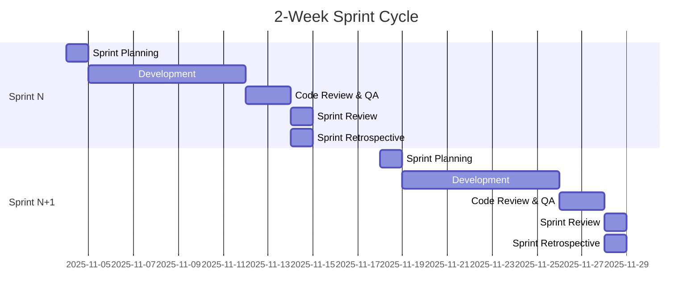

# LazyFranchisor: Development Team Handbook - Part 2

**Document Version:** 1.0
**Date:** October 29, 2025
**Purpose:** Continuation of Development Team Handbook - Sprint Planning, ADRs, Performance, Security, Deployment

---

## Table of Contents (Part 2)

9. [Sprint Planning & Agile Process](#sprint-planning--agile-process)
10. [Architecture Decision Records](#architecture-decision-records)
11. [Performance & Optimization](#performance--optimization)
12. [Security Guidelines](#security-guidelines)
13. [Deployment Procedures](#deployment-procedures)
14. [Monitoring & Debugging](#monitoring--debugging)
15. [Team Communication](#team-communication)
16. [Onboarding New Engineers](#onboarding-new-engineers)
17. [Technical Debt Management](#technical-debt-management)
18. [Incident Response](#incident-response)

---

## Sprint Planning & Agile Process

### Sprint Structure (2-Week Sprints)



---

### Sprint Ceremonies

#### 1. Sprint Planning (Monday, 9:00 AM - 12:00 PM)

**Attendees:** Entire development team + Product Manager + Designer

**Agenda:**
1. Review sprint goal (30 min)
2. Review and refine backlog items (60 min)
3. Team commitment and capacity planning (30 min)
4. Technical discussion and task breakdown (60 min)

**Output:**
- Sprint goal defined
- User stories committed
- Tasks created and estimated
- Team capacity allocated

**Planning Poker:**
```
Story Points Scale (Fibonacci):
1  - Trivial (1-2 hours)
2  - Small (2-4 hours)
3  - Medium (4-8 hours)
5  - Large (1-2 days)
8  - Very Large (2-3 days)
13 - Huge (3-5 days) - Should be broken down
21+ - Epic - Must be broken down
```

**Example Sprint Backlog:**
```markdown
## Sprint 12: November 4-17, 2025

**Sprint Goal:** Complete Accounting Module MVP

**Committed Stories (34 points):**

### High Priority
- [8pts] As a franchisee, I can record sales transactions
  - [ ] Create SalesTransaction model and migration
  - [ ] Implement POST /api/v1/sales endpoint
  - [ ] Add input validation
  - [ ] Write unit tests
  - [ ] Write integration tests

- [5pts] As a franchisee, I can view daily sales summary
  - [ ] Implement GET /api/v1/sales/summary endpoint
  - [ ] Add date range filtering
  - [ ] Create summary dashboard UI
  - [ ] Add loading states

### Medium Priority
- [8pts] As a franchisee, I can export sales data to CSV
  - [ ] Implement CSV export endpoint
  - [ ] Add frontend export button
  - [ ] Handle large datasets (pagination)
  - [ ] Test download functionality

### Low Priority
- [5pts] As an admin, I can view all franchisee sales
  - [ ] Add admin-only endpoint
  - [ ] Implement permission checks
  - [ ] Create admin sales view

**Team Capacity:**
- Backend Team: 60 hours (3 engineers × 20 hours)
- Frontend Team: 40 hours (2 engineers × 20 hours)
- Total: 100 hours = ~40 story points
- Buffer: 15% (6 points)
- Committed: 34 points
```

---

#### 2. Daily Standup (Every Day, 9:30 AM - 9:45 AM)

**Format:** Each person answers:
1. What did I accomplish yesterday?
2. What will I work on today?
3. Are there any blockers?

**Rules:**
- Keep it brief (15 minutes max)
- Discuss details after the standup
- Update task board before standup
- Be on time

**Example Standup Update:**
```
John (Backend):
✅ Yesterday: Completed sales transaction model and migration
🔄 Today: Implementing POST /api/v1/sales endpoint
🚫 Blockers: None

Sarah (Frontend):
✅ Yesterday: Created sales form UI component
🔄 Today: Integrating sales form with API
🚫 Blockers: Waiting for API endpoint from John (discussed, will pair this afternoon)

Mike (DevOps):
✅ Yesterday: Set up staging environment monitoring
🔄 Today: Configuring automated backups
🚫 Blockers: Need AWS permissions escalation (will ping CTO)
```

---

#### 3. Sprint Review (Last Day, 2:00 PM - 3:00 PM)

**Attendees:** Team + Stakeholders (CEO, Product, Sales, CS)

**Agenda:**
1. Demo completed features (40 min)
2. Review sprint metrics (10 min)
3. Stakeholder feedback (10 min)

**Demo Checklist:**
- [ ] Prepare demo environment
- [ ] Test all features before demo
- [ ] Prepare talking points
- [ ] Invite stakeholders
- [ ] Record demo (optional)

---

#### 4. Sprint Retrospective (Last Day, 3:15 PM - 4:15 PM)

**Format:** Start, Stop, Continue

**Questions:**
- What went well?
- What didn't go well?
- What should we improve?
- Action items for next sprint

**Example Retrospective:**
```markdown
## Sprint 12 Retrospective

### What Went Well (Continue)
- Pair programming on complex API design helped knowledge sharing
- Automated testing caught 3 critical bugs before QA
- Communication on Slack was responsive

### What Didn't Go Well (Stop)
- Too many meetings interrupted deep work
- Code reviews took too long (avg 24 hours)
- Design specs came late, causing rework

### Action Items (Start)
1. [Mike] Block "Focus Time" on calendar (10-12 AM daily)
2. [Sarah] Set code review SLA: 4 hours for critical, 8 hours for normal
3. [Product] Finalize designs 2 days before sprint planning
4. [Team] Try mob programming for architecture decisions

### Kudos
- John: Great job on database optimization, 50% query speedup!
- Sarah: Excellent UI polish, stakeholders loved the demo
```

---

### Story Writing Template

```markdown
## User Story Title

**As a** [role]
**I want** [feature]
**So that** [benefit]

### Acceptance Criteria
- [ ] Criterion 1
- [ ] Criterion 2
- [ ] Criterion 3

### Technical Notes
- Use existing authentication middleware
- Store data in `sales_transactions` table
- Follow error handling patterns from auth module

### Design
[Link to Figma mockups]

### API Contract
```json
POST /api/v1/sales
{
  "franchisee_id": "uuid",
  "total_amount": 123.45,
  "payment_method": "cash",
  "line_items": [...]
}
```

### Definition of Done
- [ ] Code complete and tested
- [ ] Code review approved
- [ ] Unit tests written (>80% coverage)
- [ ] Integration tests written
- [ ] Documentation updated
- [ ] Deployed to staging
- [ ] QA verified
- [ ] Product owner accepted

### Estimation
**Story Points:** 8

### Dependencies
- Depends on: #234 (Product model)
- Blocks: #246 (Sales reporting)
```

---

### Task Board (GitHub Projects / Linear)

**Columns:**
```
Backlog → Ready → In Progress → In Review → QA → Done
```

**Example Board:**
```
┌─────────┬─────────┬─────────────┬──────────┬─────┬──────┐
│ Backlog │  Ready  │ In Progress │ In Review│ QA  │ Done │
├─────────┼─────────┼─────────────┼──────────┼─────┼──────┤
│ #250    │ #245    │ #234 (John) │ #230     │#228 │ #220 │
│ Export  │ Dashboard│ Sales API   │ Auth fix │Form │Login │
│ CSV     │ UI       │             │          │     │      │
│         │          │             │          │     │      │
│ #251    │ #246    │ #235 (Sarah)│ #231     │     │ #221 │
│ Filters │ Reports  │ Form UI     │ UI polish│     │Signup│
│         │          │             │          │     │      │
│ #252    │         │ #236 (Mike) │          │     │ #222 │
│ Multi-  │         │ Monitoring  │          │     │Tests │
│ currency│         │             │          │     │      │
└─────────┴─────────┴─────────────┴──────────┴─────┴──────┘
```

---

### Velocity Tracking

**Track Velocity Over Time:**
```
Sprint  | Committed | Completed | Velocity | Notes
--------|-----------|-----------|----------|------------------
10      | 32        | 28        | 28       | Holiday week
11      | 35        | 35        | 35       | On target
12      | 34        | 32        | 32       | Prod incident
13      | 36        | 36        | 36       | Strong sprint
14      | 38        | 34        | 34       | Over-committed
--------|-----------|-----------|----------|------------------
Avg     |           |           | 33       | Use for planning
```

**Velocity Chart:**
```
Points
  40 ┤     ╭─╮   ╭─╮
  35 ┤   ╭─╯ ╰───╯ ╰─╮
  30 ┤ ╭─╯           ╰─
  25 ┤ │
  20 ┤ │
     └─┴─┴─┴─┴─┴─┴─┴─┴─
       10 11 12 13 14  Sprint
```

---

## Architecture Decision Records

### ADR Template

```markdown
# ADR-001: Use Rust with Axum for Backend API

**Date:** 2025-10-15
**Status:** Accepted
**Deciders:** CTO, Senior Backend Engineer, Backend Team
**Consulted:** DevOps, Frontend Team

## Context
We need to choose a backend framework for the LazyFranchisor API. Key requirements:
- High performance (handle 1000+ req/sec)
- Type safety to reduce runtime errors
- Good async/concurrent support
- Strong ecosystem
- Team can learn/adopt quickly

## Decision
We will use **Rust with the Axum web framework** for the backend API.

## Rationale

### Why Rust?
- **Performance:** Comparable to C/C++, much faster than Node.js/Python
- **Safety:** Compile-time guarantees prevent memory bugs, data races
- **Concurrency:** Tokio async runtime handles high concurrency efficiently
- **Type Safety:** Strong type system catches bugs at compile time
- **Cost:** Lower infrastructure costs due to efficiency

### Why Axum?
- Built on proven Tokio async runtime
- Type-safe routing and handlers
- Minimal boilerplate compared to Actix-web
- Excellent middleware ecosystem
- Strong community momentum

### Alternatives Considered

**Node.js (Express/Fastify):**
- ✅ Team familiarity
- ✅ Faster development initially
- ❌ Lower performance
- ❌ Runtime type errors
- ❌ Weaker concurrency model

**Go (Gin/Echo):**
- ✅ Good performance
- ✅ Fast compilation
- ✅ Simpler language
- ❌ No generics (at decision time)
- ❌ GC pauses

**Python (FastAPI):**
- ✅ Fast prototyping
- ✅ Great for ML integration (future)
- ❌ Much slower performance
- ❌ GIL limits concurrency

## Consequences

### Positive
- Superior performance and resource efficiency
- Compile-time safety reduces production bugs
- Strong typing improves maintainability
- Lower AWS costs

### Negative
- Steeper learning curve for team
- Slower initial development
- Smaller talent pool for hiring
- Longer compile times

### Neutral
- Need to invest in Rust training
- May need to contribute to ecosystem

## Implementation
- Week 1-2: Team Rust training (async, error handling, sqlx)
- Week 3: Set up project structure, CI/CD
- Week 4+: Begin feature development

## Monitoring
- Track development velocity vs Node.js baseline
- Monitor team satisfaction with Rust
- Re-evaluate after 3 months (Jan 2026)

## References
- Axum Documentation: https://docs.rs/axum
- Tokio Guide: https://tokio.rs/
- Rust Performance Benchmarks: [internal link]
```

---

### Existing ADRs

#### ADR-002: PostgreSQL with PostGIS for Database

**Decision:** Use PostgreSQL 15+ with PostGIS extension

**Rationale:**
- ACID compliance required for financial data
- PostGIS for geo-location features
- Excellent JSON support
- Strong RBAC capabilities
- Proven at scale

---

#### ADR-003: React with TypeScript for Frontend

**Decision:** Use React 18+ with TypeScript

**Rationale:**
- Large ecosystem of components
- Strong TypeScript support
- Team expertise
- Excellent developer tools
- Mobile code sharing via React Native

---

#### ADR-004: Monorepo vs Multi-Repo

**Decision:** Use monorepo with workspace structure

**Rationale:**
- Easier code sharing between web/mobile
- Atomic commits across frontend/backend
- Simplified dependency management
- Unified CI/CD pipeline

**Structure:**
```
lazyfranchisor/
├── backend/          (Rust workspace)
├── frontend/
│   ├── web/         (React)
│   ├── mobile/      (React Native)
│   └── shared/      (Shared types, utils)
└── infrastructure/  (Terraform, K8s)
```

---

#### ADR-005: Redis for Session and Cache Layer

**Decision:** Use Redis for caching and sessions

**Rationale:**
- Sub-millisecond latency
- Pub/sub for real-time features
- Automatic expiration
- Proven reliability

**Usage:**
- Session tokens: 15 min TTL
- Permissions cache: 5 min TTL
- Dashboard aggregations: 5 min TTL

---

## Performance & Optimization

### Performance Targets

**API Response Times (95th percentile):**
```
Endpoint Type          | Target  | Acceptable | Unacceptable
-----------------------|---------|------------|-------------
Simple GET (by ID)     | <100ms  | <200ms     | >500ms
Complex GET (filtered) | <300ms  | <500ms     | >1s
POST/PUT              | <200ms  | <400ms     | >1s
Batch operations      | <1s     | <2s        | >5s
Report generation     | <2s     | <5s        | >10s
```

**Frontend Performance:**
```
Metric                 | Target  | Acceptable | Unacceptable
-----------------------|---------|------------|-------------
First Contentful Paint | <1s     | <2s        | >3s
Time to Interactive    | <2s     | <3.5s      | >5s
Largest Contentful Paint| <2.5s  | <4s        | >5s
Cumulative Layout Shift| <0.1    | <0.25      | >0.25
```

---

### Backend Optimization Techniques

#### 1. Database Query Optimization

**Use EXPLAIN ANALYZE:**
```sql
EXPLAIN ANALYZE
SELECT
    s.id,
    s.total_amount,
    s.created_at,
    f.name AS franchisee_name,
    COUNT(li.id) AS item_count
FROM sales_transactions s
JOIN franchisees f ON s.franchisee_id = f.id
LEFT JOIN sales_line_items li ON s.id = li.transaction_id
WHERE s.created_at >= NOW() - INTERVAL '30 days'
  AND f.is_active = true
GROUP BY s.id, f.name
ORDER BY s.created_at DESC
LIMIT 100;

-- Look for:
-- - Sequential scans (add indexes)
-- - High cost operations
-- - Missing indexes
```

**Add Indexes:**
```sql
-- Cover common query patterns
CREATE INDEX idx_sales_created_at ON sales_transactions(created_at DESC);
CREATE INDEX idx_sales_franchisee_created ON sales_transactions(franchisee_id, created_at);

-- Partial indexes for common filters
CREATE INDEX idx_active_franchisees ON franchisees(id) WHERE is_active = true;

-- Composite indexes for sorting + filtering
CREATE INDEX idx_sales_franchisee_date_amount
    ON sales_transactions(franchisee_id, created_at DESC, total_amount);
```

**Use Connection Pooling:**
```rust
// src/db.rs
use sqlx::postgres::{PgPool, PgPoolOptions};

pub async fn create_pool(database_url: &str) -> Result<PgPool> {
    PgPoolOptions::new()
        .max_connections(20)
        .min_connections(5)
        .acquire_timeout(Duration::from_secs(3))
        .idle_timeout(Duration::from_secs(600))
        .max_lifetime(Duration::from_secs(1800))
        .connect(database_url)
        .await
        .map_err(|e| anyhow!("Failed to create pool: {}", e))
}
```

---

#### 2. Caching Strategy

**Multi-Layer Caching:**
```rust
// src/services/product_service.rs

pub struct ProductService {
    db: PgPool,
    cache: Arc<CacheService>,
}

impl ProductService {
    pub async fn get_product(&self, id: Uuid) -> Result<Product> {
        let cache_key = format!("product:{}", id);

        // Layer 1: Redis cache
        if let Ok(cached) = self.cache.get::<Product>(&cache_key).await {
            return Ok(cached);
        }

        // Layer 2: Database
        let product = sqlx::query_as::<_, Product>(
            "SELECT * FROM products WHERE id = $1"
        )
        .bind(id)
        .fetch_one(&self.db)
        .await?;

        // Update cache
        self.cache.set(&cache_key, &product, 3600).await?;

        Ok(product)
    }

    pub async fn get_active_products(&self) -> Result<Vec<Product>> {
        let cache_key = "products:active";

        // Cache list queries for 5 minutes
        self.cache.get_or_set(
            cache_key,
            300,
            || async {
                sqlx::query_as::<_, Product>(
                    "SELECT * FROM products WHERE is_active = true ORDER BY name"
                )
                .fetch_all(&self.db)
                .await
            }
        ).await
    }
}
```

**Cache Invalidation:**
```rust
impl ProductService {
    pub async fn update_product(&self, id: Uuid, data: UpdateProductData) -> Result<Product> {
        // Update database
        let product = sqlx::query_as::<_, Product>(
            "UPDATE products SET name = $1, price = $2, updated_at = NOW()
             WHERE id = $3 RETURNING *"
        )
        .bind(&data.name)
        .bind(data.price)
        .bind(id)
        .fetch_one(&self.db)
        .await?;

        // Invalidate caches
        self.cache.delete(&format!("product:{}", id)).await?;
        self.cache.delete("products:active").await?;

        Ok(product)
    }
}
```

---

#### 3. Async/Concurrent Operations

**Parallel Queries:**
```rust
use futures::future::try_join_all;

pub async fn get_dashboard_data(&self, franchisee_id: Uuid) -> Result<DashboardData> {
    // Execute queries in parallel
    let (sales, inventory, notifications) = tokio::try_join!(
        self.get_sales_summary(franchisee_id),
        self.get_inventory_alerts(franchisee_id),
        self.get_recent_notifications(franchisee_id),
    )?;

    Ok(DashboardData {
        sales,
        inventory,
        notifications,
    })
}
```

**Batch Processing:**
```rust
pub async fn process_daily_reports(&self) -> Result<()> {
    let franchisees = self.get_all_active_franchisees().await?;

    // Process in batches of 10 to avoid overwhelming the database
    let chunks = franchisees.chunks(10);

    for chunk in chunks {
        let futures = chunk.iter().map(|f| {
            self.generate_daily_report(f.id)
        });

        try_join_all(futures).await?;
    }

    Ok(())
}
```

---

#### 4. Response Pagination

**Cursor-Based Pagination:**
```rust
#[derive(Deserialize)]
pub struct PaginationParams {
    cursor: Option<Uuid>,
    limit: Option<i64>,
}

pub async fn get_sales_paginated(
    &self,
    params: PaginationParams,
) -> Result<PaginatedResponse<SalesTransaction>> {
    let limit = params.limit.unwrap_or(50).min(100);

    let mut query = QueryBuilder::new(
        "SELECT * FROM sales_transactions WHERE franchisee_id = "
    );
    query.push_bind(franchisee_id);

    if let Some(cursor) = params.cursor {
        query.push(" AND id < ");
        query.push_bind(cursor);
    }

    query.push(" ORDER BY id DESC LIMIT ");
    query.push_bind(limit + 1);

    let mut results = query
        .build_query_as::<SalesTransaction>()
        .fetch_all(&self.db)
        .await?;

    let has_more = results.len() > limit as usize;
    if has_more {
        results.pop();
    }

    let next_cursor = results.last().map(|s| s.id);

    Ok(PaginatedResponse {
        data: results,
        next_cursor,
        has_more,
    })
}
```

---

### Frontend Optimization Techniques

#### 1. Code Splitting

```typescript
// src/App.tsx
import { lazy, Suspense } from 'react';
import { BrowserRouter, Routes, Route } from 'react-router-dom';
import { LoadingSpinner } from './components/common';

// Lazy load route components
const Dashboard = lazy(() => import('./pages/Dashboard'));
const Sales = lazy(() => import('./pages/Sales'));
const Inventory = lazy(() => import('./pages/Inventory'));
const Reports = lazy(() => import('./pages/Reports'));

export const App = () => {
  return (
    <BrowserRouter>
      <Suspense fallback={<LoadingSpinner />}>
        <Routes>
          <Route path="/" element={<Dashboard />} />
          <Route path="/sales" element={<Sales />} />
          <Route path="/inventory" element={<Inventory />} />
          <Route path="/reports" element={<Reports />} />
        </Routes>
      </Suspense>
    </BrowserRouter>
  );
};
```

---

#### 2. React Performance Optimization

**Memoization:**
```typescript
import { memo, useMemo, useCallback } from 'react';

interface SalesListProps {
  sales: SalesTransaction[];
  onSelect: (id: string) => void;
}

export const SalesList = memo<SalesListProps>(({ sales, onSelect }) => {
  // Memoize expensive calculations
  const totalSales = useMemo(() => {
    return sales.reduce((sum, sale) => sum + sale.totalAmount, 0);
  }, [sales]);

  // Memoize callbacks to prevent re-renders
  const handleSelect = useCallback((id: string) => {
    onSelect(id);
  }, [onSelect]);

  return (
    <div>
      <h2>Total: ${totalSales.toFixed(2)}</h2>
      {sales.map(sale => (
        <SaleItem
          key={sale.id}
          sale={sale}
          onSelect={handleSelect}
        />
      ))}
    </div>
  );
});
```

**Virtualization for Large Lists:**
```typescript
import { FixedSizeList } from 'react-window';

export const LargeInventoryList = ({ items }: { items: InventoryItem[] }) => {
  const Row = ({ index, style }: { index: number; style: React.CSSProperties }) => (
    <div style={style}>
      <InventoryRow item={items[index]} />
    </div>
  );

  return (
    <FixedSizeList
      height={600}
      itemCount={items.length}
      itemSize={60}
      width="100%"
    >
      {Row}
    </FixedSizeList>
  );
};
```

---

#### 3. API Request Optimization

**Request Deduplication:**
```typescript
// src/hooks/useApiCache.ts
import { useQuery } from '@tanstack/react-query';
import api from '../services/api';

export function useApiCache<T>(key: string, endpoint: string) {
  return useQuery({
    queryKey: [key],
    queryFn: async () => {
      const response = await api.get<T>(endpoint);
      return response.data;
    },
    staleTime: 5 * 60 * 1000, // 5 minutes
    cacheTime: 10 * 60 * 1000, // 10 minutes
  });
}

// Usage
const { data, isLoading } = useApiCache<Product[]>('products', '/api/v1/products');
```

**Debounced Search:**
```typescript
import { useState, useEffect } from 'react';
import { useDebounce } from './useDebounce';

export const SearchProducts = () => {
  const [searchTerm, setSearchTerm] = useState('');
  const debouncedSearch = useDebounce(searchTerm, 500);
  const [results, setResults] = useState<Product[]>([]);

  useEffect(() => {
    if (debouncedSearch) {
      api.get(`/api/v1/products/search?q=${debouncedSearch}`)
        .then(res => setResults(res.data));
    }
  }, [debouncedSearch]);

  return (
    <input
      value={searchTerm}
      onChange={(e) => setSearchTerm(e.target.value)}
      placeholder="Search products..."
    />
  );
};
```

---

#### 4. Image Optimization

```typescript
// Use modern formats with fallbacks
export const OptimizedImage = ({ src, alt }: { src: string; alt: string }) => {
  return (
    <picture>
      <source srcSet={`${src}.webp`} type="image/webp" />
      <source srcSet={`${src}.jpg`} type="image/jpeg" />
      
    </picture>
  );
};
```

---

### Performance Monitoring

**Backend Metrics:**
```rust
use prometheus::{Encoder, TextEncoder, Registry, HistogramVec};

lazy_static! {
    static ref HTTP_REQUEST_DURATION: HistogramVec = HistogramVec::new(
        prometheus::histogram_opts!(
            "http_request_duration_seconds",
            "HTTP request duration in seconds"
        ),
        &["method", "endpoint", "status"]
    ).unwrap();
}

// Middleware to track request duration
pub async fn metrics_middleware(
    req: Request<Body>,
    next: Next<Body>,
) -> Response {
    let method = req.method().clone();
    let path = req.uri().path().to_string();
    let start = Instant::now();

    let response = next.run(req).await;

    let duration = start.elapsed().as_secs_f64();
    let status = response.status().as_u16().to_string();

    HTTP_REQUEST_DURATION
        .with_label_values(&[method.as_str(), &path, &status])
        .observe(duration);

    response
}
```

**Frontend Metrics:**
```typescript
// Track Web Vitals
import { getCLS, getFID, getFCP, getLCP, getTTFB } from 'web-vitals';

function sendToAnalytics(metric: Metric) {
  const body = JSON.stringify(metric);
  // Use `navigator.sendBeacon()` if available, falling back to `fetch()`
  if (navigator.sendBeacon) {
    navigator.sendBeacon('/api/analytics', body);
  } else {
    fetch('/api/analytics', { body, method: 'POST', keepalive: true });
  }
}

getCLS(sendToAnalytics);
getFID(sendToAnalytics);
getFCP(sendToAnalytics);
getLCP(sendToAnalytics);
getTTFB(sendToAnalytics);
```

---

## Security Guidelines

### OWASP Top 10 Mitigations

#### 1. Injection (SQL, Command)

**✅ Use Parameterized Queries:**
```rust
// GOOD: Parameterized
let user = sqlx::query_as::<_, User>(
    "SELECT * FROM users WHERE email = $1"
)
.bind(email)
.fetch_one(&pool)
.await?;

// BAD: String concatenation (NEVER DO THIS)
let query = format!("SELECT * FROM users WHERE email = '{}'", email);
```

**✅ Validate Inputs:**
```rust
use validator::{Validate, ValidationError};

#[derive(Deserialize, Validate)]
pub struct CreateUserRequest {
    #[validate(email)]
    pub email: String,

    #[validate(length(min = 8, max = 100))]
    pub password: String,

    #[validate(length(min = 1, max = 100))]
    pub first_name: String,
}

pub async fn create_user(
    Json(payload): Json<CreateUserRequest>,
) -> Result<Json<User>> {
    // Validate
    payload.validate()?;

    // Process...
}
```

---

#### 2. Broken Authentication

**✅ Secure Password Hashing:**
```rust
use argon2::{
    password_hash::{PasswordHash, PasswordHasher, PasswordVerifier, SaltString},
    Argon2
};
use rand_core::OsRng;

pub fn hash_password(password: &str) -> Result<String> {
    let salt = SaltString::generate(&mut OsRng);
    let argon2 = Argon2::default();

    let password_hash = argon2
        .hash_password(password.as_bytes(), &salt)?
        .to_string();

    Ok(password_hash)
}

pub fn verify_password(password: &str, hash: &str) -> Result<bool> {
    let parsed_hash = PasswordHash::new(hash)?;
    let argon2 = Argon2::default();

    Ok(argon2
        .verify_password(password.as_bytes(), &parsed_hash)
        .is_ok())
}
```

**✅ Secure JWT Tokens:**
```rust
use jsonwebtoken::{encode, decode, Header, Validation, EncodingKey, DecodingKey};

#[derive(Serialize, Deserialize)]
struct Claims {
    sub: String,      // user_id
    exp: usize,       // expiration
    iat: usize,       // issued at
    role: String,
}

pub fn create_token(user_id: &str, role: &str) -> Result<String> {
    let expiration = Utc::now()
        .checked_add_signed(chrono::Duration::minutes(15))
        .unwrap()
        .timestamp() as usize;

    let claims = Claims {
        sub: user_id.to_string(),
        exp: expiration,
        iat: Utc::now().timestamp() as usize,
        role: role.to_string(),
    };

    let token = encode(
        &Header::default(),
        &claims,
        &EncodingKey::from_secret(SECRET.as_bytes())
    )?;

    Ok(token)
}
```

---

#### 3. Sensitive Data Exposure

**✅ Encrypt at Rest:**
```rust
use aes_gcm::{
    aead::{Aead, KeyInit},
    Aes256Gcm, Nonce
};

pub fn encrypt_sensitive_data(plaintext: &str, key: &[u8]) -> Result<Vec<u8>> {
    let cipher = Aes256Gcm::new(key.into());
    let nonce = Nonce::from_slice(b"unique nonce"); // Use random nonce in production

    let ciphertext = cipher
        .encrypt(nonce, plaintext.as_bytes())
        .map_err(|e| anyhow!("Encryption failed: {}", e))?;

    Ok(ciphertext)
}
```

**✅ Use HTTPS Only:**
```rust
// Force HTTPS middleware
pub async fn force_https_middleware(
    req: Request<Body>,
    next: Next<Body>,
) -> Response {
    if req.uri().scheme_str() != Some("https") {
        let uri = req.uri();
        let https_uri = format!("https://{}{}",
            uri.host().unwrap_or(""),
            uri.path_and_query().map(|pq| pq.as_str()).unwrap_or("/")
        );

        return Response::builder()
            .status(StatusCode::MOVED_PERMANENTLY)
            .header("Location", https_uri)
            .body(Body::empty())
            .unwrap();
    }

    next.run(req).await
}
```

---

#### 4. XML External Entities (XXE)

**✅ Not Applicable** (we use JSON, not XML)

---

#### 5. Broken Access Control

**✅ Implement RBAC:**
```rust
#[derive(Debug, PartialEq)]
pub enum Permission {
    SalesRead,
    SalesWrite,
    InventoryRead,
    InventoryWrite,
    UsersManage,
}

pub async fn check_permission(
    user_id: &Uuid,
    required: Permission,
    pool: &PgPool,
) -> Result<bool> {
    let has_permission = sqlx::query_scalar::<_, bool>(
        "SELECT EXISTS(
            SELECT 1 FROM user_permissions up
            JOIN permissions p ON up.permission_id = p.id
            WHERE up.user_id = $1 AND p.name = $2
        )"
    )
    .bind(user_id)
    .bind(required.to_string())
    .fetch_one(pool)
    .await?;

    Ok(has_permission)
}

// Middleware
pub async fn require_permission(
    permission: Permission,
) -> impl Fn(Request<Body>, Next<Body>) -> Response {
    move |req, next| async move {
        let user_id = extract_user_from_token(&req)?;

        if !check_permission(&user_id, permission.clone(), &pool).await? {
            return Response::builder()
                .status(StatusCode::FORBIDDEN)
                .body(Body::from("Insufficient permissions"))
                .unwrap();
        }

        next.run(req).await
    }
}
```

---

#### 6. Security Misconfiguration

**✅ Secure Headers:**
```rust
pub async fn security_headers_middleware(
    req: Request<Body>,
    next: Next<Body>,
) -> Response {
    let mut response = next.run(req).await;

    let headers = response.headers_mut();
    headers.insert("X-Frame-Options", "DENY".parse().unwrap());
    headers.insert("X-Content-Type-Options", "nosniff".parse().unwrap());
    headers.insert("X-XSS-Protection", "1; mode=block".parse().unwrap());
    headers.insert(
        "Strict-Transport-Security",
        "max-age=31536000; includeSubDomains".parse().unwrap()
    );
    headers.insert(
        "Content-Security-Policy",
        "default-src 'self'; script-src 'self' 'unsafe-inline'".parse().unwrap()
    );

    response
}
```

---

#### 7. Cross-Site Scripting (XSS)

**✅ Frontend Protection:**
```typescript
// React automatically escapes content
// But be careful with dangerouslySetInnerHTML

// GOOD: Automatic escaping
<div>{userInput}</div>

// BAD: Unsafe HTML
<div dangerouslySetInnerHTML={{ __html: userInput }} />

// If you must render HTML, sanitize it first
import DOMPurify from 'dompurify';

const SafeHTML = ({ html }: { html: string }) => {
  const sanitized = DOMPurify.sanitize(html);
  return <div dangerouslySetInnerHTML={{ __html: sanitized }} />;
};
```

---

#### 8. Insecure Deserialization

**✅ Validate Deserialized Data:**
```rust
#[derive(Deserialize, Validate)]
pub struct CreateSaleRequest {
    #[validate(length(min = 1))]
    pub line_items: Vec<LineItemData>,

    #[validate(custom = "validate_payment_method")]
    pub payment_method: String,
}

fn validate_payment_method(method: &str) -> Result<(), ValidationError> {
    match method {
        "cash" | "card" | "digital" => Ok(()),
        _ => Err(ValidationError::new("invalid_payment_method")),
    }
}
```

---

#### 9. Using Components with Known Vulnerabilities

**✅ Regular Dependency Updates:**
```bash
# Rust
cargo audit
cargo outdated
cargo update

# Node.js
npm audit
npm audit fix
npm update
```

**✅ Automated Dependency Scanning (GitHub Dependabot):**
```yaml
# .github/dependabot.yml
version: 2
updates:
  - package-ecosystem: "cargo"
    directory: "/backend"
    schedule:
      interval: "weekly"

  - package-ecosystem: "npm"
    directory: "/frontend/web"
    schedule:
      interval: "weekly"
```

---

#### 10. Insufficient Logging & Monitoring

**✅ Comprehensive Logging:**
```rust
use tracing::{info, warn, error, instrument};

#[instrument(skip(pool))]
pub async fn create_sale(
    user_id: Uuid,
    data: CreateSaleRequest,
    pool: &PgPool,
) -> Result<SalesTransaction> {
    info!("Creating sale for user {}", user_id);

    let result = sqlx::query_as::<_, SalesTransaction>(
        "INSERT INTO sales_transactions (...) VALUES (...) RETURNING *"
    )
    .fetch_one(pool)
    .await;

    match result {
        Ok(sale) => {
            info!("Sale {} created successfully", sale.id);
            Ok(sale)
        }
        Err(e) => {
            error!("Failed to create sale: {}", e);
            Err(e.into())
        }
    }
}
```

**✅ Security Event Logging:**
```rust
pub async fn log_security_event(
    event_type: &str,
    user_id: Option<Uuid>,
    details: serde_json::Value,
    pool: &PgPool,
) {
    sqlx::query(
        "INSERT INTO security_events (event_type, user_id, details, ip_address, user_agent)
         VALUES ($1, $2, $3, $4, $5)"
    )
    .bind(event_type)
    .bind(user_id)
    .bind(details)
    .bind(ip_address)
    .bind(user_agent)
    .execute(pool)
    .await
    .ok();
}

// Log login attempts
log_security_event(
    "login_success",
    Some(user.id),
    json!({ "email": user.email }),
    pool
).await;
```

---

### Secrets Management

**✅ Never Commit Secrets:**
```bash
# .gitignore
.env
.env.local
.env.production
*.pem
*.key
secrets/
```

**✅ Use AWS Secrets Manager:**
```rust
use aws_sdk_secretsmanager::Client;

pub async fn get_secret(secret_name: &str) -> Result<String> {
    let config = aws_config::load_from_env().await;
    let client = Client::new(&config);

    let response = client
        .get_secret_value()
        .secret_id(secret_name)
        .send()
        .await?;

    Ok(response.secret_string().unwrap_or_default().to_string())
}

// Usage
let db_password = get_secret("production/database/password").await?;
```

---

## Deployment Procedures

### Environment Strategy

```
Development  →  Staging  →  Production
(local)         (AWS)        (AWS)
```

---

### Deployment Checklist

#### Pre-Deployment

- [ ] All tests passing (unit, integration, E2E)
- [ ] Code review approved
- [ ] Security scan passed (cargo audit, npm audit)
- [ ] Performance benchmarks met
- [ ] Database migrations tested
- [ ] Feature flags configured
- [ ] Rollback plan documented
- [ ] Monitoring dashboards ready
- [ ] On-call engineer identified

---

#### Staging Deployment

```bash
# 1. Merge to develop branch
git checkout develop
git merge feature/my-feature
git push origin develop

# 2. GitHub Actions automatically deploys to staging

# 3. Run smoke tests
npm run test:e2e:staging

# 4. Verify deployment
curl https://staging-api.lazyfranchisor.com/health
```

---

#### Production Deployment

```bash
# 1. Create release branch
git checkout -b release/v1.2.0 develop

# 2. Update version
# backend/Cargo.toml: version = "1.2.0"
# frontend/package.json: "version": "1.2.0"

# 3. Update CHANGELOG.md

# 4. Commit and tag
git commit -m "chore: bump version to 1.2.0"
git tag -a v1.2.0 -m "Release v1.2.0"

# 5. Push to main (triggers production deployment)
git checkout main
git merge release/v1.2.0
git push origin main --tags

# 6. GitHub Actions deploys to production with manual approval

# 7. Merge back to develop
git checkout develop
git merge release/v1.2.0
git push origin develop
```

---

### Database Migrations

**Migration File:**
```sql
-- migrations/20251115_add_inventory_batches.sql

-- Up Migration
CREATE TABLE inventory_batches (
    id UUID PRIMARY KEY DEFAULT gen_random_uuid(),
    product_id UUID NOT NULL REFERENCES products(id),
    batch_number VARCHAR(50) NOT NULL,
    expiration_date DATE,
    quantity DECIMAL(10, 2) NOT NULL,
    created_at TIMESTAMPTZ DEFAULT NOW()
);

CREATE INDEX idx_batches_product_id ON inventory_batches(product_id);
CREATE INDEX idx_batches_expiration ON inventory_batches(expiration_date);

-- Down Migration (for rollback)
-- DROP TABLE inventory_batches;
```

**Apply Migration:**
```bash
# Staging
sqlx migrate run --database-url $STAGING_DATABASE_URL

# Production (with backup first)
aws rds create-db-snapshot \
    --db-instance-identifier lazyfranchisor-prod \
    --db-snapshot-identifier pre-migration-$(date +%Y%m%d-%H%M%S)

sqlx migrate run --database-url $PRODUCTION_DATABASE_URL
```

---

### Rollback Procedure

```bash
# 1. Identify problematic deployment
git log --oneline

# 2. Create rollback PR
git checkout -b hotfix/rollback-v1.2.0 main
git revert <commit-sha>
git push origin hotfix/rollback-v1.2.0

# 3. Emergency deploy (skip CI if necessary)
# Or use previous Docker image
aws ecs update-service \
    --cluster lazyfranchisor-prod \
    --service api \
    --task-definition api:revision-N-1

# 4. Rollback database migration if needed
sqlx migrate revert --database-url $PRODUCTION_DATABASE_URL
```

---

## Monitoring & Debugging

### Application Monitoring

**Metrics to Track:**
```
System Metrics:
- CPU usage
- Memory usage
- Disk I/O
- Network I/O

Application Metrics:
- Request rate (req/sec)
- Response time (p50, p95, p99)
- Error rate (%)
- Database query time
- Cache hit rate

Business Metrics:
- Active users
- Sales transactions per hour
- API usage by endpoint
- Feature adoption
```

---

### Logging Strategy

**Log Levels:**
```
ERROR  - Production issues requiring immediate attention
WARN   - Potential issues, degraded performance
INFO   - Important business events (user login, sale created)
DEBUG  - Detailed diagnostic information (development only)
TRACE  - Very detailed (local development only)
```

**Structured Logging:**
```rust
use tracing::{info, error, instrument};

#[instrument(fields(user_id = %user_id, sale_id))]
pub async fn create_sale(user_id: Uuid, data: CreateSaleRequest) -> Result<SalesTransaction> {
    info!("Creating sale");

    let sale = match insert_sale(&data).await {
        Ok(s) => {
            info!(sale_id = %s.id, amount = %s.total_amount, "Sale created");
            s
        }
        Err(e) => {
            error!(error = %e, "Failed to create sale");
            return Err(e);
        }
    };

    Ok(sale)
}
```

---

### Alerting Rules

**Critical Alerts (PagerDuty):**
- API error rate >5% for 5 minutes
- Database connection pool exhausted
- Disk usage >90%
- Service down/unhealthy

**Warning Alerts (Slack):**
- API response time p95 >1s for 10 minutes
- CPU usage >80% for 15 minutes
- Failed background jobs >10 in 1 hour

---

## Team Communication

### Communication Channels

**Slack Channels:**
```
#engineering          - General engineering discussion
#engineering-backend  - Backend-specific topics
#engineering-frontend - Frontend-specific topics
#engineering-alerts   - Automated alerts from CI/CD, monitoring
#engineering-oncall   - On-call rotations and incidents
#product              - Product discussions
#general              - Company-wide
#random               - Off-topic
```

**Response Time Expectations:**
```
Critical (P0): Immediate (PagerDuty)
Urgent (P1):   <1 hour
Normal (P2):   <4 hours
Low (P3):      <24 hours
```

---

### Documentation

**Where to Document:**
```
Code Comments      - Complex logic, algorithms
README files       - Project setup, getting started
This Handbook      - Processes, standards, architecture
ADRs               - Architecture decisions
API Docs (Swagger) - API endpoints, contracts
Confluence/Notion  - Product specs, designs
```

---

## Onboarding New Engineers

See **Week 1-2 Schedule** in Main Handbook Section: Team Onboarding Checklist

---

## Technical Debt Management

**Track Tech Debt:**
- Create GitHub issues tagged with `tech-debt`
- Review quarterly in planning
- Allocate 20% of sprint capacity to tech debt

**Examples:**
- Migrate from deprecated libraries
- Improve test coverage
- Refactor complex modules
- Update documentation

---

## Incident Response

**Severity Levels:**
```
P0 (Critical):  Production down, data loss
P1 (High):      Major feature broken, degraded performance
P2 (Medium):    Minor feature broken, workaround available
P3 (Low):       Cosmetic issues, minor bugs
```

**Incident Response Steps:**
1. Detect and alert
2. Assess severity
3. Notify stakeholders
4. Mitigate (rollback, hotfix)
5. Communicate status
6. Resolve root cause
7. Post-mortem

---

**Document Control:**
- **Version:** 1.0
- **Last Updated:** October 29, 2025
- **Next Review:** Monthly
- **Owner:** CTO / Engineering Lead

*End of Development Team Handbook - Part 2*
