# LazyFranchisor: Complete Franchise Lifecycle Management Guide

**Document Version:** 1.0
**Date:** October 28, 2025
**Purpose:** End-to-end documentation for franchise business operations from application to exit

---

## Table of Contents

1. [Executive Overview](#executive-overview)
2. [Franchise Application & Qualification Process](#franchise-application--qualification-process)
3. [Franchise Agreement & Legal Process](#franchise-agreement--legal-process)
4. [Implementation & Onboarding Process](#implementation--onboarding-process)
5. [Ongoing Business Operations](#ongoing-business-operations)
6. [Performance Evaluation & Monitoring](#performance-evaluation--monitoring)
7. [Compliance & Quality Assurance](#compliance--quality-assurance)
8. [Support & Relationship Management](#support--relationship-management)
9. [Renewal & Expansion Process](#renewal--expansion-process)
10. [Exit & Termination Process](#exit--termination-process)
11. [Complete Process Visualizations](#complete-process-visualizations)

---

## Executive Overview

### Purpose of This Document

This comprehensive guide documents the **complete lifecycle** of a franchise relationship managed through the LazyFranchisor platform, from initial inquiry through to exit. It serves as the operational blueprint for franchisors using our system to manage their franchise networks effectively.

### Franchise Lifecycle Stages

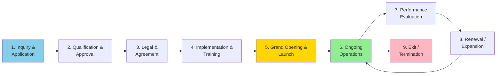

**Average Timeline:**
- Application to Approval: 30-60 days
- Agreement to Opening: 90-180 days
- Ongoing Operations: 5-10 years (typical franchise term)
- Renewal Process: 6-12 months before expiration

---

### Key Stakeholders

```
┌─────────────────────────────────────────────────────────────┐
│                     STAKEHOLDER ROLES                        │
├─────────────────────────────────────────────────────────────┤
│                                                              │
│  FRANCHISOR SIDE:                                            │
│  ├─ Franchise Development Manager                            │
│  │  └─ Leads recruitment and qualification                   │
│  ├─ Legal Team                                               │
│  │  └─ Handles agreements and compliance                     │
│  ├─ Training & Onboarding Team                               │
│  │  └─ Conducts training and implementation                  │
│  ├─ Operations Support Team                                  │
│  │  └─ Provides ongoing operational guidance                 │
│  ├─ Field Consultants                                        │
│  │  └─ Conducts site visits and evaluations                  │
│  └─ Franchisor Executive Team                                │
│      └─ Strategic oversight and final approvals              │
│                                                              │
│  FRANCHISEE SIDE:                                            │
│  ├─ Franchisee Owner/Operator                                │
│  ├─ Location Manager                                         │
│  ├─ Staff (Cashiers, Warehouse, Admin)                       │
│  └─ Financial/Legal Advisors                                 │
│                                                              │
│  LAZYFRANCHIS OR PLATFORM:                                   │
│  ├─ Implementation Specialist                                │
│  ├─ Customer Success Manager                                 │
│  ├─ Technical Support Team                                   │
│  └─ Account Manager                                          │
│                                                              │
└─────────────────────────────────────────────────────────────┘
```

---

## Franchise Application & Qualification Process

### 1. Lead Generation & Initial Inquiry

#### 1.1 Lead Sources

```
┌─────────────────────────────────────────────────────────────┐
│                    FRANCHISE LEAD SOURCES                    │
├─────────────────────────────────────────────────────────────┤
│                                                              │
│  DIRECT CHANNELS:                                            │
│  ├─ Corporate Website (franchise.company.com/apply)          │
│  ├─ Franchise Discovery Days / Open Houses                   │
│  ├─ Franchise Expos & Trade Shows                            │
│  └─ Referrals from Existing Franchisees                      │
│                                                              │
│  FRANCHISE PORTALS:                                          │
│  ├─ Franchise.com                                            │
│  ├─ FranchiseGator                                           │
│  ├─ Entrepreneur.com Franchise 500                           │
│  └─ FranchiseDirect                                          │
│                                                              │
│  MARKETING CAMPAIGNS:                                        │
│  ├─ Google Ads (franchise opportunity keywords)              │
│  ├─ Social Media Advertising (LinkedIn, Facebook)            │
│  ├─ Content Marketing (blogs, success stories)               │
│  └─ Email Campaigns to Target Audiences                      │
│                                                              │
│  BROKER NETWORK:                                             │
│  └─ Franchise Brokers/Consultants (commission-based)         │
│                                                              │
└─────────────────────────────────────────────────────────────┘
```

---

#### 1.2 Initial Inquiry Workflow

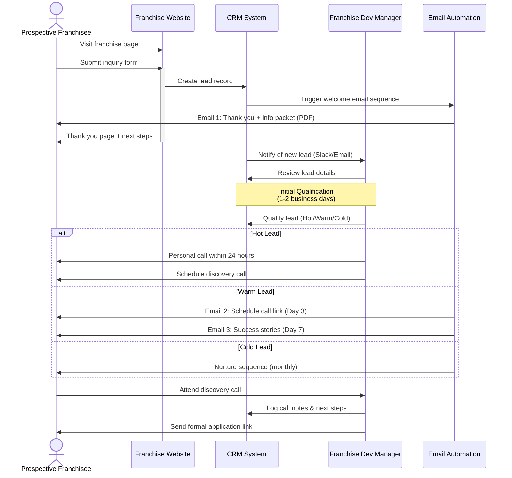

**Information Collected in Initial Inquiry:**

```yaml
Personal Information:
  - Full name
  - Email address
  - Phone number
  - Current location / preferred territory

Background:
  - Current employment/business
  - Industry experience
  - Franchise ownership experience (if any)

Financial:
  - Net worth range (select from ranges)
  - Liquid capital available (select from ranges)

Motivation:
  - Why interested in franchising?
  - Why interested in this brand?
  - Timeline to open (select: <3mo, 3-6mo, 6-12mo, 12+ mo)

Preferences:
  - Preferred territory/location
  - Number of units interested in
  - Involvement level (owner-operator vs. semi-absentee)
```

---

### 2. Formal Application Process

#### 2.1 Application Submission

**Application Components:**

```
┌─────────────────────────────────────────────────────────────┐
│              FRANCHISE APPLICATION PACKAGE                   │
├─────────────────────────────────────────────────────────────┤
│                                                              │
│  SECTION 1: PERSONAL INFORMATION                             │
│  ├─ Full legal name, SSN, date of birth                      │
│  ├─ Current address and contact information                  │
│  ├─ Marital status and spouse information (if applicable)    │
│  └─ Emergency contact details                                │
│                                                              │
│  SECTION 2: BUSINESS EXPERIENCE                              │
│  ├─ Employment history (last 10 years)                       │
│  ├─ Business ownership history                               │
│  ├─ Franchise ownership experience                           │
│  ├─ Management experience and skills                         │
│  └─ Industry-specific experience                             │
│                                                              │
│  SECTION 3: FINANCIAL QUALIFICATION                          │
│  ├─ Net worth statement                                      │
│  ├─ Liquid capital available                                 │
│  ├─ Income sources (employment, investments, business)       │
│  ├─ Outstanding liabilities and obligations                  │
│  ├─ Credit score authorization                               │
│  └─ Bank references (2 required)                             │
│                                                              │
│  SECTION 4: INVESTMENT & FUNDING                             │
│  ├─ Intended funding source (cash, loan, SBA, etc.)          │
│  ├─ Estimated investment budget                              │
│  ├─ Real estate plans (lease vs. purchase)                   │
│  └─ Construction/buildout budget                             │
│                                                              │
│  SECTION 5: LOCATION & TERRITORY                             │
│  ├─ Preferred territory/city                                 │
│  ├─ Alternate territory options                              │
│  ├─ Real estate identified (Y/N, details if yes)             │
│  └─ Demographic research conducted                           │
│                                                              │
│  SECTION 6: REFERENCES                                       │
│  ├─ Professional references (3 required)                     │
│  ├─ Character references (2 required)                        │
│  └─ Franchisee references (if applicable)                    │
│                                                              │
│  SECTION 7: BACKGROUND & DISCLOSURES                         │
│  ├─ Criminal history (felony/misdemeanor)                    │
│  ├─ Bankruptcy history                                       │
│  ├─ Litigation history                                       │
│  ├─ Business failures                                        │
│  └─ Regulatory actions                                       │
│                                                              │
│  SECTION 8: SUPPORTING DOCUMENTS                             │
│  ├─ Resume/CV                                                │
│  ├─ Personal financial statement (PFS)                       │
│  ├─ Bank statements (last 3 months)                          │
│  ├─ Tax returns (last 2 years)                               │
│  ├─ Business plan (if prepared)                              │
│  └─ Signed confidentiality agreement                         │
│                                                              │
│  APPLICATION FEE: $50,000 (non-refundable, credited to       │
│                   franchise fee upon approval)               │
│                                                              │
└─────────────────────────────────────────────────────────────┘
```

---

#### 2.2 Application Evaluation Flowchart

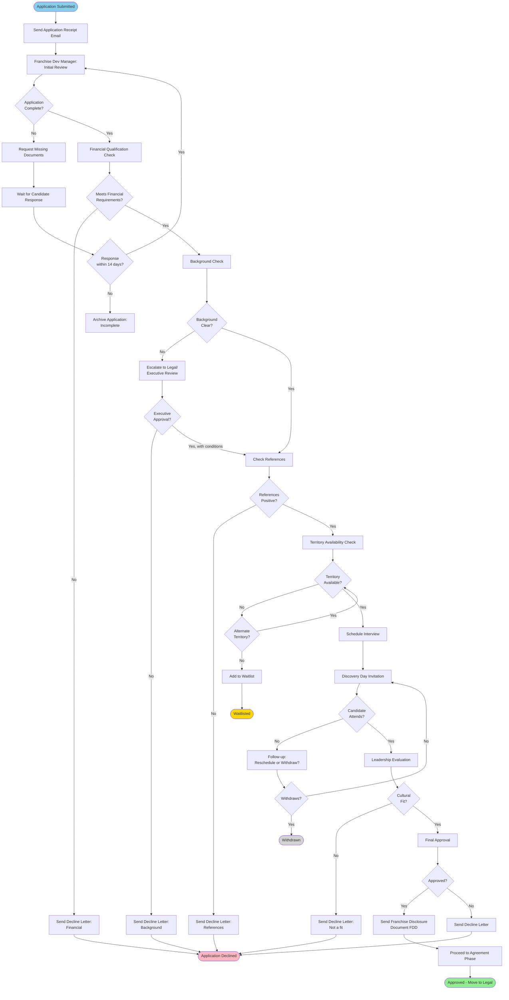

---

#### 2.3 Qualification Criteria

**Minimum Requirements:**

```
┌─────────────────────────────────────────────────────────────┐
│               FRANCHISEE QUALIFICATION CRITERIA              │
├─────────────────────────────────────────────────────────────┤
│                                                              │
│  FINANCIAL REQUIREMENTS:                                     │
│  ├─ Net Worth: Minimum $500,000                              │
│  ├─ Liquid Capital: Minimum $150,000                         │
│  ├─ Credit Score: Minimum 680                                │
│  ├─ Debt-to-Income Ratio: < 40%                              │
│  └─ No recent bankruptcies (within 7 years)                  │
│                                                              │
│  EXPERIENCE REQUIREMENTS:                                    │
│  ├─ Management experience: 3+ years preferred                │
│  ├─ Business ownership: Helpful but not required             │
│  ├─ Industry experience: Preferred but not required          │
│  └─ Multi-unit experience: Required for multi-unit deals     │
│                                                              │
│  PERSONAL REQUIREMENTS:                                      │
│  ├─ Clean criminal background (no felonies)                  │
│  ├─ No history of franchise litigation                       │
│  ├─ Strong work ethic and entrepreneurial spirit             │
│  ├─ Coachable and willing to follow system                   │
│  └─ Commitment to brand values and culture                   │
│                                                              │
│  OPERATIONAL REQUIREMENTS:                                   │
│  ├─ Full-time commitment (owner-operator model) OR           │
│  ├─ Strong management team (semi-absentee model)             │
│  ├─ Ability to relocate to territory (if needed)             │
│  └─ Availability for training (3-4 weeks required)           │
│                                                              │
│  DISQUALIFYING FACTORS:                                      │
│  ├─ Felony convictions (case-by-case review)                 │
│  ├─ Recent bankruptcy (within 7 years)                       │
│  ├─ Poor credit history (multiple collections/judgments)     │
│  ├─ Negative franchisee references                           │
│  ├─ Competing business interests (conflict of interest)      │
│  └─ Inability to meet financial requirements                 │
│                                                              │
└─────────────────────────────────────────────────────────────┘
```

---

### 3. Discovery Day Process

**Purpose:** In-person (or virtual) meeting for candidate to learn about the franchise and for franchisor to evaluate fit.

**Agenda:**

```
┌─────────────────────────────────────────────────────────────┐
│            DISCOVERY DAY AGENDA (8:00 AM - 4:00 PM)          │
├─────────────────────────────────────────────────────────────┤
│                                                              │
│  8:00 AM - Welcome & Registration                            │
│  ├─ Coffee and networking                                    │
│  ├─ Review agenda and expectations                           │
│  └─ Icebreaker activity                                      │
│                                                              │
│  8:30 AM - Company Overview & History                        │
│  ├─ Founder's story and vision                               │
│  ├─ Brand positioning and competitive advantages             │
│  ├─ Growth trajectory and future plans                       │
│  └─ Q&A                                                      │
│                                                              │
│  9:30 AM - Franchise Business Model                          │
│  ├─ Revenue streams and unit economics                       │
│  ├─ Item 19 (Financial Performance Representation) review    │
│  ├─ Investment breakdown and ROI expectations                │
│  └─ Q&A                                                      │
│                                                              │
│  10:30 AM - Break                                            │
│                                                              │
│  10:45 AM - Operations Deep Dive                             │
│  ├─ Day-in-the-life of a franchisee                          │
│  ├─ Operating systems and technology (LazyFranchisor demo)   │
│  ├─ Supply chain and vendor relationships                    │
│  ├─ Marketing and customer acquisition                       │
│  └─ Q&A                                                      │
│                                                              │
│  12:00 PM - Lunch with Current Franchisees                   │
│  ├─ Candid conversations with 2-3 existing franchisees       │
│  ├─ Unfiltered Q&A about challenges and rewards              │
│  └─ Networking opportunity                                   │
│                                                              │
│  1:00 PM - Site Visit to Operating Location                  │
│  ├─ Tour of flagship/local franchise location                │
│  ├─ See operations in action                                 │
│  ├─ Meet staff and observe customer interactions             │
│  └─ Behind-the-scenes look at back-office operations         │
│                                                              │
│  2:30 PM - Training & Support Overview                       │
│  ├─ Initial training program (timeline and content)          │
│  ├─ Ongoing support structure                                │
│  ├─ Field consultant visits and guidance                     │
│  ├─ Marketing and technology support                         │
│  └─ Q&A                                                      │
│                                                              │
│  3:15 PM - Legal & Franchise Agreement Overview              │
│  ├─ FDD walkthrough (key sections)                           │
│  ├─ Franchise agreement terms and obligations                │
│  ├─ Territory rights and exclusivity                         │
│  ├─ Fees and ongoing costs                                   │
│  └─ Q&A (attorney attendance encouraged)                     │
│                                                              │
│  3:45 PM - Next Steps & One-on-One Meetings                  │
│  ├─ Individual meetings with franchise development team      │
│  ├─ Address specific concerns or questions                   │
│  ├─ Discuss timeline to decision                             │
│  └─ Provide feedback and assessment                          │
│                                                              │
│  4:00 PM - Adjourn                                           │
│                                                              │
└─────────────────────────────────────────────────────────────┘
```

**Post-Discovery Day Evaluation:**

```
Franchisor Evaluation Scorecard:

1. Cultural Fit (1-5 score):
   - Alignment with brand values
   - Enthusiasm and engagement
   - Coachability and openness to feedback

2. Business Acumen (1-5 score):
   - Understanding of business model
   - Financial literacy
   - Strategic thinking

3. Operational Capability (1-5 score):
   - Management experience
   - Attention to detail
   - Ability to execute

4. Communication & Relationships (1-5 score):
   - Interpersonal skills
   - Team-building ability
   - Professionalism

5. Commitment Level (1-5 score):
   - Seriousness about opportunity
   - Timeline alignment
   - Family support

Total Score: ___/25

Recommendation:
□ Strongly Approve (20-25)
□ Approve with Reservations (15-19)
□ Decline (< 15)
```

---

## Franchise Agreement & Legal Process

### 1. Franchise Disclosure Document (FDD) Review

**FDD Delivery Timeline:**

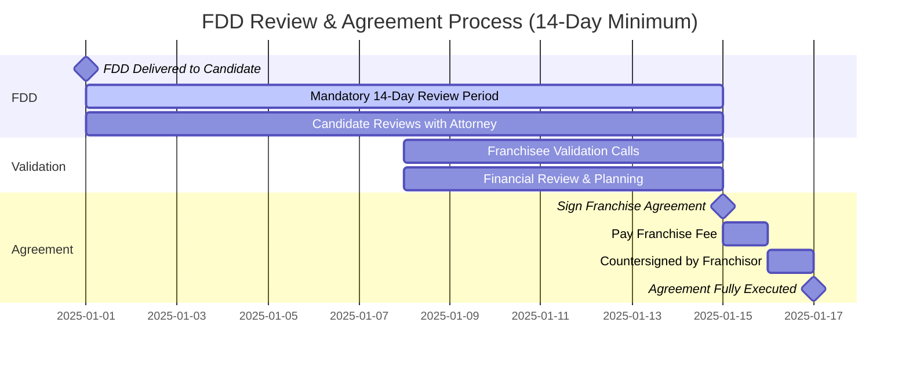

**FDD Key Sections:**

```
Item 1:  The Franchisor and Affiliates
Item 2:  Business Experience (of franchisor executives)
Item 3:  Litigation History
Item 4:  Bankruptcy History
Item 5:  Initial Franchise Fee
Item 6:  Other Fees (royalties, marketing, etc.)
Item 7:  Estimated Initial Investment
Item 8:  Restrictions on Sources of Products/Services
Item 9:  Franchisee's Obligations
Item 10: Financing Arrangements
Item 11: Franchisor's Assistance, Training, and Support
Item 12: Territory
Item 13: Trademarks
Item 14: Patents, Copyrights, and Proprietary Information
Item 15: Obligation to Participate in Operation
Item 16: Restrictions on What Franchisee May Sell
Item 17: Renewal, Termination, Transfer, and Dispute Resolution
Item 18: Public Figures
Item 19: Financial Performance Representations (Item 19)
Item 20: Outlets and Franchisee Information
Item 21: Financial Statements
Item 22: Contracts (sample franchise agreement and related documents)
Item 23: Receipts
```

---

### 2. Franchisee Validation Process

**Validation Call Guidelines:**

```
┌─────────────────────────────────────────────────────────────┐
│              FRANCHISEE VALIDATION PROTOCOL                  │
├─────────────────────────────────────────────────────────────┤
│                                                              │
│  PURPOSE:                                                    │
│  Allow prospective franchisees to speak with existing        │
│  franchisees to validate business model and franchisor       │
│  representations.                                            │
│                                                              │
│  FRANCHISOR RESPONSIBILITIES:                                │
│  ├─ Provide list of franchisees (random sample)              │
│  ├─ Include variety: successful, struggling, new, mature     │
│  ├─ DO NOT coach franchisees on what to say                  │
│  └─ Encourage honest, transparent feedback                   │
│                                                              │
│  CANDIDATE QUESTIONS (Suggested):                            │
│  ├─ Why did you choose this franchise?                       │
│  ├─ What has been your experience with the franchisor?       │
│  ├─ How accurate were the financial projections (Item 19)?   │
│  ├─ What surprised you (positively or negatively)?           │
│  ├─ How is the training and ongoing support?                 │
│  ├─ What are the biggest challenges?                         │
│  ├─ What do you wish you had known before signing?           │
│  ├─ How is the territory exclusivity working?                │
│  ├─ Would you do it again? Would you buy more units?         │
│  └─ Any advice for someone considering this franchise?       │
│                                                              │
│  RECOMMENDED CALLS:                                          │
│  └─ Minimum 5-10 franchisees across different markets        │
│     and stages of operation                                  │
│                                                              │
└─────────────────────────────────────────────────────────────┘
```

---

### 3. Franchise Agreement Execution

**Agreement Structure:**

```
FRANCHISE AGREEMENT - TABLE OF CONTENTS

RECITALS
1.  GRANT OF FRANCHISE
    1.1  Grant of License
    1.2  Territory
    1.3  No Exclusivity (or Exclusivity Terms)

2.  TERM AND RENEWAL
    2.1  Initial Term (typically 10 years)
    2.2  Renewal Terms (2 additional 5-year terms)
    2.3  Conditions for Renewal

3.  FEES AND PAYMENTS
    3.1  Initial Franchise Fee ($45,000)
    3.2  Royalty Fee (6% of gross sales)
    3.3  Marketing Fund Contribution (2% of gross sales)
    3.4  Technology Fee ($500/month for LazyFranchisor platform)
    3.5  Other Fees (transfer, renewal, etc.)

4.  TRAINING AND ASSISTANCE
    4.1  Initial Training Program
    4.2  Ongoing Support and Field Visits
    4.3  Operations Manual
    4.4  Technology and Systems Support

5.  DEVELOPMENT AND OPENING
    5.1  Site Selection and Approval
    5.2  Lease Review and Approval
    5.3  Construction and Buildout
    5.4  Equipment and Inventory
    5.5  Grand Opening Assistance

6.  OPERATIONS
    6.1  Operating Standards
    6.2  Quality Control
    6.3  Approved Suppliers
    6.4  Equipment and Technology Requirements
    6.5  Hours of Operation
    6.6  Staffing Requirements

7.  MARKETING AND ADVERTISING
    7.1  Brand Standards and Trademark Usage
    7.2  National Marketing Fund
    7.3  Local Marketing Requirements (2% minimum)
    7.4  Digital Marketing and Social Media
    7.5  Grand Opening Marketing

8.  PROPRIETARY INFORMATION
    8.1  Confidential Information
    8.2  Non-Competition During Term
    8.3  Non-Competition Post-Termination (2 years)
    8.4  Trade Secrets and Know-How

9.  REPORTING AND RECORDS
    9.1  Financial Reporting (weekly sales reports)
    9.2  LazyFranchisor Platform Usage (required)
    9.3  Right to Audit
    9.4  Record Retention (7 years)

10. INSURANCE
    10.1 Required Coverage (general liability, property, etc.)
    10.2 Minimum Limits ($2M aggregate)
    10.3 Proof of Insurance

11. TRANSFER OF FRANCHISE
    11.1 Restrictions on Transfer
    11.2 Right of First Refusal
    11.3 Transfer Conditions and Fees
    11.4 Death or Disability

12. DEFAULT AND TERMINATION
    12.1 Events of Default
    12.2 Termination by Franchisor
    12.3 Obligations Upon Termination
    12.4 Post-Termination Obligations

13. DISPUTE RESOLUTION
    13.1 Mediation (required first step)
    13.2 Arbitration
    13.3 Governing Law
    13.4 Venue

14. GENERAL PROVISIONS
    14.1 Entire Agreement
    14.2 Amendments
    14.3 Waiver
    14.4 Severability
    14.5 Notices

EXHIBITS
A - Territory Description and Map
B - Ownership and Guaranty
C - Franchise Fee Payment Schedule
D - Approved Suppliers List
E - Technology Requirements (LazyFranchisor Platform)
F - Operations Manual Table of Contents
```

---

### 4. Fee Structure

```
┌─────────────────────────────────────────────────────────────┐
│                    FRANCHISE FEE STRUCTURE                   │
├─────────────────────────────────────────────────────────────┤
│                                                              │
│  INITIAL FEES (One-Time):                                    │
│  ├─ Franchise Fee: $45,000                                   │
│  ├─ Training Fee: Included                                   │
│  ├─ Grand Opening Support: Included                          │
│  └─ Initial Inventory: $25,000 (estimated, variable)         │
│                                                              │
│  ONGOING FEES (Monthly/Recurring):                           │
│  ├─ Royalty Fee: 6% of gross sales                           │
│  │  └─ Paid weekly via ACH                                   │
│  ├─ Marketing Fund: 2% of gross sales                        │
│  │  └─ National brand marketing                              │
│  ├─ Technology Fee: $500/month                               │
│  │  └─ LazyFranchisor platform subscription                  │
│  └─ Local Marketing: 2% minimum (franchisee-directed)        │
│                                                              │
│  OTHER FEES:                                                 │
│  ├─ Renewal Fee: $5,000 (every 10 years)                     │
│  ├─ Transfer Fee: $10,000 (if franchisee sells)              │
│  ├─ Additional Unit Fee: $30,000 per unit                    │
│  ├─ Non-Compliance Audit Fee: $1,500/day (if required)       │
│  └─ Late Payment Fee: 1.5% per month                         │
│                                                              │
│  TOTAL INITIAL INVESTMENT:                                   │
│  ├─ Low Range: $250,000                                      │
│  ├─ High Range: $500,000                                     │
│  └─ Average: $375,000                                        │
│     (includes franchise fee, buildout, equipment,            │
│      inventory, working capital)                             │
│                                                              │
└─────────────────────────────────────────────────────────────┘
```

---

## Implementation & Onboarding Process

### 1. Pre-Opening Timeline (90-180 Days)

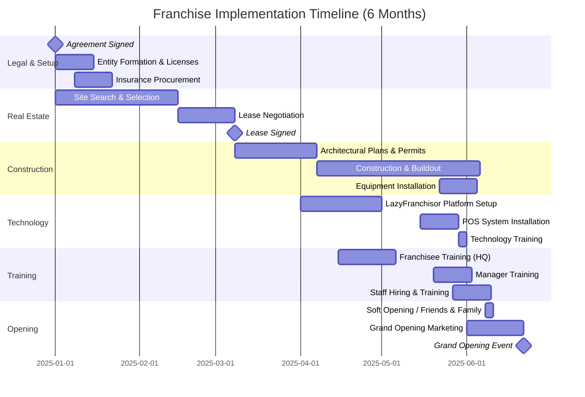

---

### 2. Site Selection & Real Estate Process

#### 2.1 Site Selection Criteria

```
┌─────────────────────────────────────────────────────────────┐
│                  SITE SELECTION CRITERIA                     │
├─────────────────────────────────────────────────────────────┤
│                                                              │
│  DEMOGRAPHICS:                                               │
│  ├─ Population Density: Minimum 25,000 within 3-mile radius  │
│  ├─ Median Household Income: $50,000+                        │
│  ├─ Age Demographics: 25-54 (target customer base)           │
│  ├─ Daytime Population: High traffic area preferred          │
│  └─ Growth Rate: Positive population growth                  │
│                                                              │
│  LOCATION TYPE:                                              │
│  ├─ Retail Center (strip mall, shopping center)              │
│  ├─ Standalone Building (freestanding with parking)          │
│  ├─ Mixed-Use Development                                    │
│  └─ Downtown/Urban Core (high foot traffic)                  │
│                                                              │
│  SITE REQUIREMENTS:                                          │
│  ├─ Square Footage: 2,000-3,000 sq ft                        │
│  ├─ Visibility: High visibility from main road               │
│  ├─ Access: Easy ingress/egress                              │
│  ├─ Parking: Minimum 15 spaces                               │
│  ├─ Signage: Pylon or monument sign rights                   │
│  └─ Zoning: Approved for commercial food/retail use          │
│                                                              │
│  CO-TENANCY (Preferred Neighbors):                           │
│  ├─ Grocery stores (traffic driver)                          │
│  ├─ Banks and financial services                             │
│  ├─ Fitness centers                                          │
│  ├─ Coffee shops                                             │
│  └─ Other complementary retail                               │
│                                                              │
│  COMPETITION ANALYSIS:                                       │
│  ├─ Direct Competitors: >1 mile away (minimum)               │
│  ├─ Brand Saturation: Consider market density                │
│  └─ Market Share Opportunity: Underserved areas preferred    │
│                                                              │
└─────────────────────────────────────────────────────────────┘
```

---

#### 2.2 Site Approval Process

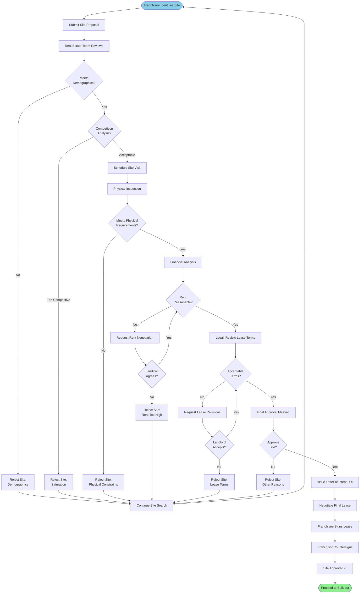

**Average Timeline: 45-60 days from site identification to lease signing**

---

### 3. Training Program

#### 3.1 Initial Training Curriculum

```
┌─────────────────────────────────────────────────────────────┐
│          FRANCHISEE INITIAL TRAINING PROGRAM (3 WEEKS)       │
├─────────────────────────────────────────────────────────────┤
│                                                              │
│  WEEK 1: BUSINESS FUNDAMENTALS & BRAND                       │
│  Location: Corporate Headquarters                            │
│                                                              │
│  Monday:                                                     │
│  ├─ Orientation and welcome                                  │
│  ├─ Company history, culture, and values                     │
│  ├─ Franchise system overview                                │
│  └─ Operations manual review                                 │
│                                                              │
│  Tuesday:                                                    │
│  ├─ Financial management and unit economics                  │
│  ├─ P&L management and KPIs                                  │
│  ├─ Cost control and inventory management                    │
│  └─ LazyFranchisor: Accounting module training               │
│                                                              │
│  Wednesday:                                                  │
│  ├─ Marketing fundamentals and brand standards               │
│  ├─ Local marketing strategies                               │
│  ├─ Social media and digital marketing                       │
│  ├─ Grand opening planning                                   │
│  └─ LazyFranchisor: CRM module training                      │
│                                                              │
│  Thursday:                                                   │
│  ├─ Human resources and labor management                     │
│  ├─ Hiring, training, and retention                          │
│  ├─ Scheduling and labor cost control                        │
│  ├─ Employee relations and compliance                        │
│  └─ LazyFranchisor: Employee management                      │
│                                                              │
│  Friday:                                                     │
│  ├─ Customer service excellence                              │
│  ├─ Handling complaints and difficult situations             │
│  ├─ Building customer loyalty                                │
│  └─ Week 1 assessment and Q&A                                │
│                                                              │
│  WEEK 2: OPERATIONAL EXCELLENCE                              │
│  Location: Training Store                                    │
│                                                              │
│  Monday-Tuesday:                                             │
│  ├─ POS system training (hands-on)                           │
│  ├─ Transaction processing                                   │
│  ├─ Discounts, promotions, refunds                           │
│  ├─ End-of-day procedures                                    │
│  └─ LazyFranchisor: POS module training                      │
│                                                              │
│  Wednesday-Thursday:                                         │
│  ├─ Warehouse and inventory management                       │
│  ├─ Receiving and putaway procedures                         │
│  ├─ Stock transfers and ordering                             │
│  ├─ Cycle counting and inventory accuracy                    │
│  ├─ FIFO and expiration management                           │
│  └─ LazyFranchisor: Warehouse module training                │
│                                                              │
│  Friday:                                                     │
│  ├─ Food safety and quality control (if applicable)          │
│  ├─ Health department regulations                            │
│  ├─ Opening and closing procedures                           │
│  ├─ Security and loss prevention                             │
│  └─ Week 2 assessment                                        │
│                                                              │
│  WEEK 3: HANDS-ON OPERATIONS                                 │
│  Location: High-Volume Training Store                        │
│                                                              │
│  Monday-Thursday:                                            │
│  ├─ Hands-on shifts in all positions                         │
│  │  ├─ Front counter/cashier                                 │
│  │  ├─ Kitchen/production (if applicable)                    │
│  │  ├─ Drive-thru (if applicable)                            │
│  │  └─ Manager duties                                        │
│  ├─ Practice all operational procedures                      │
│  ├─ Work opening, mid-day, and closing shifts                │
│  └─ Shadow experienced managers                              │
│                                                              │
│  Friday:                                                     │
│  ├─ Final comprehensive assessment                           │
│  ├─ Certification exam (written and practical)               │
│  ├─ Graduation ceremony                                      │
│  └─ Ongoing support plan and next steps                      │
│                                                              │
│  TRAINING MATERIALS PROVIDED:                                │
│  ├─ Operations manual (digital and physical)                 │
│  ├─ Training videos and e-learning modules                   │
│  ├─ Standard operating procedures (SOPs)                     │
│  ├─ LazyFranchisor platform training guides                  │
│  ├─ Marketing templates and assets                           │
│  └─ Recipes and production guides (if applicable)            │
│                                                              │
│  CERTIFICATION REQUIREMENTS:                                 │
│  ├─ Attendance: 100% required                                │
│  ├─ Written Exam: Minimum 80% passing score                  │
│  ├─ Practical Assessment: Pass all critical skills           │
│  └─ Re-training available if needed                          │
│                                                              │
└─────────────────────────────────────────────────────────────┘
```

---

#### 3.2 Pre-Opening Support

```
30 Days Before Opening:

Week -4:
├─ Site visit by operations consultant
├─ Final equipment inspection and testing
├─ LazyFranchisor platform final setup and testing
├─ POS system testing and integration
└─ Hire and schedule opening team

Week -3:
├─ Staff training begins (40 hours minimum per employee)
├─ Soft opening planning
├─ Final inventory ordering
├─ Marketing materials distribution
└─ Health department inspection (if required)

Week -2:
├─ Staff certification assessments
├─ Grand opening event planning finalized
├─ Press releases and media outreach
├─ Friends & family soft opening (test run)
└─ Final walkthrough with operations consultant

Week -1:
├─ Daily operations rehearsal
├─ Systems and procedures testing
├─ Grand opening marketing push (social media, ads)
├─ Final inventory delivery
├─ Opening day staffing confirmed
└─ 24/7 support hotline activated

Grand Opening Week:
├─ Day 1-2: Soft opening to work out issues
├─ Day 3: Grand opening event
├─ Days 4-7: On-site support from franchisor team
└─ Daily debriefs and adjustments
```

---

## Ongoing Business Operations

### 1. Daily Operations

#### 1.1 Standard Operating Procedures (SOPs)

```
┌─────────────────────────────────────────────────────────────┐
│                  DAILY OPERATIONS CHECKLIST                  │
├─────────────────────────────────────────────────────────────┤
│                                                              │
│  OPENING PROCEDURES (Completed by Opening Manager):          │
│  Time: 30 minutes before store opening                       │
│                                                              │
│  □ Unlock facility and disarm security system                │
│  □ Turn on lights, music, and HVAC                           │
│  □ Conduct facility walkthrough (cleanliness, safety)        │
│  □ Review day's schedule and staffing                        │
│  □ Count opening cash drawer (POS system)                    │
│  □ Check inventory levels for day's needs                    │
│  □ Prepare equipment and workstations                        │
│  □ Review previous day's performance via LazyFranchisor      │
│  □ Check for system messages and updates                     │
│  □ Unlock doors at official opening time                     │
│  □ Log opening checklist completion in LazyFranchisor        │
│                                                              │
│  MID-DAY PROCEDURES:                                         │
│  □ Monitor sales and customer traffic (real-time)            │
│  □ Adjust staffing as needed based on traffic                │
│  □ Conduct hourly facility checks (restrooms, dining area)   │
│  □ Review inventory usage and restock as needed              │
│  □ Respond to customer feedback and issues                   │
│  □ Review LazyFranchisor alerts and notifications            │
│  □ Process deliveries and stock transfers                    │
│  □ Conduct employee break schedules                          │
│  □ Log any incidents or issues in system                     │
│                                                              │
│  CLOSING PROCEDURES (Completed by Closing Manager):          │
│  Time: After last customer, 30-60 minutes                    │
│                                                              │
│  □ Lock doors at official closing time                       │
│  □ Complete end-of-day sales report in POS                   │
│  □ Count and reconcile cash drawer                           │
│  □ Prepare bank deposit                                      │
│  □ Clean and sanitize all equipment and surfaces             │
│  □ Restock supplies for next day                             │
│  □ Conduct inventory spot checks                             │
│  □ Review day's performance metrics (LazyFranchisor)         │
│  │  ├─ Sales vs. target                                      │
│  │  ├─ Labor cost %                                          │
│  │  ├─ Waste and shrinkage                                   │
│  │  └─ Customer satisfaction                                 │
│  □ Turn off equipment, lights, music                         │
│  □ Set security alarm and lock facility                      │
│  □ Log closing checklist completion in LazyFranchisor        │
│  □ Submit daily report to franchisor (automatic via system)  │
│                                                              │
└─────────────────────────────────────────────────────────────┘
```

---

#### 1.2 Weekly Operations Cadence

```
Monday:
├─ Review previous week's performance (sales, costs, KPIs)
├─ Staff meeting (30 minutes)
├─ Set weekly goals and priorities
├─ Review upcoming week's schedule
└─ Submit weekly sales report via LazyFranchisor (automated)

Tuesday:
├─ Inventory management day
├─ Conduct cycle counts
├─ Place orders for upcoming deliveries
├─ Review slow-moving inventory
└─ Update inventory levels in LazyFranchisor

Wednesday:
├─ Marketing and customer engagement
├─ Post social media content
├─ Review customer feedback and online reviews
├─ Plan promotional activities
└─ Review marketing performance in LazyFranchisor CRM

Thursday:
├─ Labor and staffing management
├─ Review labor cost % for week
├─ Adjust upcoming week's schedule
├─ Address any HR issues
└─ Review employee performance in LazyFranchisor

Friday:
├─ Financial review day
├─ Review week-to-date sales and profitability
├─ Analyze high/low performing products or services
├─ Prepare for weekend (typically high-volume days)
└─ Review financial reports in LazyFranchisor

Saturday-Sunday:
├─ Execute operations with focus on customer experience
├─ Manager-on-duty coverage
└─ Real-time monitoring via LazyFranchisor mobile app
```

---

### 2. Franchisee Support Structure

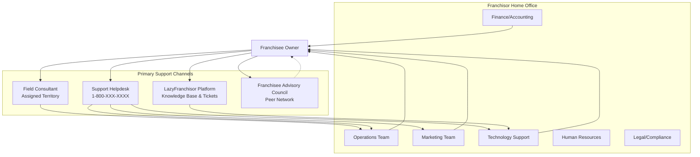

---

#### 2.1 Field Consultant Support

**Role:** Provide hands-on, in-person support and consultation

**Responsibilities:**
- Conduct quarterly site visits (minimum)
- Perform operational assessments
- Provide coaching and training
- Identify opportunities for improvement
- Ensure compliance with brand standards
- Facilitate best practice sharing
- Troubleshoot operational challenges

**Visit Schedule:**
```
Months 1-3 (New Franchisee): Monthly visits
Months 4-6: Every 6 weeks
Months 7-12: Every 8 weeks
Year 2+: Quarterly (4x per year)
Ad-hoc visits: As needed for issues or requested support
```

**Visit Report Template:**
```
FIELD CONSULTANT VISIT REPORT

Franchisee: _____________________
Location: _______________________
Visit Date: _____________________
Consultant: _____________________

OPERATIONAL ASSESSMENT (1-5 scale):
□ Cleanliness & Maintenance: ___
□ Brand Standards Compliance: ___
□ Product Quality: ___
□ Customer Service: ___
□ Staff Training & Knowledge: ___
□ Inventory Management: ___
□ Financial Performance: ___

STRENGTHS OBSERVED:
- ________________________________
- ________________________________

AREAS FOR IMPROVEMENT:
- ________________________________
- ________________________________

ACTION ITEMS:
1. _______________________________ (Owner: ____ Due: ____)
2. _______________________________ (Owner: ____ Due: ____)
3. _______________________________ (Owner: ____ Due: ____)

NEXT VISIT DATE: _______________

Consultant Signature: _____________________
Franchisee Signature: _____________________
```

---

### 3. Performance Monitoring via LazyFranchisor Platform

**Real-Time Dashboards:**

```
FRANCHISEE DASHBOARD - REAL-TIME VIEW

TODAY'S PERFORMANCE:
├─ Sales: $4,250 (vs. $4,000 target) ✓ +6.3%
├─ Transactions: 185 (vs. 175 target) ✓
├─ Average Ticket: $22.97 (vs. $22.86)
├─ Labor Cost: $850 (20% of sales) ✓ Target: <22%
└─ Inventory Alerts: 3 items low stock ⚠️

WEEK-TO-DATE (Mon-Today Wed):
├─ Sales: $12,500 (on track for $20,000 weekly target)
├─ Labor Cost %: 21.2% ✓
├─ Food Cost %: 28.5% ⚠️ (Target: <27%)
└─ Customer Satisfaction: 4.7/5.0 ✓

ALERTS & NOTIFICATIONS:
⚠️ Inventory: Reorder needed for 3 items
⚠️ Staff Schedule: 2 shifts need coverage this weekend
✓ Sales Report: Weekly report submitted successfully
ℹ️ Training: New SOP published - review required

UPCOMING TASKS:
□ Submit monthly royalty payment (Due: Nov 5)
□ Complete employee performance reviews (3 pending)
□ Respond to customer review on Google (2 days old)
□ Schedule equipment maintenance (Due: Nov 15)
```

---

## Performance Evaluation & Monitoring

### 1. Key Performance Indicators (KPIs)

```
┌─────────────────────────────────────────────────────────────┐
│               FRANCHISEE PERFORMANCE KPIs                    │
├─────────────────────────────────────────────────────────────┤
│                                                              │
│  FINANCIAL METRICS:                                          │
│  ├─ Gross Sales: Target varies by location                   │
│  ├─ Sales Growth %: Target +5-10% YoY                        │
│  ├─ Average Unit Volume (AUV): $750,000/year average         │
│  ├─ Profit Margin (EBITDA): Target 15-20%                    │
│  ├─ Same-Store Sales Growth: Target +3-5% YoY                │
│  └─ Royalty Payment Compliance: 100% on-time                 │
│                                                              │
│  OPERATIONAL METRICS:                                        │
│  ├─ Labor Cost %: Target <25% of sales                       │
│  ├─ Food/Product Cost %: Target <30% of sales                │
│  ├─ Waste %: Target <3% of sales                             │
│  ├─ Inventory Turnover: Target 2x per month                  │
│  ├─ Operational Hours Compliance: 100%                       │
│  └─ LazyFranchisor Platform Usage: Daily activity required   │
│                                                              │
│  CUSTOMER EXPERIENCE METRICS:                                │
│  ├─ Customer Satisfaction Score: Target 4.5+/5.0             │
│  ├─ Net Promoter Score (NPS): Target 50+                     │
│  ├─ Online Review Rating: Target 4.3+/5.0                    │
│  ├─ Customer Complaints: <2 per month                        │
│  └─ Repeat Customer Rate: Target 40%+                        │
│                                                              │
│  QUALITY & COMPLIANCE METRICS:                               │
│  ├─ Audit Score: Target 90+/100                              │
│  ├─ Health Inspection Score: Target 95+/100                  │
│  ├─ Brand Standards Compliance: Target 100%                  │
│  ├─ Training Compliance: 100% staff certified                │
│  └─ Safety Incidents: 0 per quarter (goal)                   │
│                                                              │
│  GROWTH & INNOVATION METRICS:                                │
│  ├─ New Customer Acquisition: Track monthly                  │
│  ├─ Local Marketing Activity: 2% of sales minimum            │
│  ├─ Social Media Engagement: Track followers, posts          │
│  └─ Staff Retention Rate: Target 70%+ annually               │
│                                                              │
└─────────────────────────────────────────────────────────────┘
```

---

### 2. Performance Review Cadence

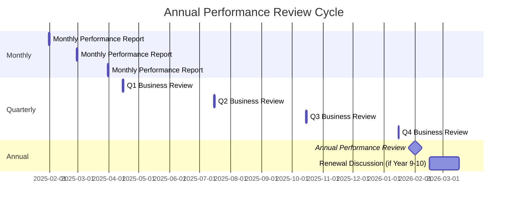

---

#### 2.1 Quarterly Business Review (QBR) Format

```
QUARTERLY BUSINESS REVIEW AGENDA (90 minutes)

Attendees:
├─ Franchisee Owner
├─ Location Manager (if applicable)
├─ Field Consultant
└─ Operations Manager (franchisor)

Pre-Meeting Prep:
├─ Franchisee reviews performance reports in LazyFranchisor
├─ Field Consultant prepares assessment and recommendations
└─ Both parties submit discussion topics in advance

AGENDA:

1. Welcome & Relationship Check-In (10 minutes)
   ├─ Personal updates
   ├─ Overall satisfaction with franchise relationship
   └─ Any concerns or issues to address

2. Financial Performance Review (20 minutes)
   ├─ Sales performance vs. budget and prior year
   ├─ Profitability and margin analysis
   ├─ Cost management (labor, COGS, overhead)
   ├─ Cash flow and working capital
   └─ ROI and breakeven status

3. Operational Performance Review (20 minutes)
   ├─ KPIs scorecard review (all metrics)
   ├─ Quality and compliance (audit scores)
   ├─ Customer satisfaction and feedback
   ├─ Staff performance and retention
   └─ Facility maintenance and condition

4. Marketing & Customer Acquisition (15 minutes)
   ├─ Local marketing efforts and ROI
   ├─ Customer acquisition and retention
   ├─ Online presence and reputation management
   ├─ Grand openings, promotions, events
   └─ National campaign participation

5. Opportunities & Action Plan (20 minutes)
   ├─ Areas for improvement identified
   ├─ Best practices to implement
   ├─ Training and development needs
   ├─ Growth opportunities (additional units?)
   ├─ Technology enhancements or features needed
   └─ Create 90-day action plan with owners and deadlines

6. System Updates & Resources (10 minutes)
   ├─ New products, services, or initiatives
   ├─ Updates to SOPs or operations manual
   ├─ Upcoming training or events
   ├─ Resources available to franchisee
   └─ Q&A

7. Wrap-Up & Next Steps (5 minutes)
   ├─ Recap action items
   ├─ Schedule next QBR
   └─ Any final questions or concerns

Post-Meeting:
├─ Field Consultant sends summary notes within 48 hours
├─ Action items logged in LazyFranchisor with due dates
├─ Progress tracked monthly until next QBR
└─ Franchisee acknowledges receipt and commits to action plan
```

---

### 3. Performance Improvement Plans

**Trigger for Performance Improvement Plan (PIP):**

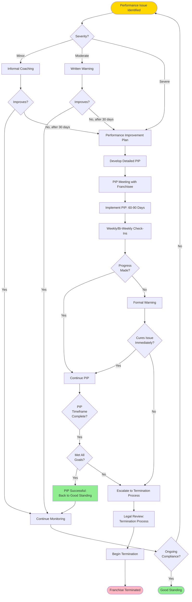

---

#### 3.1 Performance Improvement Plan Template

```
PERFORMANCE IMPROVEMENT PLAN (PIP)

Franchisee: _____________________
Location: _______________________
Date Issued: ____________________
Plan Duration: 60 Days (______ to ______)

AREAS OF CONCERN:

1. [Issue Category - e.g., Financial Performance]
   Current State: ___________________________
   Impact: __________________________________
   Required Standard: ________________________

2. [Issue Category - e.g., Quality/Compliance]
   Current State: ___________________________
   Impact: __________________________________
   Required Standard: ________________________

3. [Issue Category - e.g., Customer Satisfaction]
   Current State: ___________________________
   Impact: __________________________________
   Required Standard: ________________________

PERFORMANCE EXPECTATIONS:

1. [Goal 1]: ________________________________
   Measurement: _____________________________
   Deadline: ________________________________

2. [Goal 2]: ________________________________
   Measurement: _____________________________
   Deadline: ________________________________

3. [Goal 3]: ________________________________
   Measurement: _____________________________
   Deadline: ________________________________

SUPPORT PROVIDED BY FRANCHISOR:

├─ Field Consultant: Weekly visits (first 30 days)
├─ Additional Training: [Specify topics and dates]
├─ Operations Manual Review: [Specific SOPs to focus on]
├─ Technology Support: [LazyFranchisor platform training]
├─ Marketing Assistance: [Specific campaigns or strategies]
└─ Peer Mentorship: [Assign successful franchisee mentor]

CHECK-IN SCHEDULE:

Week 2: ________ (Date) - Conference call
Week 4: ________ (Date) - In-person site visit
Week 6: ________ (Date) - Conference call
Week 8: ________ (Date) - Final evaluation & decision

CONSEQUENCES OF NON-COMPLIANCE:

If performance expectations are not met by the end of this PIP period,
the Franchisor reserves the right to:
├─ Extend the PIP for an additional 30 days, OR
├─ Issue a Notice of Default under the Franchise Agreement, OR
├─ Begin termination proceedings

ACKNOWLEDGMENT:

I acknowledge receipt of this Performance Improvement Plan and understand
the expectations, support provided, and potential consequences.

Franchisee Signature: __________________ Date: __________

Franchisor Representative: _____________ Date: __________
```

---

## Compliance & Quality Assurance

### 1. Audit and Inspection Program

#### 1.1 Audit Schedule

```
ANNUAL AUDIT CALENDAR

Q1 (Jan-Mar):
├─ Operational Audit: All locations (scheduled)
├─ Financial Audit: Random sample (10% of locations)
└─ Technology Audit: LazyFranchisor platform usage review

Q2 (Apr-Jun):
├─ Quality Audit: Focus on product/service quality
├─ Marketing Compliance: Brand standards review
└─ Customer Experience: Mystery shopper program

Q3 (Jul-Sep):
├─ Safety & Security Audit: All locations (scheduled)
├─ HR & Labor Compliance: Documentation review
└─ Facility Maintenance Audit: Physical condition assessment

Q4 (Oct-Dec):
├─ Comprehensive Annual Audit: Top/bottom 10% performers
├─ Compliance Audit: Licenses, permits, insurance
└─ Year-end performance review preparation

Ad-Hoc Audits:
├─ Triggered by: Customer complaints, performance issues, or
│   reported violations
└─ Unannounced visits (as needed)
```

---

#### 1.2 Audit Process Workflow

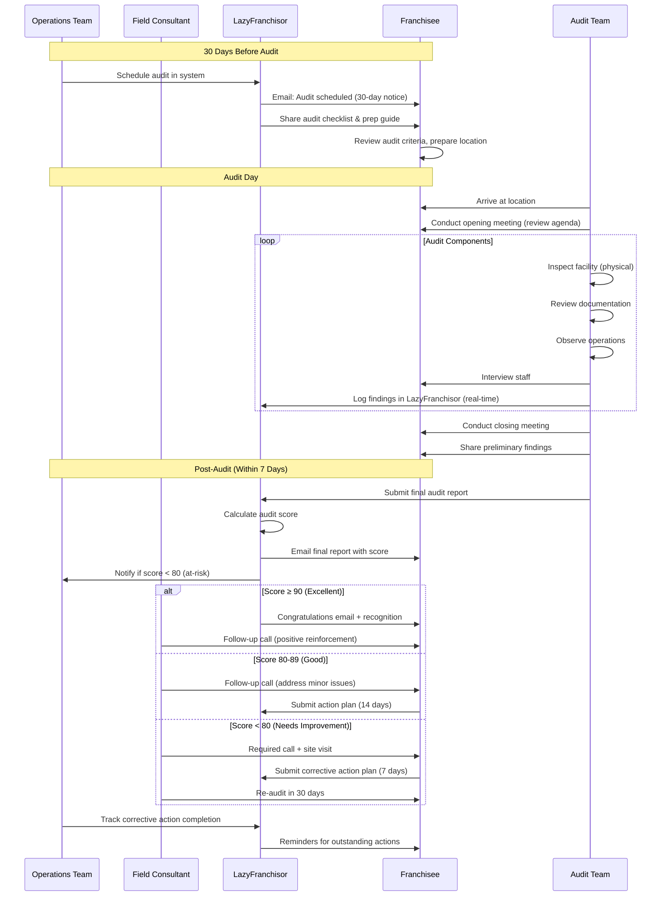

---

#### 1.3 Audit Scorecard

```
┌─────────────────────────────────────────────────────────────┐
│                   FRANCHISE AUDIT SCORECARD                  │
│                        (100 Points Total)                    │
├─────────────────────────────────────────────────────────────┤
│                                                              │
│  SECTION 1: FACILITY & CLEANLINESS (20 points)              │
│  ├─ Exterior appearance and signage (4 pts)         ____    │
│  ├─ Interior cleanliness and maintenance (4 pts)    ____    │
│  ├─ Restrooms (4 pts)                               ____    │
│  ├─ Kitchen/back-of-house (4 pts)                   ____    │
│  └─ Equipment condition and functionality (4 pts)   ____    │
│                                            Subtotal: ____/20 │
│                                                              │
│  SECTION 2: OPERATIONAL COMPLIANCE (25 points)              │
│  ├─ Opening/closing procedures followed (5 pts)     ____    │
│  ├─ Inventory management and organization (5 pts)   ____    │
│  ├─ Cash handling and POS procedures (5 pts)        ____    │
│  ├─ Safety and security protocols (5 pts)           ____    │
│  └─ Operating hours compliance (5 pts)              ____    │
│                                            Subtotal: ____/25 │
│                                                              │
│  SECTION 3: PRODUCT/SERVICE QUALITY (20 points)             │
│  ├─ Product quality and presentation (7 pts)        ____    │
│  ├─ Recipe/specification compliance (7 pts)         ____    │
│  └─ Speed of service (6 pts)                        ____    │
│                                            Subtotal: ____/20 │
│                                                              │
│  SECTION 4: CUSTOMER SERVICE (15 points)                    │
│  ├─ Greeting and friendliness (5 pts)               ____    │
│  ├─ Order accuracy and attentiveness (5 pts)        ____    │
│  └─ Problem resolution (5 pts)                      ____    │
│                                            Subtotal: ____/15 │
│                                                              │
│  SECTION 5: BRAND STANDARDS (10 points)                     │
│  ├─ Uniform compliance and name tags (3 pts)        ____    │
│  ├─ Marketing materials and signage (3 pts)         ____    │
│  ├─ Music, ambiance, and atmosphere (2 pts)         ____    │
│  └─ Branded packaging and supplies (2 pts)          ____    │
│                                            Subtotal: ____/10 │
│                                                              │
│  SECTION 6: TECHNOLOGY & SYSTEMS (10 points)                │
│  ├─ LazyFranchisor platform usage (daily) (5 pts)   ____    │
│  ├─ Data accuracy and timeliness (3 pts)            ____    │
│  └─ Technology maintenance (2 pts)                  ____    │
│                                            Subtotal: ____/10 │
│                                                              │
│                                      TOTAL SCORE: ____/100   │
│                                                              │
│  SCORING INTERPRETATION:                                     │
│  ├─ 90-100: Excellent (Recognition Program)                  │
│  ├─ 80-89:  Good (Minor improvements needed)                 │
│  ├─ 70-79:  Fair (Corrective action plan required)           │
│  └─ < 70:   Poor (PIP and re-audit in 30 days)               │
│                                                              │
│  CRITICAL VIOLATIONS (Automatic Fail):                       │
│  ├─ Health code violation                                    │
│  ├─ Safety hazard (imminent danger)                          │
│  ├─ Fraudulent reporting or data manipulation                │
│  └─ Expired licenses or insurance                            │
│                                                              │
│  AUDITOR: _____________________ DATE: __________             │
│  FRANCHISEE: ___________________ DATE: __________            │
│                                                              │
└─────────────────────────────────────────────────────────────┘
```

---

## Renewal & Expansion Process

### 1. Franchise Renewal Process (Typically 10-Year Term)

**Timeline: 12-18 Months Before Expiration**

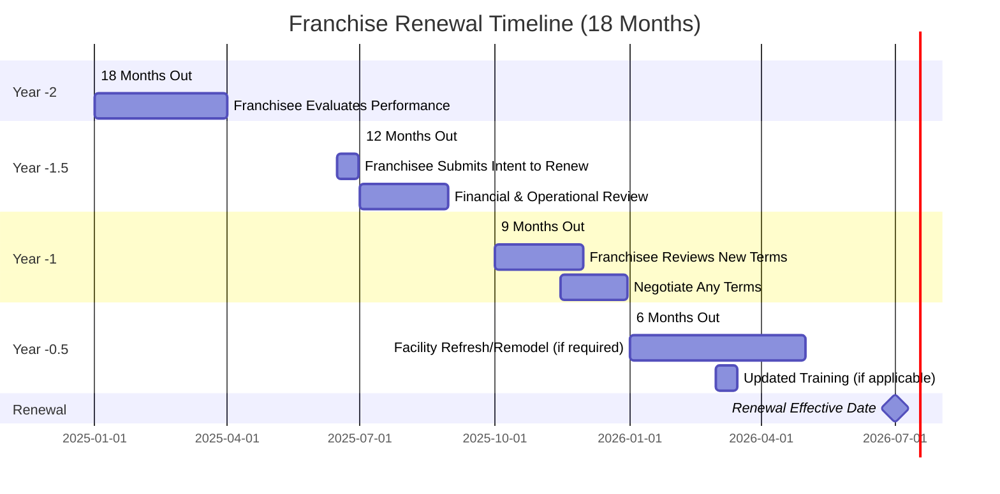

---

#### 1.1 Renewal Eligibility Criteria

```
RENEWAL QUALIFICATION CHECKLIST

To be eligible for renewal, franchisee must meet the following:

OPERATIONAL REQUIREMENTS:
□ In good standing for last 3 years (no defaults)
□ Audit scores averaging 80+ over last 3 years
□ No unresolved compliance issues
□ Operating hours compliance: 95%+
□ LazyFranchisor platform usage: Active and current

FINANCIAL REQUIREMENTS:
□ All royalty payments current (no outstanding balances)
□ Sales performance within acceptable range (not bottom 10%)
□ Financial statements submitted on time (last 3 years)
□ No outstanding fees or charges owed to franchisor
□ Satisfactory credit standing

FACILITY REQUIREMENTS:
□ Facility in good condition (not requiring major repairs)
□ Willing to complete required refresh/remodel
□ Lease secured for renewal term (if leasing)
□ All required equipment functional and up-to-date

COMPLIANCE REQUIREMENTS:
□ No breach of franchise agreement in last 3 years
□ All licenses, permits, and insurance current
□ No significant litigation or legal issues
□ Training certifications current for owner and managers

RELATIONSHIP REQUIREMENTS:
□ Positive working relationship with franchisor
□ Participation in franchisee advisory council (if applicable)
□ Responsiveness to communications and requests
□ Good reputation in local market and community

RENEWAL FEE: $5,000
RENEWAL TERM: 10 years (with option for 1 additional 10-year renewal)

DISQUALIFYING FACTORS:
├─ Material breach of franchise agreement (unresolved)
├─ Fraud or misrepresentation
├─ Criminal conviction related to business operations
├─ Repeated violations of brand standards
├─ Bottom 5% of system performance (3 consecutive years)
└─ Refusal to complete required facility improvements
```

---

### 2. Multi-Unit Expansion Process

**Expansion Qualification:**

```
┌─────────────────────────────────────────────────────────────┐
│              MULTI-UNIT EXPANSION CRITERIA                   │
├─────────────────────────────────────────────────────────────┤
│                                                              │
│  ELIGIBILITY FOR SECOND UNIT:                                │
│  ├─ First unit operating for minimum 18 months               │
│  ├─ First unit audit score: 85+ average                      │
│  ├─ First unit sales: Top 60% of system                      │
│  ├─ Royalty payments: 100% on-time for 12 months             │
│  ├─ Strong management team in place (can operate without     │
│  │   owner present)                                          │
│  ├─ Financial capacity: Additional $250K-$500K liquid        │
│  └─ Demonstrated leadership and operational excellence       │
│                                                              │
│  AREA DEVELOPMENT AGREEMENT (3-5 UNITS):                     │
│  ├─ Requirements: All of the above, plus                     │
│  │  ├─ Net worth: $1.5M+                                     │
│  │  ├─ Liquid capital: $750K+                                │
│  │  ├─ Multi-unit experience (preferred)                     │
│  │  └─ Commit to development schedule                        │
│  ├─ Benefits:                                                │
│  │  ├─ Reduced franchise fee: $30K per unit (vs. $45K)       │
│  │  ├─ Protected territory for development                   │
│  │  └─ Priority support from franchisor                      │
│  └─ Development Schedule:                                    │
│      ├─ Unit 2: Within 18 months                             │
│      ├─ Unit 3: Within 30 months                             │
│      ├─ Unit 4: Within 42 months                             │
│      └─ Unit 5: Within 54 months                             │
│                                                              │
│  MASTER FRANCHISE AGREEMENT (10+ UNITS):                     │
│  ├─ Requirements:                                            │
│  │  ├─ Net worth: $5M+                                       │
│  │  ├─ Liquid capital: $2M+                                  │
│  │  ├─ Extensive multi-unit franchising experience           │
│  │  └─ Operational infrastructure (management team)          │
│  ├─ Benefits:                                                │
│  │  ├─ Territory: Exclusive market (state/region)            │
│  │  ├─ Franchise fee: $20K per unit                          │
│  │  ├─ Reduced royalty: 5% (vs. 6%)                          │
│  │  └─ Sub-franchising rights (with approval)                │
│  └─ Custom development schedule (negotiated)                 │
│                                                              │
└─────────────────────────────────────────────────────────────┘
```

---

## Exit & Termination Process

### 1. Voluntary Exit (Franchisee-Initiated)

#### 1.1 Sale/Transfer to Third Party

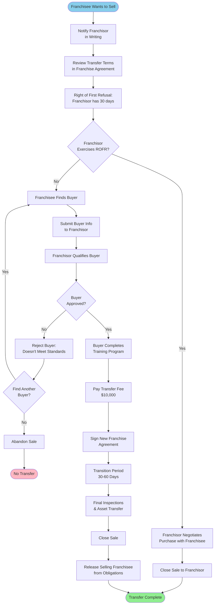

**Transfer Requirements:**
- Buyer must meet all qualification criteria (same as new franchisee)
- Seller must be in good standing (no defaults)
- Transfer fee: $10,000 (covers legal and administrative costs)
- Buyer completes full training program
- Seller assists with transition (30-60 days)
- All outstanding fees paid to franchisor

---

#### 1.2 Closure/Non-Renewal

```
VOLUNTARY CLOSURE PROCESS

Notice Required: 180 days before intended closure date

Steps:

1. Submit Written Notice (Day 1):
   └─ Certified letter to franchisor with closure date

2. Exit Interview (Within 14 days):
   ├─ Discuss reasons for closure
   ├─ Explore alternatives (transfer, temporary relief)
   └─ Review post-closure obligations

3. Wind-Down Period (Months 1-6):
   ├─ Continue operations per franchise agreement
   ├─ Pay all royalties and fees through closure date
   ├─ Maintain brand standards through final day
   └─ Plan liquidation of assets

4. Final Month:
   ├─ Announce closure to customers and community
   ├─ Liquidate inventory (with franchisor approval)
   ├─ Terminate lease or prepare property for return
   └─ Employee terminations (follow labor laws)

5. Closure Day:
   ├─ Final sales report submitted
   ├─ Final royalty payment
   ├─ Return all proprietary materials (manuals, recipes, etc.)
   └─ De-identification (remove all brand signage and materials)

6. Post-Closure (Within 30 days):
   ├─ Final inspection by franchisor
   ├─ Settle any outstanding accounts
   ├─ Sign release and termination agreement
   └─ Non-compete period begins (typically 2 years)

Costs:
├─ All outstanding fees and royalties
├─ De-identification costs (signage removal, etc.)
├─ Any lease termination fees (franchisee's responsibility)
└─ No refund of franchise fee
```

---

### 2. Involuntary Termination (Franchisor-Initiated)

**Grounds for Termination:**

```
IMMEDIATE TERMINATION (No Cure Period):
├─ Fraud or misrepresentation
├─ Criminal conviction related to business
├─ Abandonment of franchise (closed without notice)
├─ Bankruptcy filing
├─ Health or safety violations endangering public
├─ Unauthorized transfer or sublicense
└─ Operating competing business during term

TERMINATION AFTER NOTICE & CURE PERIOD (30 days):
├─ Failure to pay royalties or fees (3 consecutive times)
├─ Repeated breach of brand standards (3+ violations)
├─ Persistent failure to meet minimum sales standards
├─ Loss of required licenses or permits
├─ Failure to maintain required insurance
├─ Failure to complete Performance Improvement Plan
└─ Material breach of franchise agreement
```

---

#### 2.1 Termination Process

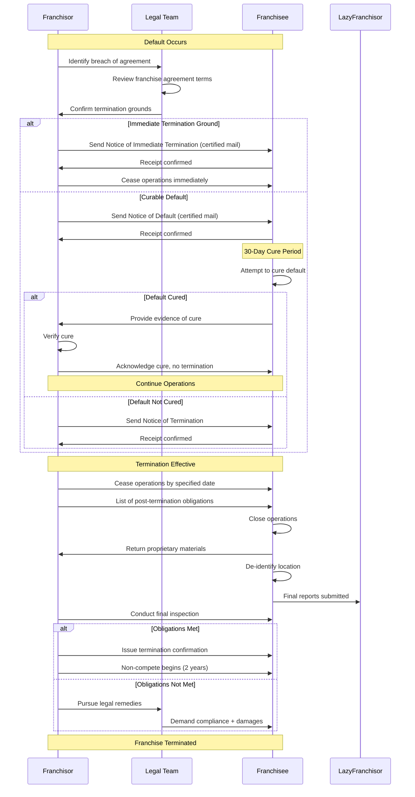

---

## Complete Process Visualizations

### 1. Complete Franchise Lifecycle (End-to-End)

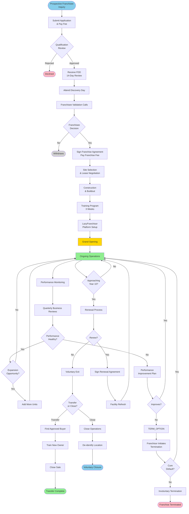

---

### 2. Data Flow Through LazyFranchisor Platform

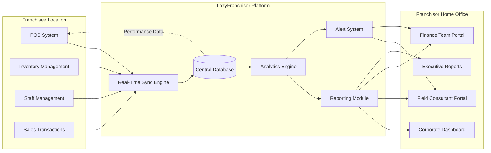

---

## Conclusion

This comprehensive Franchise Lifecycle Management Guide provides the complete operational framework for managing franchises from initial inquiry through exit. By leveraging the LazyFranchisor platform, both franchisors and franchisees benefit from:

✅ **Streamlined Processes**: Documented workflows for every stage
✅ **Clear Expectations**: Defined standards and KPIs
✅ **Consistent Support**: Structured training and ongoing assistance
✅ **Data-Driven Decisions**: Real-time monitoring and analytics
✅ **Quality Assurance**: Regular audits and performance reviews
✅ **Scalable Growth**: Multi-unit expansion pathways
✅ **Risk Management**: Compliance and termination procedures

### Key Success Factors

1. **Technology Integration**: LazyFranchisor platform as central operating system
2. **Proactive Support**: Regular QBRs and field consultant visits
3. **Performance Management**: Early intervention for at-risk franchisees
4. **Continuous Improvement**: Feedback loops and system optimization
5. **Relationship Focus**: Partnership mentality vs. top-down control

---

**Document Control:**
- **Version**: 1.0
- **Last Updated**: October 28, 2025
- **Next Review**: January 28, 2026
- **Owner**: VP Operations / Franchise Development

*End of Franchise Lifecycle Management Guide*
