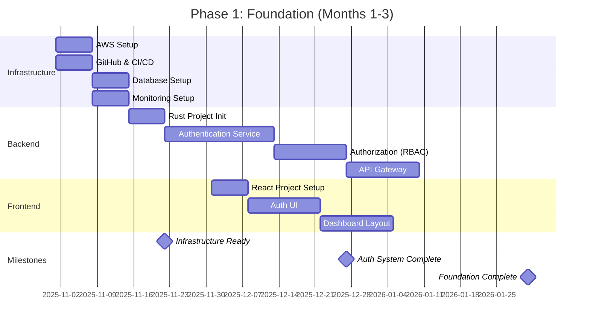
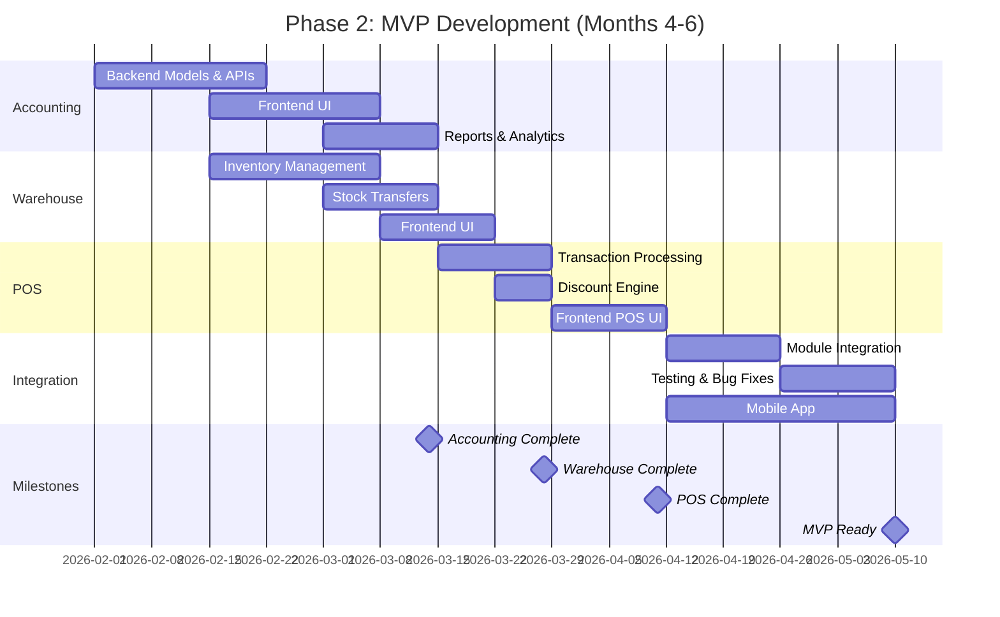
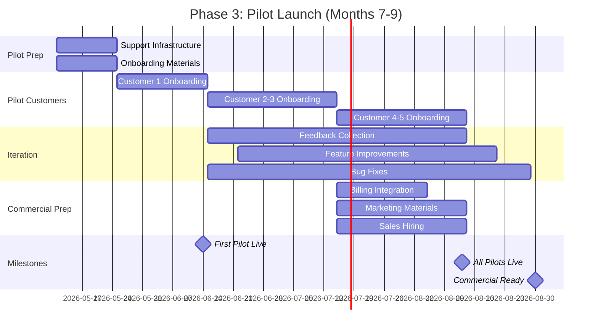
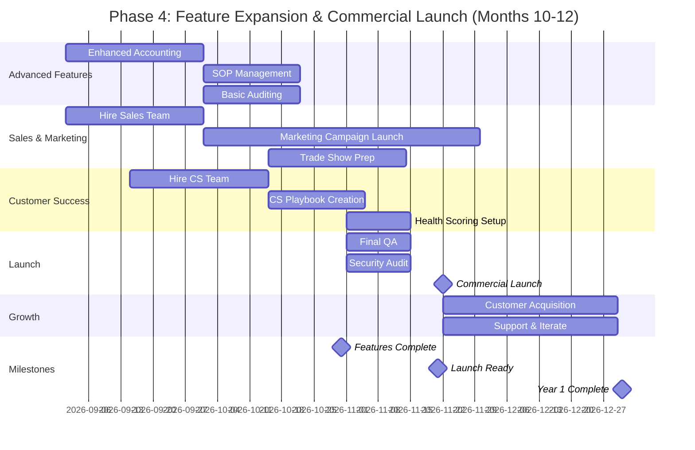
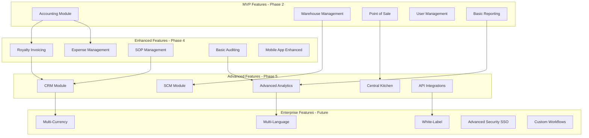
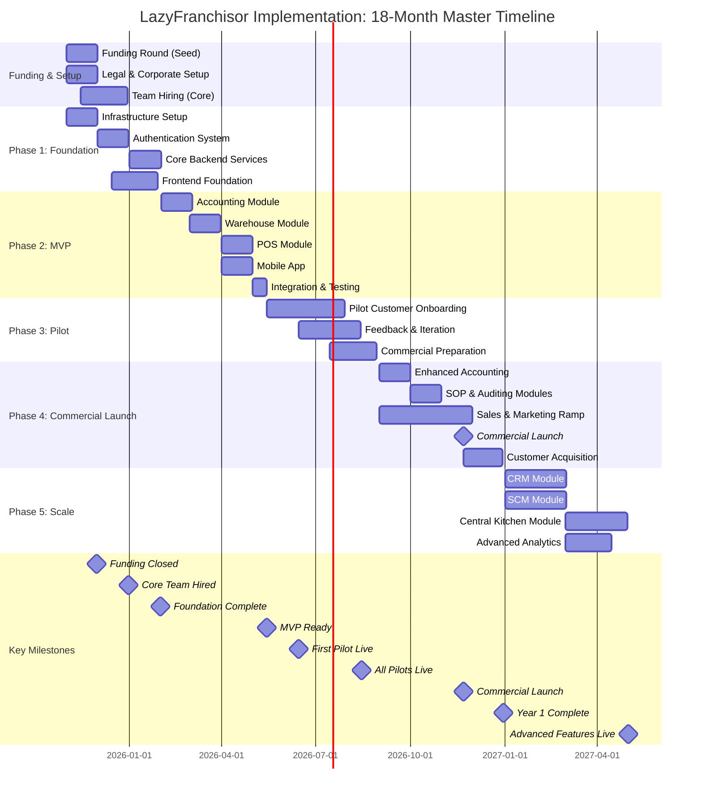

# LazyFranchisor: Implementation Checklist & Plans

**Document Version:** 1.0
**Date:** October 28, 2025
**Purpose:** Comprehensive implementation checklist, phased plans, and execution guidelines

---

## Table of Contents

1. [Master Implementation Checklist](#master-implementation-checklist)
2. [Phase-by-Phase Implementation Plans](#phase-by-phase-implementation-plans)
3. [Feature Development Roadmap](#feature-development-roadmap)
4. [Team Onboarding Checklist](#team-onboarding-checklist)
5. [Infrastructure Setup Checklist](#infrastructure-setup-checklist)
6. [Go-Live Readiness Checklist](#go-live-readiness-checklist)
7. [Implementation Timeline Visualization](#implementation-timeline-visualization)
8. [Risk Management Checklist](#risk-management-checklist)

---

## Master Implementation Checklist

### ✅ Pre-Implementation Phase (Weeks 1-4)

#### Week 1: Foundation & Setup

**Legal & Corporate:**
- [ ] Incorporate company (C-Corp recommended)
- [ ] Register business name and trademark
- [ ] Obtain EIN from IRS
- [ ] Open business bank account
- [ ] Set up business credit card
- [ ] Engage corporate attorney
- [ ] Engage accounting firm
- [ ] Set up cap table management (Carta, etc.)

**Funding & Finance:**
- [ ] Finalize financial model and projections
- [ ] Create investor pitch deck
- [ ] Identify target investors (angels, VCs)
- [ ] Schedule investor meetings
- [ ] Negotiate term sheet
- [ ] Close seed funding round ($2-3M target)
- [ ] Set up accounting software (QuickBooks, NetSuite)
- [ ] Establish budget and expense policies

**Team & Recruitment:**
- [ ] Define job descriptions for core roles
- [ ] Post jobs on LinkedIn, AngelList, etc.
- [ ] Engage technical recruiters
- [ ] Screen initial candidates
- [ ] Schedule interviews for engineering lead
- [ ] Prepare offer letters and equity agreements
- [ ] Set up HR system (Gusto, Rippling)
- [ ] Create employee handbook

---

#### Week 2: Infrastructure & Tooling

**Development Infrastructure:**
- [ ] Set up AWS account (root and IAM users)
- [ ] Configure multi-factor authentication (MFA)
- [ ] Create VPC and subnet architecture
- [ ] Set up development, staging, production environments
- [ ] Configure CloudFront CDN
- [ ] Set up S3 buckets (development, production, backups)
- [ ] Provision RDS PostgreSQL instances
- [ ] Configure ElastiCache Redis clusters
- [ ] Set up monitoring (CloudWatch, Prometheus)

**Developer Tools:**
- [ ] Create GitHub organization
- [ ] Set up GitHub repositories (monorepo structure)
- [ ] Configure branch protection rules (main, develop)
- [ ] Set up GitHub Actions for CI/CD
- [ ] Create Docker Hub account
- [ ] Configure Docker registry
- [ ] Set up Slack workspace
- [ ] Create team channels (#engineering, #product, #general)
- [ ] Set up Linear/Jira for project management
- [ ] Configure Figma for design

**Security & Compliance:**
- [ ] Implement security policies
- [ ] Set up 1Password for credential management
- [ ] Configure VPN access
- [ ] Implement IP whitelisting
- [ ] Set up SSL certificates (Let's Encrypt)
- [ ] Create incident response plan
- [ ] Set up log aggregation (ELK stack)
- [ ] Configure automated backups

---

#### Week 3: Team Building

**Core Hires (Priority Order):**
- [ ] Hire Engineering Lead/CTO
  - [ ] Offer extended
  - [ ] Offer accepted
  - [ ] Background check completed
  - [ ] Start date confirmed

- [ ] Hire Backend Engineer #1 (Rust)
  - [ ] Offer extended
  - [ ] Offer accepted
  - [ ] Start date confirmed

- [ ] Hire Backend Engineer #2 (Rust)
  - [ ] Offer extended
  - [ ] Offer accepted
  - [ ] Start date confirmed

- [ ] Hire Frontend Engineer (React)
  - [ ] Offer extended
  - [ ] Offer accepted
  - [ ] Start date confirmed

- [ ] Hire DevOps Engineer
  - [ ] Offer extended
  - [ ] Offer accepted
  - [ ] Start date confirmed

**Onboarding Preparation:**
- [ ] Create onboarding documentation
- [ ] Set up employee workstations (laptops, monitors)
- [ ] Provision GitHub access
- [ ] Provision AWS access (IAM roles)
- [ ] Provision Slack accounts
- [ ] Create email accounts (@lazyfranchisor.com)
- [ ] Prepare welcome packages

---

#### Week 4: Product & Planning

**Product Management:**
- [ ] Hire Product Manager
- [ ] Create product roadmap (18 months)
- [ ] Define MVP scope (accounting, warehouse, POS)
- [ ] Create user stories for MVP
- [ ] Prioritize backlog in Linear/Jira
- [ ] Define acceptance criteria
- [ ] Create wireframes for key screens
- [ ] Design system setup in Figma

**Technical Architecture:**
- [ ] Review and finalize system architecture
- [ ] Define database schema (ERD)
- [ ] Design API contracts (OpenAPI spec)
- [ ] Define microservices boundaries
- [ ] Create technical design documents
- [ ] Set up architecture decision records (ADRs)
- [ ] Conduct architecture review meeting

**Development Standards:**
- [ ] Define coding standards (Rust, TypeScript)
- [ ] Set up linters (Clippy for Rust, ESLint for TS)
- [ ] Configure code formatters (rustfmt, Prettier)
- [ ] Define git workflow (Gitflow)
- [ ] Create pull request template
- [ ] Define testing requirements (80% coverage)
- [ ] Document deployment procedures

---

### ✅ Phase 1: Foundation (Months 1-3)

#### Month 1: Core Infrastructure

**Backend Setup:**
- [ ] Initialize Rust workspace (Cargo.toml)
- [ ] Set up Axum web framework
- [ ] Configure logging (tracing, tracing-subscriber)
- [ ] Implement error handling
- [ ] Set up database connection pool (sqlx)
- [ ] Create migration framework
- [ ] Implement health check endpoint
- [ ] Set up API documentation (Swagger/OpenAPI)

**Database:**
- [ ] Create initial migration (users, roles, permissions)
- [ ] Set up PostGIS extension
- [ ] Configure connection pooling
- [ ] Implement seed data scripts
- [ ] Set up backup procedures
- [ ] Configure replication (read replicas)
- [ ] Test disaster recovery

**CI/CD Pipeline:**
- [ ] Configure GitHub Actions for Rust tests
- [ ] Set up automated linting
- [ ] Configure Docker image builds
- [ ] Implement automated migrations
- [ ] Set up staging deployment
- [ ] Configure production deployment (manual approval)
- [ ] Set up rollback procedures

**Sprint 1 Deliverables:**
- [ ] Health check API endpoint
- [ ] Database connection established
- [ ] CI/CD pipeline operational
- [ ] Development environment accessible

---

#### Month 2: Authentication & Authorization

**Authentication Service:**
- [ ] Implement user registration endpoint
- [ ] Implement login endpoint (JWT generation)
- [ ] Implement password hashing (Argon2)
- [ ] Implement JWT middleware
- [ ] Implement refresh token flow
- [ ] Implement password reset flow
- [ ] Implement email verification
- [ ] Write unit tests (80%+ coverage)

**Authorization (RBAC):**
- [ ] Define role hierarchy (Admin, Manager, User)
- [ ] Implement permission checking middleware
- [ ] Create role assignment endpoints
- [ ] Implement permission caching (Redis)
- [ ] Test authorization flows
- [ ] Document API endpoints

**Frontend - Authentication:**
- [ ] Create login page
- [ ] Create registration page
- [ ] Implement JWT storage (secure)
- [ ] Implement protected routes
- [ ] Create password reset flow
- [ ] Implement error handling
- [ ] Add form validation

**Sprint 2-3 Deliverables:**
- [ ] User can register and login
- [ ] JWT authentication working
- [ ] Role-based access control functional
- [ ] Frontend auth flows complete

---

#### Month 3: Core Backend Services

**API Gateway:**
- [ ] Implement request routing
- [ ] Set up rate limiting
- [ ] Configure CORS policies
- [ ] Implement request logging
- [ ] Set up API versioning (/api/v1)
- [ ] Configure timeout handling

**Data Models:**
- [ ] Implement User model
- [ ] Implement Franchisee model
- [ ] Implement Product model
- [ ] Implement basic CRUD operations
- [ ] Write integration tests
- [ ] Document data models

**Frontend Foundation:**
- [ ] Set up React project (Vite or CRA)
- [ ] Configure TypeScript
- [ ] Set up Redux or Context API
- [ ] Create main layout component
- [ ] Implement navigation
- [ ] Create dashboard skeleton
- [ ] Set up component library (Material-UI, Ant Design)

**Sprint 4-5 Deliverables:**
- [ ] API gateway operational
- [ ] Basic CRUD operations working
- [ ] Frontend framework set up
- [ ] Navigation and layout complete

---

### ✅ Phase 2: MVP Development (Months 4-6)

#### Month 4: Accounting Module

**Backend - Accounting:**
- [ ] Implement SalesTransaction model
- [ ] Implement SalesLineItem model
- [ ] Create POST /api/v1/sales endpoint
- [ ] Create GET /api/v1/sales endpoints
- [ ] Create GET /api/v1/reports/sales/summary
- [ ] Implement sales aggregation logic
- [ ] Write comprehensive tests
- [ ] Optimize query performance

**Frontend - Accounting:**
- [ ] Create sales entry form
- [ ] Create sales list view
- [ ] Create sales detail view
- [ ] Create sales summary dashboard
- [ ] Implement date range filtering
- [ ] Add export to CSV functionality
- [ ] Create charts (sales trends)

**Sprint 6-7 Deliverables:**
- [ ] Sales transactions can be recorded
- [ ] Sales reports can be generated
- [ ] Dashboard shows key metrics
- [ ] Export functionality works

---

#### Month 5: Warehouse & POS Modules

**Backend - Warehouse:**
- [ ] Implement InventoryItem model
- [ ] Implement StockTransfer model
- [ ] Create inventory management endpoints
- [ ] Create stock transfer endpoints
- [ ] Implement inventory adjustment logic
- [ ] Add low stock alerts
- [ ] Write tests

**Backend - POS:**
- [ ] Create POS transaction endpoint
- [ ] Implement discount application logic
- [ ] Integrate with inventory (real-time updates)
- [ ] Implement receipt generation
- [ ] Create POS reporting endpoints
- [ ] Write tests

**Frontend - Warehouse:**
- [ ] Create inventory list view
- [ ] Create stock transfer form
- [ ] Create receiving interface
- [ ] Add inventory alerts
- [ ] Implement barcode scanning (if hardware available)

**Frontend - POS:**
- [ ] Create POS transaction interface
- [ ] Implement product search
- [ ] Add discount application UI
- [ ] Create cart management
- [ ] Implement payment processing UI
- [ ] Generate and display receipt

**Sprint 8-10 Deliverables:**
- [ ] Inventory management functional
- [ ] Stock transfers working end-to-end
- [ ] POS transactions processing correctly
- [ ] Real-time inventory updates working

---

#### Month 6: Integration & Testing

**System Integration:**
- [ ] Test end-to-end workflows
- [ ] Verify POS → Inventory integration
- [ ] Test Sales → Accounting integration
- [ ] Verify data consistency
- [ ] Load testing (Apache JMeter)
- [ ] Security testing (OWASP Top 10)

**Mobile App (React Native):**
- [ ] Initialize React Native project
- [ ] Set up navigation
- [ ] Implement authentication screens
- [ ] Create mobile dashboard
- [ ] Implement key features (POS, inventory check)
- [ ] Test on iOS and Android

**Bug Fixes & Polish:**
- [ ] Address all critical bugs
- [ ] Fix UI/UX issues
- [ ] Optimize performance bottlenecks
- [ ] Improve error messages
- [ ] Add loading states
- [ ] Implement offline support (basic)

**Documentation:**
- [ ] API documentation complete (Swagger)
- [ ] User guide written
- [ ] Admin guide written
- [ ] Training videos recorded
- [ ] FAQ document created

**Sprint 11-12 Deliverables:**
- [ ] MVP feature complete
- [ ] All critical bugs fixed
- [ ] Mobile app functional (basic)
- [ ] Documentation ready
- [ ] **MVP READY FOR PILOT** ✅

---

### ✅ Phase 3: Pilot Launch (Months 7-9)

#### Month 7: Pilot Onboarding

**Pilot Customer Selection:**
- [ ] Identify 3-5 pilot candidates
- [ ] Conduct discovery calls
- [ ] Offer pilot terms (50% discount, 6 months)
- [ ] Sign pilot agreements
- [ ] Collect feedback requirements

**Pilot Customer #1 Onboarding:**
- [ ] Kickoff call
- [ ] Collect franchisee data
- [ ] Import data to system
- [ ] Configure system settings
- [ ] Train admin users
- [ ] Train end users
- [ ] Go live
- [ ] Monitor usage daily

**Pilot Customer #2-3 Onboarding:**
- [ ] Repeat onboarding process
- [ ] Document lessons learned
- [ ] Update onboarding materials
- [ ] Refine training approach

**Support Infrastructure:**
- [ ] Set up support email (support@lazyfranchisor.com)
- [ ] Configure Zendesk or similar
- [ ] Create support ticket categories
- [ ] Write initial knowledge base articles
- [ ] Set up on-call rotation
- [ ] Define SLAs for pilot customers

---

#### Month 8: Iteration Based on Feedback

**Product Iteration:**
- [ ] Collect pilot feedback (surveys, interviews)
- [ ] Prioritize feature requests
- [ ] Address critical pain points
- [ ] Implement quick wins
- [ ] Conduct usability testing
- [ ] Iterate on UX improvements

**Bug Fixes:**
- [ ] Fix pilot-reported bugs (priority queue)
- [ ] Improve error handling
- [ ] Optimize slow queries
- [ ] Enhance mobile app stability

**Additional Features:**
- [ ] Implement top 3 requested features
- [ ] Improve reporting capabilities
- [ ] Add more integrations (if requested)
- [ ] Enhance mobile app features

**Pilot Customers #4-5:**
- [ ] Onboard remaining pilot customers
- [ ] Apply learnings from previous onboardings
- [ ] Measure onboarding time (target: <30 days)

---

#### Month 9: Stabilization & Commercial Prep

**Platform Stabilization:**
- [ ] Conduct security audit
- [ ] Perform load testing (1000 concurrent users)
- [ ] Optimize database queries
- [ ] Implement caching strategies
- [ ] Set up monitoring dashboards
- [ ] Test disaster recovery procedures

**Commercial Readiness:**
- [ ] Finalize pricing tiers
- [ ] Create self-service signup flow
- [ ] Implement billing integration (Stripe)
- [ ] Set up subscription management
- [ ] Create invoicing system
- [ ] Test payment flows

**Marketing Materials:**
- [ ] Build marketing website
- [ ] Create product demo videos
- [ ] Write case studies (pilot customers)
- [ ] Design sales collateral
- [ ] Prepare launch campaign

**Sales Enablement:**
- [ ] Hire first Sales Executive
- [ ] Create sales playbook
- [ ] Develop demo script
- [ ] Set up CRM (Salesforce/HubSpot)
- [ ] Train sales team on product
- [ ] Define lead qualification criteria

**Sprint 13-15 Deliverables:**
- [ ] 5 pilot customers using system successfully
- [ ] Platform stable and performant
- [ ] Commercial launch ready
- [ ] Sales and marketing materials complete

---

### ✅ Phase 4: Feature Expansion (Months 10-12)

#### Month 10: Advanced Accounting Features

**Enhanced Accounting:**
- [ ] Implement royalty invoice generation
- [ ] Create expense management module
- [ ] Build advanced financial reports (P&L, Balance Sheet)
- [ ] Add budget tracking
- [ ] Implement multi-currency support (if needed)
- [ ] Create automated royalty calculation

**Frontend:**
- [ ] Create royalty dashboard
- [ ] Build expense submission form
- [ ] Implement financial report builder
- [ ] Add data export (PDF, Excel)

---

#### Month 11: SOP & Auditing Modules

**SOP Management:**
- [ ] Implement SOPDocument model
- [ ] Create SOP CRUD endpoints
- [ ] Implement version control
- [ ] Build SOP task assignment
- [ ] Create training tracking
- [ ] Add SOP search functionality

**Basic Auditing:**
- [ ] Implement AuditChecklist model
- [ ] Implement Inspection model
- [ ] Create audit scheduling endpoints
- [ ] Build audit submission flow
- [ ] Implement media upload (photos/videos)
- [ ] Generate audit reports

**Frontend:**
- [ ] Create SOP library interface
- [ ] Build SOP editor
- [ ] Implement audit checklist builder
- [ ] Create inspection mobile interface
- [ ] Build audit reporting dashboard

---

#### Month 12: Commercial Launch

**Final Preparations:**
- [ ] Complete all feature development
- [ ] Final QA testing
- [ ] Security penetration testing
- [ ] Compliance review (GDPR, SOC 2 prep)
- [ ] Update all documentation
- [ ] Record training videos

**Launch Activities:**
- [ ] Launch marketing website
- [ ] Activate advertising campaigns
- [ ] Send press releases
- [ ] Host launch webinar
- [ ] Activate referral program

**Sales & Marketing:**
- [ ] Hire additional Sales Executives (2 total)
- [ ] Hire Marketing Manager
- [ ] Launch content marketing strategy
- [ ] Attend first franchise trade show
- [ ] Begin partnership outreach

**Customer Success:**
- [ ] Hire 2 Implementation Specialists
- [ ] Hire 2 Customer Success Managers
- [ ] Create customer success playbook
- [ ] Implement customer health scoring
- [ ] Set up QBR process

**Sprint 16-18 Deliverables:**
- [ ] **COMMERCIAL LAUNCH** 🚀
- [ ] All expanded features live
- [ ] Sales team operational
- [ ] Marketing campaigns active
- [ ] Target: 10+ paying customers

---

## Phase-by-Phase Implementation Plans

### Phase 1 Detailed Plan (Months 1-3)



**Success Criteria:**
- ✅ All infrastructure provisioned and accessible
- ✅ Authentication and authorization working end-to-end
- ✅ CI/CD pipeline operational
- ✅ Frontend framework set up with basic navigation

---

### Phase 2 Detailed Plan (Months 4-6)



**Success Criteria:**
- ✅ All MVP modules functional
- ✅ End-to-end workflows tested
- ✅ Mobile app working (basic features)
- ✅ Ready for pilot customers

---

### Phase 3 Detailed Plan (Months 7-9)



**Success Criteria:**
- ✅ 5 pilot customers successfully onboarded
- ✅ Positive feedback and case studies
- ✅ Platform stable with <5 critical bugs
- ✅ Ready for commercial launch

---

### Phase 4 Detailed Plan (Months 10-12)



**Success Criteria:**
- ✅ All Phase 4 features launched
- ✅ 10+ paying customers acquired
- ✅ Sales and marketing teams operational
- ✅ Platform generating revenue

---

## Feature Development Roadmap

### Feature Priority Matrix



---

### Feature Breakdown by Module

#### 1. Accounting Module

**MVP Features (Month 4):**
```
├─ Sales Transaction Recording
│  ├─ Manual entry form
│  ├─ Multiple line items
│  ├─ Tax calculation
│  └─ Receipt generation
├─ Sales Reporting
│  ├─ Daily sales summary
│  ├─ Weekly/monthly aggregation
│  ├─ Sales by product
│  └─ Sales by location
└─ Basic Dashboard
   ├─ Today's sales
   ├─ Week-to-date
   ├─ Month-to-date
   └─ Year-to-date
```

**Enhanced Features (Month 10):**
```
├─ Royalty Management
│  ├─ Automated calculation (% of sales)
│  ├─ Invoice generation
│  ├─ Payment tracking
│  └─ Royalty reports
├─ Expense Management
│  ├─ Expense submission
│  ├─ Category management
│  ├─ Approval workflow
│  └─ Expense reports
├─ Advanced Financial Reports
│  ├─ Profit & Loss statement
│  ├─ Balance sheet
│  ├─ Cash flow statement
│  └─ Budget vs actual
└─ Financial Analytics
   ├─ Trend analysis
   ├─ Comparative reports (YoY, MoM)
   ├─ Forecast projections
   └─ Custom report builder
```

---

#### 2. Warehouse Management Module

**MVP Features (Month 5):**
```
├─ Inventory Tracking
│  ├─ Product catalog
│  ├─ Current stock levels
│  ├─ Low stock alerts
│  └─ Inventory valuation
├─ Stock Transfers
│  ├─ Transfer request form
│  ├─ Approval workflow
│  ├─ Shipping tracking
│  └─ Receipt confirmation
└─ Basic Inventory Reports
   ├─ Stock on hand
   ├─ Transfer history
   └─ Stock valuation
```

**Enhanced Features (Phase 5):**
```
├─ Advanced Inventory
│  ├─ Batch/lot tracking
│  ├─ Expiration date management
│  ├─ Serial number tracking
│  └─ Multi-location inventory
├─ Receiving & Putaway
│  ├─ Purchase order receiving
│  ├─ Bin location management
│  ├─ Quality inspection
│  └─ Putaway optimization
├─ Cycle Counting
│  ├─ Count schedule generation
│  ├─ Mobile counting interface
│  ├─ Variance reporting
│  └─ Adjustment tracking
└─ Warehouse Analytics
   ├─ Inventory turnover
   ├─ ABC analysis
   ├─ Slow-moving stock
   └─ Shrinkage reports
```

---

#### 3. Point of Sale Module

**MVP Features (Month 5):**
```
├─ Transaction Processing
│  ├─ Product search/scan
│  ├─ Cart management
│  ├─ Payment processing
│  └─ Receipt printing
├─ Discount Management
│  ├─ Percentage discounts
│  ├─ Fixed amount discounts
│  ├─ Product-specific promotions
│  └─ Discount approval workflow
└─ POS Reporting
   ├─ End-of-day report
   ├─ Transaction history
   └─ Tender reconciliation
```

**Enhanced Features (Phase 5):**
```
├─ Order Management
│  ├─ Dine-in orders
│  ├─ Takeout orders
│  ├─ Delivery orders
│  └─ Order tracking
├─ Table Management
│  ├─ Table layout
│  ├─ Table status
│  ├─ Server assignment
│  └─ Table transfers
├─ Employee Management
│  ├─ Clock in/out
│  ├─ Sales by employee
│  ├─ Commission tracking
│  └─ Performance metrics
└─ Loyalty & Gift Cards
   ├─ Customer loyalty program
   ├─ Points accumulation
   ├─ Points redemption
   └─ Gift card management
```

---

## Team Onboarding Checklist

### New Engineer Onboarding (Week 1-2)

**Day 1: Welcome & Setup**
- [ ] Welcome meeting with team
- [ ] Receive laptop and equipment
- [ ] Set up email and Slack accounts
- [ ] Get access to GitHub organization
- [ ] Get access to AWS console
- [ ] Review company handbook
- [ ] Complete HR paperwork
- [ ] Lunch with team

**Day 2-3: Documentation Review**
- [ ] Read Master Documentation Index
- [ ] Review system architecture diagrams
- [ ] Study database ERD
- [ ] Read Development Guidelines
- [ ] Review coding standards
- [ ] Study API documentation
- [ ] Watch demo videos

**Day 4-5: Environment Setup**
- [ ] Clone repositories
- [ ] Set up local development environment
- [ ] Install Rust toolchain
- [ ] Install Node.js and npm
- [ ] Install Docker Desktop
- [ ] Configure IDE (VS Code, IntelliJ)
- [ ] Run application locally
- [ ] Run test suite locally

**Week 2: First Contributions**
- [ ] Assign first "good first issue"
- [ ] Pair programming with senior engineer
- [ ] Submit first pull request
- [ ] Participate in code review
- [ ] Attend sprint planning
- [ ] Attend daily standup
- [ ] Shadow customer support (1 day)

**Onboarding Success Criteria:**
- [ ] Can run application locally
- [ ] Understands system architecture
- [ ] Has submitted and merged first PR
- [ ] Feels comfortable asking questions

---

## Infrastructure Setup Checklist

### AWS Infrastructure

**Core Services:**
- [ ] VPC with public and private subnets
- [ ] Application Load Balancer (ALB)
- [ ] EC2 instances for API servers (Auto Scaling Group)
- [ ] RDS PostgreSQL (Multi-AZ)
- [ ] ElastiCache Redis (cluster mode)
- [ ] S3 buckets (development, staging, production)
- [ ] CloudFront CDN
- [ ] Route 53 DNS
- [ ] ACM SSL certificates

**Security:**
- [ ] IAM roles and policies
- [ ] Security groups configured
- [ ] Network ACLs configured
- [ ] VPC Flow Logs enabled
- [ ] GuardDuty enabled
- [ ] CloudTrail logging enabled
- [ ] Secrets Manager configured
- [ ] WAF rules configured

**Monitoring:**
- [ ] CloudWatch dashboards
- [ ] CloudWatch alarms (CPU, memory, disk)
- [ ] Log Groups configured
- [ ] SNS topics for alerts
- [ ] PagerDuty integration
- [ ] Prometheus + Grafana setup

**Backups:**
- [ ] RDS automated backups (7 days)
- [ ] Manual snapshots schedule
- [ ] S3 versioning enabled
- [ ] S3 lifecycle policies
- [ ] Cross-region replication (production)

---

### Development Tools Setup

**Repository Structure:**
```
lazyfranchisor/
├─ .github/
│  └─ workflows/
│     ├─ ci.yml
│     ├─ deploy-staging.yml
│     └─ deploy-production.yml
├─ backend/
│  ├─ Cargo.toml
│  ├─ src/
│  ├─ migrations/
│  └─ tests/
├─ frontend/
│  ├─ web/
│  ├─ mobile/
│  └─ desktop/
├─ docker/
│  ├─ docker-compose.yml
│  ├─ Dockerfile.backend
│  └─ Dockerfile.frontend
├─ docs/
└─ scripts/
```

**Required Secrets:**
- [ ] `AWS_ACCESS_KEY_ID`
- [ ] `AWS_SECRET_ACCESS_KEY`
- [ ] `DATABASE_URL` (staging, production)
- [ ] `REDIS_URL` (staging, production)
- [ ] `JWT_SECRET`
- [ ] `STRIPE_API_KEY`
- [ ] `SENDGRID_API_KEY`

---

## Go-Live Readiness Checklist

### Pre-Launch (2 Weeks Before)

**Technical Readiness:**
- [ ] All MVP features complete and tested
- [ ] Performance testing passed (1000 concurrent users)
- [ ] Security audit completed (no critical findings)
- [ ] Disaster recovery tested
- [ ] Backup and restore tested
- [ ] Monitoring dashboards configured
- [ ] On-call rotation established
- [ ] Incident response playbook ready

**Product Readiness:**
- [ ] User documentation complete
- [ ] Admin documentation complete
- [ ] Training videos recorded
- [ ] FAQ document published
- [ ] In-app help content added
- [ ] Tooltips and onboarding flow
- [ ] Error messages user-friendly

**Business Readiness:**
- [ ] Pricing finalized and published
- [ ] Terms of Service reviewed by legal
- [ ] Privacy Policy published
- [ ] Billing integration tested (Stripe)
- [ ] Invoicing system tested
- [ ] Customer support ready (Zendesk)
- [ ] Sales playbook complete

**Marketing Readiness:**
- [ ] Marketing website live
- [ ] Product demo video published
- [ ] Case studies ready (pilot customers)
- [ ] Blog posts scheduled
- [ ] Social media accounts active
- [ ] Press release drafted
- [ ] Launch email campaign ready

---

### Launch Day

**Morning (8:00 AM):**
- [ ] All systems go/no-go check
- [ ] Engineering team on standby
- [ ] Support team briefed
- [ ] Monitoring dashboards open
- [ ] Incident response team identified

**Launch (10:00 AM):**
- [ ] Flip feature flag to enable signup
- [ ] Send launch email to mailing list
- [ ] Publish blog post
- [ ] Send press release
- [ ] Post on social media
- [ ] Activate advertising campaigns

**Monitoring (Throughout Day):**
- [ ] Monitor system performance (every hour)
- [ ] Monitor error rates
- [ ] Monitor signup conversion
- [ ] Monitor support ticket volume
- [ ] Address any critical issues immediately
- [ ] Post updates to team Slack channel

**End of Day Review (6:00 PM):**
- [ ] Review launch metrics
- [ ] Review any issues encountered
- [ ] Plan for next day
- [ ] Celebrate with team! 🎉

---

## Implementation Timeline Visualization

### 18-Month Master Timeline



---

## Risk Management Checklist

### Pre-Launch Risks

**Technical Risks:**
- [ ] Load testing performed (results documented)
- [ ] Disaster recovery plan tested
- [ ] Security vulnerabilities addressed
- [ ] Performance benchmarks met
- [ ] Scalability plan in place
- [ ] Database backup tested
- [ ] Rollback procedures documented

**Business Risks:**
- [ ] Competitive analysis updated
- [ ] Market timing validated
- [ ] Pricing strategy tested (pilot feedback)
- [ ] Customer acquisition channels identified
- [ ] Financial runway secured (18+ months)

**Operational Risks:**
- [ ] Key person dependencies identified
- [ ] Knowledge transfer completed
- [ ] Documentation complete
- [ ] Support team trained
- [ ] Escalation procedures defined

---

## Success Metrics & Tracking

### Phase 1 Success Metrics
```
Infrastructure:
└─ 100% uptime during development

Code Quality:
├─ 80%+ test coverage
├─ 0 critical security vulnerabilities
└─ <5 minute build time

Team:
├─ 5+ engineers hired
└─ <20% attrition rate
```

### Phase 2 Success Metrics
```
Features:
├─ 100% MVP features complete
└─ <10 critical bugs at launch

Performance:
├─ API response time <500ms (95th percentile)
├─ Page load time <2 seconds
└─ 99.5% uptime

Mobile:
├─ iOS app published
└─ Android app published
```

### Phase 3 Success Metrics
```
Pilot Customers:
├─ 5 pilot customers onboarded
├─ 90%+ user adoption within pilot organizations
├─ <30 days time to go-live
└─ 4.5+/5.0 satisfaction score

Platform:
├─ 99.9% uptime
├─ <5 critical bugs in production
└─ <2 hour mean time to resolution (MTTR)
```

### Phase 4 Success Metrics
```
Revenue:
├─ 10+ paying customers
├─ $250K+ ARR
└─ <5% churn rate

Customer Success:
├─ 95% onboarding completion rate
├─ 4.5+/5.0 customer satisfaction
└─ NPS >50

Operations:
├─ <4 hour support response SLA met 95%+
└─ <2% payment failure rate
```

---

## Next Steps After Documentation

### Week 1 Actions:
1. ✅ Review complete documentation package
2. ✅ Share Executive Summary with potential investors
3. ✅ Begin fundraising conversations
4. ✅ Post core engineering roles
5. ✅ Set up corporate entity

### Week 2-4 Actions:
1. ✅ Interview engineering candidates
2. ✅ Finalize funding round
3. ✅ Set up AWS infrastructure
4. ✅ Create GitHub organization
5. ✅ Begin Sprint 1

---

**This implementation checklist provides a complete roadmap from documentation to production launch. Follow each phase systematically for successful execution.** ✅

---

**Document Control:**
- **Version:** 1.0
- **Last Updated:** October 28, 2025
- **Next Review:** Weekly during implementation
- **Owner:** Engineering Lead / Product Manager

*End of Implementation Checklist*
