# LazyFranchisor: Revenue Management Strategy & Documentation

**Document Version:** 1.0
**Date:** October 28, 2025
**Purpose:** Comprehensive revenue management strategy, pricing models, tracking systems, and financial operations

---

## Table of Contents

1. [Executive Summary](#executive-summary)
2. [Revenue Streams Analysis](#revenue-streams-analysis)
3. [Pricing Strategy & Models](#pricing-strategy--models)
4. [Revenue Tracking & Reporting](#revenue-tracking--reporting)
5. [Financial Forecasting Models](#financial-forecasting-models)
6. [Revenue Operations & Workflows](#revenue-operations--workflows)
7. [Billing & Collections Management](#billing--collections-management)
8. [Revenue Recognition Policies](#revenue-recognition-policies)
9. [Key Performance Indicators](#key-performance-indicators)
10. [Revenue Optimization Strategies](#revenue-optimization-strategies)

---

## Executive Summary

LazyFranchisor's revenue model is designed for predictable, scalable growth through recurring subscription revenue with multiple expansion opportunities. This document outlines our comprehensive revenue management strategy covering pricing, tracking, forecasting, and optimization.

### Key Revenue Metrics (Year 3 Targets)

| Metric | Target |
|--------|--------|
| **Annual Recurring Revenue (ARR)** | $4,800,000 |
| **Monthly Recurring Revenue (MRR)** | $535,000 |
| **Total Customers** | 110 |
| **Average Revenue Per Account (ARPA)** | $44,000/year |
| **Net Revenue Retention (NRR)** | >110% |
| **Gross Margin** | >85% |
| **Customer Lifetime Value (LTV)** | $120,000 |
| **CAC Payback Period** | <18 months |

### Revenue Philosophy

Our revenue strategy is built on three core principles:

1. **Value-Based Pricing**: Charge based on value delivered, not cost-plus
2. **Customer Success = Revenue Growth**: Focus on retention and expansion
3. **Predictable & Transparent**: Clear pricing with no hidden fees

---

## Revenue Streams Analysis

### 1. Primary Revenue Streams

#### 1.1 Subscription Revenue (Core Business)

**Description:** Recurring monthly/annual fees based on number of franchise locations

**Pricing Model:** Per-location, per-month with tiered volume discounts

**Revenue Characteristics:**
- **Predictability**: High (recurring monthly)
- **Scalability**: Excellent (add locations = add revenue)
- **Margins**: 85-90% gross margin
- **Growth Rate**: Target 100% YoY in Year 1-2

**Tiers:**

```
┌─────────────────────────────────────────────────────────────┐
│                    SUBSCRIPTION TIERS                        │
├─────────────────────────────────────────────────────────────┤
│                                                              │
│  Starter Tier (5-20 locations)                              │
│  ├─ $150/location/month                                     │
│  ├─ Core modules (Accounting, Warehouse, POS)               │
│  ├─ Email support (24h response)                            │
│  └─ Target: Growing franchisors                             │
│                                                              │
│  Growth Tier (21-100 locations)                             │
│  ├─ $100/location/month                                     │
│  ├─ All Starter + SOP, Basic Auditing                       │
│  ├─ Email + phone support (4h response)                     │
│  └─ Target: Mid-size franchisors (PRIMARY)                  │
│                                                              │
│  Enterprise Tier (100+ locations)                           │
│  ├─ $50-75/location/month (negotiable)                      │
│  ├─ All Growth + CRM, SCM, Central Kitchen, Analytics       │
│  ├─ Dedicated CSM (1h response SLA)                         │
│  └─ Target: Large franchisors                               │
│                                                              │
└─────────────────────────────────────────────────────────────┘
```

**Revenue Projection (3-Year):**

| Year | Customers | Avg Locations | Avg Price/Loc | Monthly Revenue | Annual Revenue |
|------|-----------|---------------|---------------|-----------------|----------------|
| 1    | 10        | 35            | $110          | $38,500         | $250,000       |
| 2    | 50        | 40            | $105          | $210,000        | $1,800,000     |
| 3    | 110       | 47.5          | $102          | $533,775        | $4,800,000     |

---

#### 1.2 Implementation & Onboarding Fees

**Description:** One-time fees for initial setup, data migration, and training

**Pricing Model:** Fixed fee based on complexity

**Revenue Characteristics:**
- **Predictability**: Tied to new customer acquisition
- **Scalability**: Moderate (limited by CS team capacity)
- **Margins**: 60-70% (includes labor)
- **Growth Rate**: Proportional to new customer growth

**Pricing Structure:**

```yaml
Standard Onboarding:
  - Small (5-20 locations): $5,000 - $10,000
  - Medium (21-100 locations): $15,000 - $30,000
  - Large (100+ locations): $40,000 - $75,000

Included Services:
  - Kickoff and planning session
  - Data migration (up to 3 years historical data)
  - System configuration
  - Admin training (2 hours)
  - User training (1 hour, recorded)
  - 30 days post-launch support

Optional Add-Ons:
  - Complex data migration (legacy systems): +$5,000 - $20,000
  - Custom integrations: +$10,000 - $50,000
  - On-site training: +$3,000/day + travel
  - Extended support (60-90 days): +$2,500 - $5,000
```

**Revenue Projection (3-Year):**

| Year | New Customers | Avg Onboarding Fee | Annual Revenue |
|------|---------------|-------------------|----------------|
| 1    | 10            | $15,000           | $150,000       |
| 2    | 40            | $18,000           | $720,000       |
| 3    | 60            | $20,000           | $1,200,000     |

**Total Cumulative**: $2,070,000

---

#### 1.3 Professional Services

**Description:** Custom development, integrations, consulting, and training beyond standard offerings

**Pricing Model:** Hourly or project-based

**Revenue Characteristics:**
- **Predictability**: Low (ad-hoc demand)
- **Scalability**: Moderate (requires specialized resources)
- **Margins**: 50-60% (higher labor costs)
- **Growth Rate**: 30-50% YoY

**Service Offerings:**

```
┌─────────────────────────────────────────────────────────────┐
│              PROFESSIONAL SERVICES CATALOG                   │
├─────────────────────────────────────────────────────────────┤
│                                                              │
│  Custom Development                                          │
│  ├─ Rate: $200/hour                                          │
│  ├─ Custom features and modules                              │
│  ├─ API integrations with third-party systems                │
│  └─ Typical projects: $10,000 - $100,000                     │
│                                                              │
│  Strategic Consulting                                        │
│  ├─ Rate: $250/hour                                          │
│  ├─ Process optimization                                     │
│  ├─ Franchise operations consulting                          │
│  └─ Typical engagements: $5,000 - $50,000                    │
│                                                              │
│  Training & Workshops                                        │
│  ├─ Rate: $2,000/day                                         │
│  ├─ Custom training programs                                 │
│  ├─ On-site workshops                                        │
│  └─ Multi-day bootcamps                                      │
│                                                              │
│  Technical Support (Premium)                                 │
│  ├─ Rate: $5,000/month                                       │
│  ├─ 24/7 phone support                                       │
│  ├─ Dedicated Slack channel                                  │
│  └─ Priority bug fixes                                       │
│                                                              │
└─────────────────────────────────────────────────────────────┘
```

**Revenue Projection (3-Year):**

| Year | Total Customers | % Using Services | Avg Spend/Customer | Annual Revenue |
|------|-----------------|------------------|-------------------|----------------|
| 1    | 10              | 30%              | $8,000            | $24,000        |
| 2    | 50              | 40%              | $10,000           | $200,000       |
| 3    | 110             | 50%              | $12,000           | $660,000       |

---

#### 1.4 Add-On Modules & Features

**Description:** Optional premium features and advanced modules

**Pricing Model:** Monthly subscription add-ons

**Revenue Characteristics:**
- **Predictability**: High (recurring)
- **Scalability**: Excellent (software-based)
- **Margins**: 90%+ (minimal incremental cost)
- **Growth Rate**: 75-100% YoY

**Add-On Catalog:**

```
┌─────────────────────────────────────────────────────────────┐
│                    ADD-ON MODULES                            │
├─────────────────────────────────────────────────────────────┤
│                                                              │
│  Additional User Licenses                                    │
│  └─ $25/user/month (beyond included seats)                   │
│                                                              │
│  Advanced Analytics & BI                                     │
│  └─ $500/month per franchisor                                │
│     - Custom dashboards                                      │
│     - Predictive analytics                                   │
│     - Data export & API access                               │
│                                                              │
│  API Access & Integrations                                   │
│  └─ $500/month                                               │
│     - Full REST API access                                   │
│     - Webhook support                                        │
│     - Developer documentation                                │
│                                                              │
│  White-Label / Custom Branding                               │
│  └─ $5,000/month                                             │
│     - Custom logo and colors                                 │
│     - Branded mobile apps                                    │
│     - Custom domain                                          │
│                                                              │
│  Advanced Security & Compliance                              │
│  └─ $1,000/month                                             │
│     - SSO (SAML, OAuth)                                      │
│     - Advanced audit logging                                 │
│     - Compliance reports (SOC 2, GDPR)                       │
│                                                              │
│  Multi-Brand Management                                      │
│  └─ $2,000/month                                             │
│     - Manage multiple franchise brands                       │
│     - Consolidated reporting                                 │
│     - Brand-specific configurations                          │
│                                                              │
└─────────────────────────────────────────────────────────────┘
```

**Revenue Projection (3-Year):**

| Year | Base Customers | Add-On Adoption | Avg Add-On Revenue/Customer | Annual Revenue |
|------|----------------|-----------------|----------------------------|----------------|
| 1    | 10             | 20%             | $3,000/year                | $6,000         |
| 2    | 50             | 35%             | $4,500/year                | $78,750        |
| 3    | 110            | 50%             | $6,000/year                | $330,000       |

---

### 2. Revenue Stream Summary

#### Year 1 Revenue Breakdown

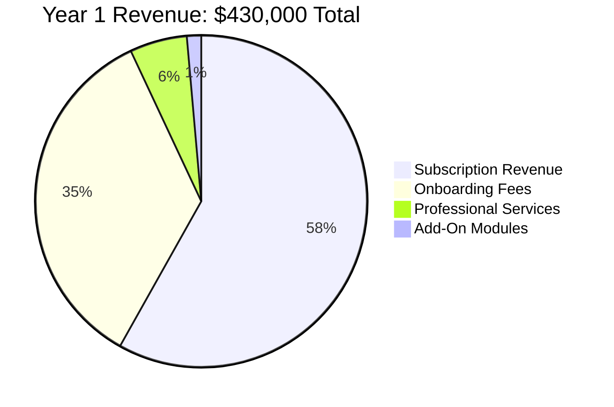

**Year 1 Total: $430,000**
- Subscription: 58.1%
- Onboarding: 34.9%
- Professional Services: 5.6%
- Add-Ons: 1.4%

---

#### Year 2 Revenue Breakdown

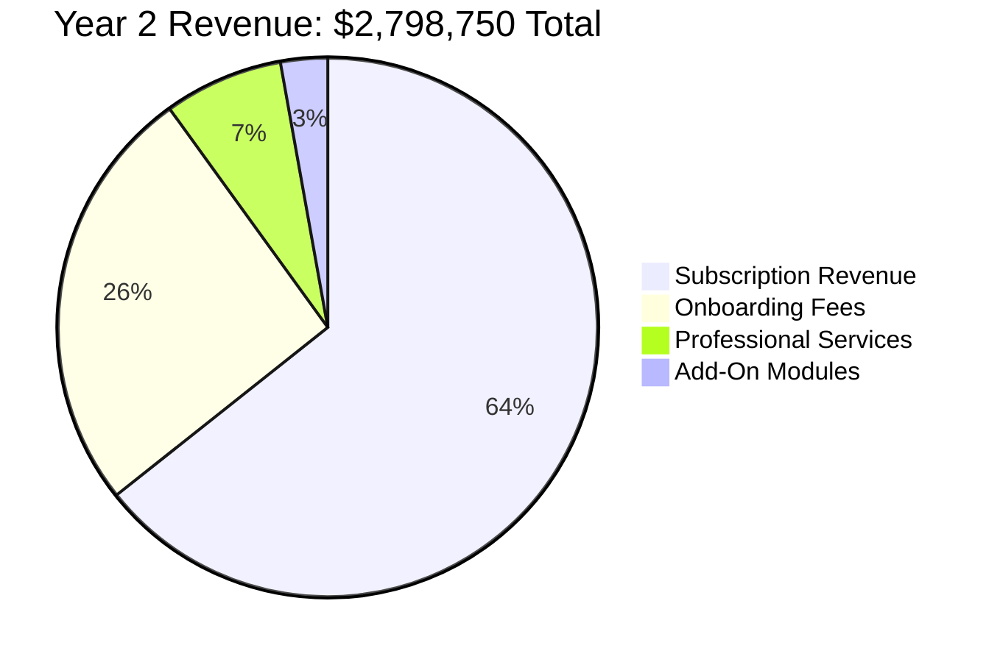

**Year 2 Total: $2,798,750**
- Subscription: 64.3%
- Onboarding: 25.7%
- Professional Services: 7.1%
- Add-Ons: 2.8%

---

#### Year 3 Revenue Breakdown

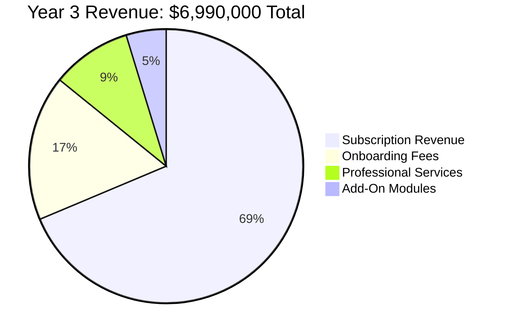

**Year 3 Total: $6,990,000**
- Subscription: 68.7%
- Onboarding: 17.2%
- Professional Services: 9.4%
- Add-Ons: 4.7%

---

#### 3-Year Revenue Trend


**Key Observations:**
- Subscription revenue grows from 58% to 69% of total (healthier recurring base)
- Onboarding fees decline as % but grow in absolute dollars
- Add-ons and professional services show strong growth trajectory
- By Year 3, 73.4% of revenue is recurring (subscription + add-ons)

---

## Pricing Strategy & Models

### 1. Pricing Philosophy

**Value-Based Pricing Framework:**

```
Customer Value > Price > Our Cost

┌─────────────────────────────────────────────────────────────┐
│                   VALUE CREATION MODEL                       │
├─────────────────────────────────────────────────────────────┤
│                                                              │
│  Customer Value Created (Annual):                            │
│  ├─ Time savings (10 hours/week × 52 weeks × $50/hour)      │
│  │   = $26,000                                               │
│  ├─ Reduced errors & waste (2% of $1M revenue)               │
│  │   = $20,000                                               │
│  ├─ Better inventory management (5% cost savings)            │
│  │   = $15,000                                               │
│  ├─ Improved compliance (avoid 1 failed audit/year)          │
│  │   = $10,000                                               │
│  └─ TOTAL VALUE = $71,000/year                               │
│                                                              │
│  Our Price (Growth Tier, 30 locations):                      │
│  └─ $100/location × 30 × 12 = $36,000/year                   │
│                                                              │
│  Value Ratio: 2:1 (Customer gets $2 for every $1 spent)     │
│                                                              │
└─────────────────────────────────────────────────────────────┘
```

---

### 2. Pricing Model Components

#### 2.1 Base Pricing Calculator

```
Monthly Subscription Price = (Base Price per Location) × (Number of Locations) × (Tier Discount) × (Volume Discount) × (Term Discount)

Where:
├─ Base Price per Location: Tier-specific ($50-$150)
├─ Tier Discount: Based on location count (0.67x - 1.0x)
├─ Volume Discount: Additional discount for 50+ locations (0-15%)
├─ Term Discount: Annual pre-pay discount (10%)
└─ Multi-Brand Discount: Multiple brands (15%)
```

**Example Calculations:**

**Example 1: Small Franchisor (12 locations)**
```
Base Price: $150/location/month (Starter Tier)
Locations: 12
Tier Discount: 1.0x (Starter)
Volume Discount: 0% (< 50 locations)
Term Discount: 0% (monthly billing)

Monthly Cost = $150 × 12 × 1.0 × 1.0 × 1.0 = $1,800/month
Annual Cost = $1,800 × 12 = $21,600/year

With Annual Pre-Pay:
Annual Cost = $21,600 × 0.90 = $19,440/year (save $2,160)
```

**Example 2: Mid-Size Franchisor (45 locations)**
```
Base Price: $100/location/month (Growth Tier)
Locations: 45
Tier Discount: 0.67x (Growth)
Volume Discount: 0% (< 50 locations)
Term Discount: 10% (annual pre-pay)

Monthly Cost = $100 × 45 × 1.0 × 1.0 = $4,500/month
Annual Cost = $4,500 × 12 = $54,000/year

With Annual Pre-Pay:
Annual Cost = $54,000 × 0.90 = $48,600/year (save $5,400)
```

**Example 3: Large Franchisor (150 locations)**
```
Base Price: $75/location/month (Enterprise Tier, negotiated)
Locations: 150
Tier Discount: 0.5x (Enterprise)
Volume Discount: 10% (100+ locations)
Term Discount: 10% (annual pre-pay)

Monthly Cost = $75 × 150 × 1.0 × 0.90 = $10,125/month
Annual Cost = $10,125 × 12 = $121,500/year

With Annual Pre-Pay:
Annual Cost = $121,500 × 0.90 = $109,350/year (save $12,150)
```

---

#### 2.2 Discount Policy

**Authorized Discounts:**

| Discount Type | Maximum | Approval Required | Use Case |
|---------------|---------|-------------------|----------|
| **Annual Pre-Pay** | 10% | Auto-approved | Standard offering |
| **Multi-Year Contract** | 15% | Sales Manager | 2-3 year commitment |
| **Volume Discount** | 15% | Auto-approved | 100+ locations |
| **Multi-Brand** | 15% | Sales Manager | 2+ franchise brands |
| **Non-Profit** | 20% | VP Sales | 501(c)(3) organizations |
| **Pilot Partner** | 50% | CEO | First 5 customers (6-month term) |
| **Competitive Win** | 25% | VP Sales | Win from competitor |
| **Expansion** | 10% | Auto-approved | Existing customer adds locations |

**Discount Stacking Rules:**
- Maximum combined discount: 35% (excluding pilot)
- Annual pre-pay + volume discount: Allowed
- Multi-year + multi-brand: Allowed
- Competitive win + others: Case-by-case (CEO approval)

**Example with Stacking:**
```
Mid-size franchisor: 75 locations, 2-year contract, annual pre-pay

Base: $100/location/month × 75 = $7,500/month
├─ Volume discount (10%): $7,500 × 0.90 = $6,750/month
├─ Multi-year (15%): $6,750 × 0.85 = $5,737.50/month
└─ Annual pre-pay (10%): $5,737.50 × 0.90 = $5,163.75/month

Total: $5,163.75/month = $61,965/year per year (2-year commitment)
Effective rate: $68.85/location/month (31.2% total discount)
```

---

### 3. Pricing Experimentation & Optimization

#### 3.1 A/B Testing Framework

**Test Plan (Year 1):**

```yaml
Test 1: Pricing Page Display
  Variants:
    A: Show monthly pricing prominently
    B: Show annual pricing prominently (with savings callout)
  Hypothesis: Annual pricing increases conversion and AOV
  Duration: 60 days
  Sample Size: 1,000 visitors per variant
  Success Metric: % choosing annual plan

Test 2: Tier Naming
  Variants:
    A: Starter / Growth / Enterprise
    B: Essential / Professional / Premium
  Hypothesis: Different naming affects tier selection
  Duration: 45 days
  Success Metric: Distribution across tiers

Test 3: Free Trial Length
  Variants:
    A: 14-day free trial
    B: 30-day free trial
  Hypothesis: Longer trial increases conversion
  Duration: 90 days
  Success Metric: Trial-to-paid conversion rate
```

#### 3.2 Price Increase Strategy

**Annual Price Review Process:**

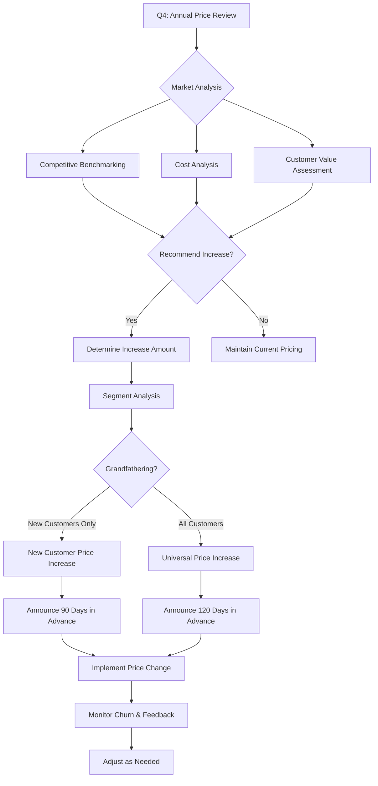

**Grandfathering Policy:**
- **First 2 years**: Existing customers grandfathered (new prices for new customers only)
- **Year 3+**: Universal price increases with 120-day notice
- **Maximum increase**: 10% per year for existing customers
- **Lock-in option**: 3-year contract at current rates

---

### 4. Packaging Strategy

#### 4.1 Feature Bundling by Tier

```
┌───────────────────────────────────────────────────────────────────┐
│                        FEATURE MATRIX                              │
├───────────────────────────────────────────────────────────────────┤
│ Feature                    │ Starter │ Growth │ Enterprise         │
├───────────────────────────────────────────────────────────────────┤
│ CORE FEATURES                                                      │
│ Accounting & Financials    │    ✓    │   ✓    │      ✓            │
│ Warehouse Management       │    ✓    │   ✓    │      ✓            │
│ Point of Sale (POS)        │    ✓    │   ✓    │      ✓            │
│ Inventory Tracking         │    ✓    │   ✓    │      ✓            │
│ Basic Reporting            │    ✓    │   ✓    │      ✓            │
│ Mobile Apps (iOS/Android)  │    ✓    │   ✓    │      ✓            │
│ Web Dashboard              │    ✓    │   ✓    │      ✓            │
│                                                                     │
│ USER MANAGEMENT                                                     │
│ User Accounts Included     │   25    │  100   │   Unlimited       │
│ Role-Based Access Control  │  Basic  │ Advanced│  Advanced         │
│ Multi-Location Access      │    ✓    │   ✓    │      ✓            │
│ Single Sign-On (SSO)       │    ✗    │   ✗    │      ✓            │
│                                                                     │
│ ADVANCED MODULES                                                    │
│ SOP Management             │    ✗    │   ✓    │      ✓            │
│ Auditing & Compliance      │    ✗    │  Basic │   Advanced        │
│ CRM (Customer Management)  │    ✗    │   ✗    │      ✓            │
│ Supply Chain Management    │    ✗    │   ✗    │      ✓            │
│ Central Kitchen Mgmt       │    ✗    │   ✗    │      ✓            │
│ Advanced Analytics         │    ✗    │   ✗    │      ✓            │
│                                                                     │
│ INTEGRATIONS                                                        │
│ Standard Integrations      │    5    │   15   │   Unlimited       │
│ API Access                 │    ✗    │  Read  │   Full (R/W)      │
│ Webhooks                   │    ✗    │   ✗    │      ✓            │
│ Custom Integrations        │    ✗    │   ✗    │      ✓            │
│                                                                     │
│ SUPPORT                                                             │
│ Email Support              │ 24h SLA │  4h    │     1h            │
│ Phone Support              │    ✗    │   ✓    │      ✓            │
│ Dedicated CSM              │    ✗    │   ✗    │      ✓            │
│ On-Call Support (24/7)     │    ✗    │   ✗    │      ✓            │
│ Quarterly Business Reviews │    ✗    │   ✗    │      ✓            │
│                                                                     │
│ DATA & SECURITY                                                     │
│ Data Retention             │ 2 years │ 5 years│   Unlimited       │
│ Data Export                │  CSV    │CSV/Excel│  All formats      │
│ Backup Frequency           │  Daily  │  Daily │  Real-time        │
│ Advanced Encryption        │    ✗    │   ✗    │      ✓            │
│ Compliance Reporting       │    ✗    │   ✗    │      ✓            │
│                                                                     │
│ CUSTOMIZATION                                                       │
│ Custom Branding            │    ✗    │   ✗    │    Add-on         │
│ Custom Dashboards          │    ✗    │  Limited│   Unlimited       │
│ Custom Reports             │   10    │   50   │   Unlimited       │
│ Workflow Automation        │    ✗    │  Basic │   Advanced        │
│                                                                     │
└───────────────────────────────────────────────────────────────────┘
```

---

## Revenue Tracking & Reporting

### 1. Revenue Metrics Dashboard

#### 1.1 Real-Time Revenue Metrics

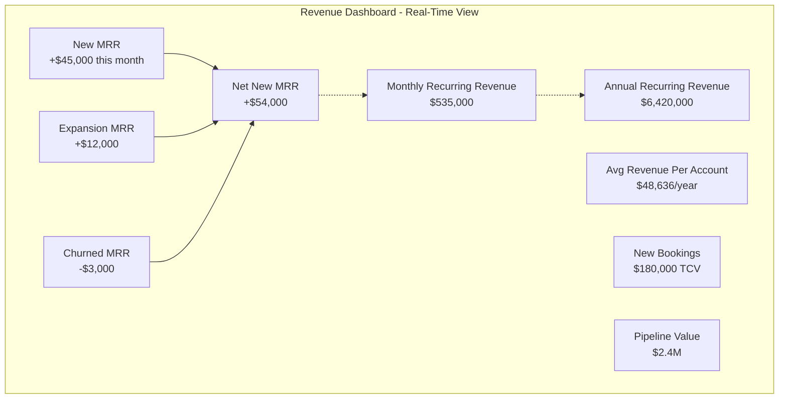

---

#### 1.2 Revenue Composition Analysis

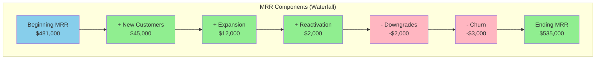

**MRR Movement Calculation:**
```
Beginning MRR:        $481,000
+ New MRR:           + $45,000  (10 new customers)
+ Expansion MRR:     + $12,000  (existing customers add locations/features)
+ Reactivation MRR:  +  $2,000  (1 churned customer returns)
- Contraction MRR:   -  $2,000  (2 customers downgrade tiers)
- Churned MRR:       -  $3,000  (1 customer cancels)
─────────────────────────────────
Ending MRR:          $535,000

Net New MRR:         + $54,000
Growth Rate:           11.2% MoM
```

---

### 2. Revenue Tracking System Architecture

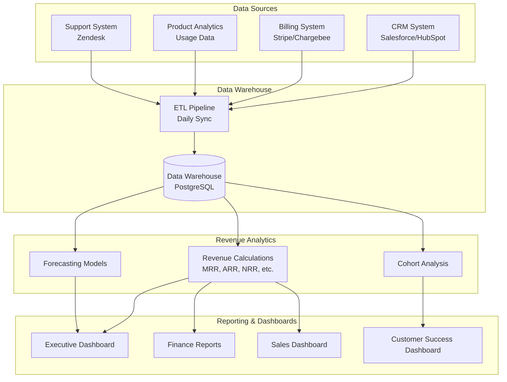

---

### 3. Revenue Reporting Framework

#### 3.1 Daily Revenue Snapshot

**Automated Daily Report (sent at 8:00 AM):**

```
┌─────────────────────────────────────────────────────────────┐
│        LAZYFRANCHIS OR DAILY REVENUE SNAPSHOT               │
│                October 28, 2025                              │
├─────────────────────────────────────────────────────────────┤
│                                                              │
│  YESTERDAY'S ACTIVITY:                                       │
│  ├─ New Customers: 0                                         │
│  ├─ Upgrades: 1 (+$1,200 MRR)                                │
│  ├─ Downgrades: 0                                            │
│  ├─ Cancellations: 0                                         │
│  └─ Net MRR Change: +$1,200                                  │
│                                                              │
│  CURRENT METRICS:                                            │
│  ├─ MRR: $535,000 (+0.22% DoD)                               │
│  ├─ ARR: $6,420,000                                          │
│  ├─ Active Customers: 110                                    │
│  └─ Avg Customer Value: $4,864/month                         │
│                                                              │
│  MONTH-TO-DATE (October):                                    │
│  ├─ New MRR: +$28,000 (28 days elapsed)                      │
│  ├─ Churned MRR: -$2,000                                     │
│  ├─ Net New MRR: +$26,000                                    │
│  ├─ Growth Rate: 5.1% MTD                                    │
│  └─ On Track: Yes ✓ (Target: +$40K MRR)                      │
│                                                              │
│  PIPELINE ACTIVITY:                                          │
│  ├─ New Leads: 12                                            │
│  ├─ Demos Scheduled: 5                                       │
│  ├─ Proposals Sent: 3 ($84K TCV)                             │
│  └─ Closing This Week: 2 ($52K TCV)                          │
│                                                              │
└─────────────────────────────────────────────────────────────┘
```

---

#### 3.2 Weekly Revenue Review

**Automated Weekly Report (sent Monday mornings):**

```markdown
# Weekly Revenue Review - Week of October 21-27, 2025

## Executive Summary
- **MRR Growth**: +$8,500 (+1.6% WoW)
- **New Customers**: 2 ($12,000 MRR)
- **Churn**: 0 customers
- **Net Revenue Retention**: 112% (trailing 12 months)

## Key Wins
1. ✅ Closed 2 new customers (QSR chain: 35 locations, Retail: 18 locations)
2. ✅ 1 customer upgraded from Starter to Growth (+$1,800 MRR)
3. ✅ Zero churn this week (5 weeks streak)
4. ✅ Pilot customer converted to paid (+$4,500 MRR)

## Concerns & Actions
1. ⚠️ 1 customer flagged as at-risk (low usage) - CSM outreach scheduled
2. ⚠️ 2 proposals pending for 3+ weeks - Sales follow-up required
3. ℹ️ October pipeline $180K below target - increase marketing spend

## Pipeline Health
- **Total Pipeline**: $2.4M (4.5x quarterly quota)
- **Closing This Month**: $180K expected
- **Top Opportunities**:
  - FranchiseCorp (150 locations): $135K ARR - 80% confidence
  - GrowthBrands (45 locations): $54K ARR - 60% confidence

## Next Week Focus
- Close 3 pending proposals ($120K TCV)
- Complete QBR with 5 customers
- Launch webinar campaign (target: 50 attendees)
```

---

#### 3.3 Monthly Business Review (MBR)

**Comprehensive Monthly Report:**

```
┌─────────────────────────────────────────────────────────────┐
│           MONTHLY BUSINESS REVIEW - OCTOBER 2025             │
├─────────────────────────────────────────────────────────────┤
│                                                              │
│  1. REVENUE PERFORMANCE                                      │
│  ├─ MRR: $535,000 (vs. $481,000 last month)                  │
│  │  └─ Growth: +11.2% MoM | Target: +8% ✓                    │
│  ├─ ARR: $6.42M (vs. $5.77M)                                 │
│  ├─ New Bookings: $180,000 TCV                               │
│  └─ Revenue Target: 105% of plan ✓                           │
│                                                              │
│  2. CUSTOMER METRICS                                         │
│  ├─ New Customers: 10 (Target: 8) ✓                          │
│  ├─ Churned Customers: 1 (0.9% churn rate)                   │
│  ├─ Net Customer Growth: +9 (+8.9%)                          │
│  ├─ Total Active: 110 customers                              │
│  └─ Avg Locations per Customer: 47.5                         │
│                                                              │
│  3. UNIT ECONOMICS                                           │
│  ├─ ARPA: $48,636/year (+2.1% MoM)                           │
│  ├─ CAC: $10,200 (Target: <$12K) ✓                           │
│  ├─ LTV: $120,000                                            │
│  ├─ LTV:CAC Ratio: 11.8:1 (Target: >3:1) ✓                   │
│  └─ CAC Payback: 14 months (Target: <18) ✓                   │
│                                                              │
│  4. REVENUE QUALITY                                          │
│  ├─ Gross Revenue Retention: 97%                             │
│  ├─ Net Revenue Retention: 112%                              │
│  ├─ Expansion Revenue: $12,000 MRR (2.2% of base)            │
│  ├─ Annual Contract %: 65% (vs. 60% target) ✓                │
│  └─ Payment Success Rate: 98.5%                              │
│                                                              │
│  5. PIPELINE & FORECAST                                      │
│  ├─ Pipeline Value: $2.4M (4.5x quota)                       │
│  ├─ Weighted Pipeline: $1.2M                                 │
│  ├─ Expected Closes (Nov): $220,000 TCV                      │
│  ├─ Q4 Forecast: $280,000 new TCV                            │
│  └─ Forecast Confidence: High (85%)                          │
│                                                              │
│  6. COHORT ANALYSIS                                          │
│  ├─ Jan 2025 Cohort Retention: 100% (10 months)              │
│  ├─ Q1 2025 Cohort ARPA Growth: +18%                         │
│  ├─ Cohort Expansion Rate: +15% avg after 12mo               │
│  └─ Best Performing Cohort: Feb 2025 (22% ARPA growth)       │
│                                                              │
│  7. REVENUE BY STREAM                                        │
│  ├─ Subscription Revenue: $535,000/month recurring           │
│  ├─ Onboarding Fees: $85,000 (one-time)                      │
│  ├─ Professional Services: $32,000                           │
│  ├─ Add-On Modules: $18,000/month recurring                  │
│  └─ Total October Revenue: $670,000                          │
│                                                              │
│  8. KEY ACTIONS & INITIATIVES                                │
│  ├─ [✓] Launch Q4 marketing campaign                         │
│  ├─ [✓] Complete 15 customer QBRs                            │
│  ├─ [⏳] Implement new pricing tier (in progress)            │
│  ├─ [⏳] Sales team expansion (2 new AEs onboarding)         │
│  └─ [📅] Prepare for Year-End planning (November)            │
│                                                              │
└─────────────────────────────────────────────────────────────┘
```

---

## Financial Forecasting Models

### 1. Revenue Forecasting Methodology

#### 1.1 Bottom-Up Forecast Model

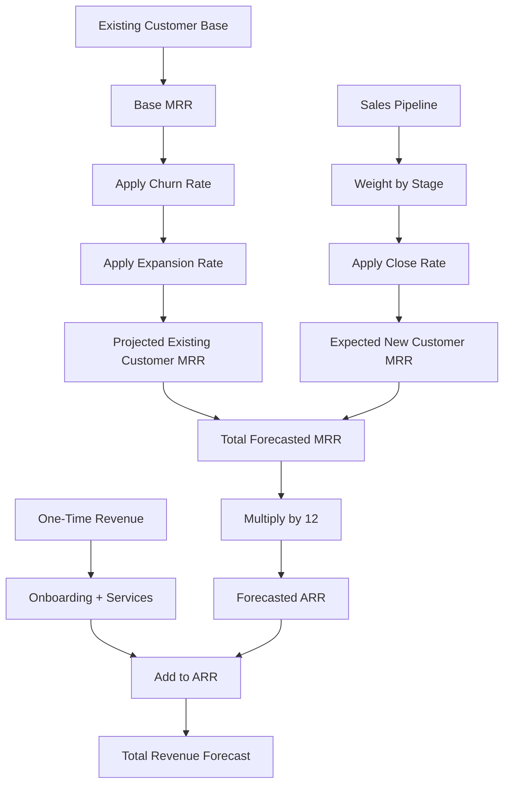

**Detailed Calculation:**

```python
# Month-by-Month Revenue Forecast

def forecast_revenue(month, existing_mrr, pipeline, churn_rate, expansion_rate):
    """
    Forecast revenue for a given month

    Parameters:
    - existing_mrr: Current MRR from existing customers
    - pipeline: List of deals with {value, close_probability, close_date}
    - churn_rate: Monthly churn rate (e.g., 0.02 = 2%)
    - expansion_rate: Monthly expansion rate (e.g., 0.03 = 3%)
    """

    # Existing customer MRR (accounting for churn and expansion)
    churned_mrr = existing_mrr * churn_rate
    expansion_mrr = existing_mrr * expansion_rate
    net_existing_mrr = existing_mrr - churned_mrr + expansion_mrr

    # New customer MRR from pipeline
    new_mrr = sum([
        deal['value'] * deal['close_probability']
        for deal in pipeline
        if deal['close_date'] == month
    ])

    # Total forecasted MRR
    total_mrr = net_existing_mrr + new_mrr

    return {
        'month': month,
        'existing_mrr': net_existing_mrr,
        'new_mrr': new_mrr,
        'total_mrr': total_mrr,
        'arr': total_mrr * 12
    }
```

---

#### 1.2 Three-Scenario Forecast

**Conservative / Base / Aggressive:**

```
┌─────────────────────────────────────────────────────────────┐
│              12-MONTH REVENUE FORECAST (Year 2)              │
├─────────────────────────────────────────────────────────────┤
│                                                              │
│  CONSERVATIVE CASE (70% confidence)                          │
│  ├─ Assumptions:                                             │
│  │  ├─ New customers: 30 (vs. 40 plan)                      │
│  │  ├─ Churn rate: 8% annually                               │
│  │  ├─ Expansion rate: 5% annually                           │
│  │  └─ Avg deal size: $40,000 ARR                            │
│  └─ Projected Year 2 ARR: $1.5M                              │
│                                                              │
│  BASE CASE (50% confidence) - PLAN                           │
│  ├─ Assumptions:                                             │
│  │  ├─ New customers: 40                                     │
│  │  ├─ Churn rate: 5% annually                               │
│  │  ├─ Expansion rate: 10% annually                          │
│  │  └─ Avg deal size: $45,000 ARR                            │
│  └─ Projected Year 2 ARR: $1.8M                              │
│                                                              │
│  AGGRESSIVE CASE (30% confidence)                            │
│  ├─ Assumptions:                                             │
│  │  ├─ New customers: 50                                     │
│  │  ├─ Churn rate: 3% annually                               │
│  │  ├─ Expansion rate: 15% annually                          │
│  │  └─ Avg deal size: $50,000 ARR                            │
│  └─ Projected Year 2 ARR: $2.3M                              │
│                                                              │
│  PROBABILITY-WEIGHTED FORECAST:                              │
│  └─ Expected ARR: $1.82M                                     │
│     = ($1.5M × 0.30) + ($1.8M × 0.50) + ($2.3M × 0.20)       │
│                                                              │
└─────────────────────────────────────────────────────────────┘
```

---

### 2. Customer Cohort Analysis

#### 2.1 Cohort Revenue Retention

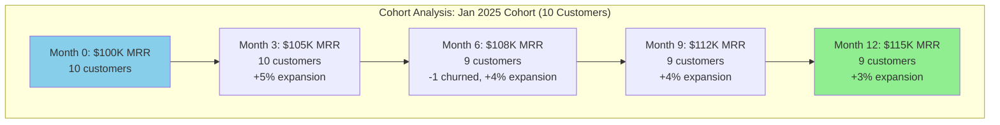

**Cohort Metrics:**
- **Gross Retention**: 90% (9 of 10 customers retained)
- **Net Revenue Retention**: 115% (revenue grew despite churn)
- **Expansion Revenue**: +$15K (+15% from original)
- **Average Time to First Expansion**: 4.2 months

---

#### 2.2 Cohort Comparison Table

| Cohort | Customers | Starting MRR | Current MRR | Retention % | NRR % | Months Active |
|--------|-----------|--------------|-------------|-------------|-------|---------------|
| **Jan 2025** | 10 | $100,000 | $115,000 | 90% | 115% | 10 |
| **Feb 2025** | 8 | $85,000 | $104,000 | 100% | 122% | 9 |
| **Mar 2025** | 12 | $125,000 | $138,000 | 92% | 110% | 8 |
| **Apr 2025** | 10 | $105,000 | $112,000 | 90% | 107% | 7 |
| **May 2025** | 15 | $160,000 | $168,000 | 93% | 105% | 6 |
| **Jun 2025** | 12 | $135,000 | $138,000 | 92% | 102% | 5 |
| **Jul 2025** | 18 | $195,000 | $195,000 | 100% | 100% | 4 |
| **Aug 2025** | 14 | $155,000 | $155,000 | 100% | 100% | 3 |
| **Sep 2025** | 11 | $120,000 | $120,000 | 100% | 100% | 2 |

**Key Insights:**
- Average NRR after 6+ months: 110%
- Early cohorts (Jan-Mar) show strong expansion patterns
- 92% average gross retention across cohorts
- Time to expansion: typically 3-5 months post-onboarding

---

### 3. Sensitivity Analysis

**Impact of Key Variables on Year 2 ARR:**

```
┌─────────────────────────────────────────────────────────────┐
│              SENSITIVITY ANALYSIS (Year 2 ARR)               │
├─────────────────────────────────────────────────────────────┤
│                                                              │
│  Base Case: $1.8M ARR                                        │
│                                                              │
│  Variable: NEW CUSTOMER ACQUISITION                          │
│  ├─ -25% (30 customers): $1.5M ARR (-16.7%)                  │
│  ├─ Base (40 customers): $1.8M ARR                           │
│  └─ +25% (50 customers): $2.1M ARR (+16.7%)                  │
│                                                              │
│  Variable: CHURN RATE                                        │
│  ├─ High (8%): $1.65M ARR (-8.3%)                            │
│  ├─ Base (5%): $1.8M ARR                                     │
│  └─ Low (3%): $1.85M ARR (+2.8%)                             │
│                                                              │
│  Variable: EXPANSION RATE                                    │
│  ├─ Low (5%): $1.7M ARR (-5.6%)                              │
│  ├─ Base (10%): $1.8M ARR                                    │
│  └─ High (15%): $1.95M ARR (+8.3%)                           │
│                                                              │
│  Variable: AVERAGE DEAL SIZE                                 │
│  ├─ Low ($35K): $1.6M ARR (-11.1%)                           │
│  ├─ Base ($45K): $1.8M ARR                                   │
│  └─ High ($55K): $2.0M ARR (+11.1%)                          │
│                                                              │
│  MOST SENSITIVE TO: New Customer Acquisition (±16.7%)        │
│  LEAST SENSITIVE TO: Churn Rate (-8.3% to +2.8%)             │
│                                                              │
└─────────────────────────────────────────────────────────────┘
```

**Strategic Implications:**
- **Priority 1**: Focus on new customer acquisition (highest impact)
- **Priority 2**: Optimize average deal size through tier mix
- **Priority 3**: Drive expansion revenue (good impact, builds over time)
- **Priority 4**: Minimize churn (important for retention, moderate revenue impact)

---

## Revenue Operations & Workflows

### 1. Quote-to-Cash Process

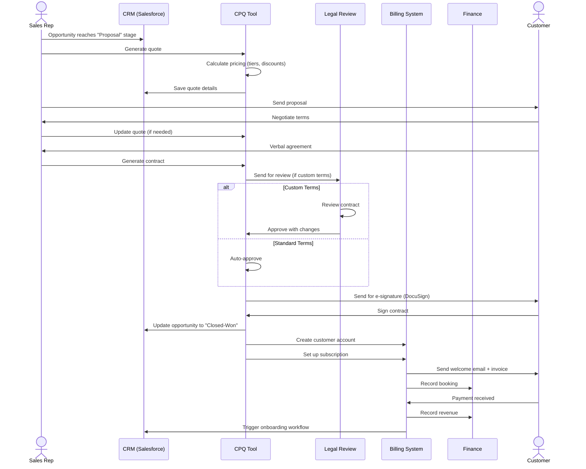

---

### 2. Billing & Invoice Workflow

#### 2.1 Monthly Subscription Billing

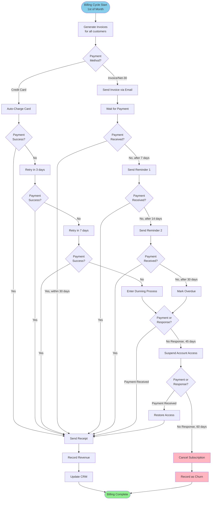

---

#### 2.2 Payment Failure Recovery (Dunning Process)

**Automated Dunning Workflow:**

```
Day 0: Payment Failure
├─ Automated email: "Payment failed, please update card"
├─ In-app banner notification
└─ Retry payment immediately (may be temporary decline)

Day 3: First Retry
├─ Auto-retry payment
├─ Email if still fails: "Action required - payment failed again"
└─ Assign CSM to reach out personally

Day 7: Second Retry
├─ Auto-retry payment
├─ Email + phone call from CSM
├─ Offer payment plan if financial difficulty
└─ In-app modal (blocks certain actions)

Day 14: Final Warning
├─ Email: "Account will be suspended in 3 days"
├─ Phone call from CSM + manager
└─ Attempt to save relationship

Day 17: Account Suspension
├─ Suspend access to system (read-only mode)
├─ Final email: "Account suspended - pay to restore"
└─ Daily automated reminder

Day 30: Subscription Cancellation
├─ Cancel subscription
├─ Export customer data (available for 30 days)
├─ Send final notice
└─ Mark as churned in CRM

Day 60: Data Deletion Warning
├─ Email: "Data will be deleted in 30 days"
└─ Option to reactivate or export data

Day 90: Data Deletion
└─ Permanently delete customer data (GDPR compliance)
```

**Success Metrics:**
- Target recovery rate: >75% within 30 days
- Automated recovery (no human touch): >50%
- Churn from payment failures: <2% of total churn

---

### 3. Revenue Recognition Policy

#### 3.1 Revenue Recognition Principles (ASC 606)

**5-Step Model:**

```
1. IDENTIFY THE CONTRACT
   ├─ Signed agreement (electronic or written)
   ├─ Payment terms specified
   └─ Commercial substance

2. IDENTIFY PERFORMANCE OBLIGATIONS
   ├─ Software subscription service (monthly/annual)
   ├─ Onboarding and implementation services
   ├─ Professional services (if applicable)
   └─ Support and maintenance (included in subscription)

3. DETERMINE TRANSACTION PRICE
   ├─ Total contract value (TCV)
   ├─ Adjust for discounts and variable consideration
   └─ Exclude sales taxes

4. ALLOCATE PRICE TO PERFORMANCE OBLIGATIONS
   ├─ Subscription: Monthly or ratably over contract term
   ├─ Onboarding: Upfront (one-time service)
   ├─ Professional services: As services rendered
   └─ Allocate based on standalone selling prices

5. RECOGNIZE REVENUE
   ├─ Subscription: Ratably over time (monthly/annual term)
   ├─ Onboarding: Upon completion of onboarding
   ├─ Professional services: As work is performed
   └─ Support: Included in subscription (not separate)
```

---

#### 3.2 Revenue Recognition Scenarios

**Scenario 1: Annual Subscription (Pre-Paid)**
```
Customer: MidSizeFranchise
Contract: $60,000 annual subscription (50 locations)
Payment: Upfront on January 1, 2025
Billing: Annual

Revenue Recognition:
├─ Month 1 (January): $5,000 recognized
├─ Month 2 (February): $5,000 recognized
├─ ...
└─ Month 12 (December): $5,000 recognized

Deferred Revenue Balance:
├─ January 1: $60,000 (cash received, zero revenue recognized yet)
├─ January 31: $55,000 (after $5K recognized)
├─ ...
└─ December 31: $0 (all revenue recognized)
```

**Scenario 2: Monthly Subscription**
```
Customer: SmallFranchise
Contract: $1,500/month subscription (10 locations)
Payment: Monthly in arrears

Revenue Recognition:
├─ Month 1: $1,500 recognized on Jan 31
├─ Month 2: $1,500 recognized on Feb 28
└─ ...

Deferred Revenue: $0 (recognized as delivered each month)
Accounts Receivable: $1,500 (invoice sent, payment pending)
```

**Scenario 3: Bundled Package (Subscription + Onboarding)**
```
Customer: NewFranchise
Contract:
├─ Onboarding fee: $20,000 (one-time)
└─ Annual subscription: $48,000 (40 locations)
Total Contract Value: $68,000
Payment: $20K upfront, $48K annual subscription

Allocation:
├─ Onboarding standalone value: $20,000
└─ Subscription standalone value: $48,000

Revenue Recognition:
├─ Onboarding: $20,000 recognized upon completion (Week 4)
└─ Subscription: $4,000/month recognized ratably (starting Month 1)

Journal Entries (simplified):
Day 1 (Contract Signed):
  DR Cash $20,000
  CR Deferred Revenue - Onboarding $20,000

Day 30 (Onboarding Complete):
  DR Deferred Revenue - Onboarding $20,000
  CR Revenue - Professional Services $20,000

Month 1 (January):
  DR Deferred Revenue - Subscription $4,000
  CR Revenue - Subscription $4,000
```

---

## Key Performance Indicators

### 1. Revenue Health Metrics

#### 1.1 Core Revenue KPIs

```
┌─────────────────────────────────────────────────────────────┐
│                  REVENUE HEALTH DASHBOARD                    │
├─────────────────────────────────────────────────────────────┤
│                                                              │
│  PRIMARY METRICS:                                            │
│  ├─ MRR: $535,000                                            │
│  │  └─ Growth: +11.2% MoM (Target: +8%) ✓                    │
│  ├─ ARR: $6,420,000                                          │
│  │  └─ Growth: +98% YoY (Target: +100%) ⚠                    │
│  ├─ Net New MRR: +$54,000 this month                         │
│  └─ Churn Rate: 0.9% (Target: <2%) ✓                         │
│                                                              │
│  REVENUE QUALITY:                                            │
│  ├─ Gross Revenue Retention: 97%                             │
│  │  └─ Target: >95% ✓                                        │
│  ├─ Net Revenue Retention: 112%                              │
│  │  └─ Target: >110% ✓                                       │
│  ├─ Expansion Revenue: $12,000 MRR                           │
│  │  └─ % of Base: 2.2% (Target: >2%) ✓                       │
│  └─ Contract Renewal Rate: 95%                               │
│      └─ Target: >90% ✓                                       │
│                                                              │
│  EFFICIENCY METRICS:                                         │
│  ├─ Magic Number: 0.85                                       │
│  │  └─ (New ARR / S&M Spend) - Good efficiency ✓             │
│  ├─ Rule of 40: 52%                                          │
│  │  └─ (Growth Rate 40% + Profit Margin 12%) ✓              │
│  ├─ Revenue per Employee: $95,000                            │
│  └─ Burn Multiple: 1.2                                       │
│      └─ (Net Burn / Net New ARR) - Efficient ✓               │
│                                                              │
└─────────────────────────────────────────────────────────────┘
```

---

#### 1.2 Unit Economics

```
┌─────────────────────────────────────────────────────────────┐
│                     UNIT ECONOMICS                           │
├─────────────────────────────────────────────────────────────┤
│                                                              │
│  CUSTOMER ACQUISITION:                                       │
│  ├─ Customer Acquisition Cost (CAC): $10,200                 │
│  │  └─ Calculation: Total S&M Spend / New Customers         │
│  │      = $408,000 / 40 customers = $10,200                  │
│  │                                                           │
│  ├─ CAC by Channel:                                          │
│  │  ├─ Conferences/Events: $12,500                           │
│  │  ├─ Content/SEO: $4,200                                   │
│  │  ├─ Paid Ads: $8,900                                      │
│  │  ├─ Partnerships: $6,800                                  │
│  │  └─ Direct Sales: $13,400                                 │
│  │                                                           │
│  └─ Blended CAC Payback: 14 months                           │
│      └─ Calculation: CAC / (ARPA × Gross Margin)             │
│          = $10,200 / ($4,050 × 85%) = 2.96 months            │
│                                                              │
│  CUSTOMER LIFETIME VALUE:                                    │
│  ├─ Lifetime Value (LTV): $120,000                           │
│  │  └─ Calculation: ARPA × Gross Margin / Churn Rate        │
│  │      = $48,636 × 85% / 5% = $827,000                      │
│  │      (Note: Using 3-year practical horizon = $120K)       │
│  │                                                           │
│  ├─ LTV:CAC Ratio: 11.8:1                                    │
│  │  └─ Target: >3:1 ✓ Excellent                              │
│  │                                                           │
│  └─ Customer Payback Distribution:                           │
│      ├─ <12 months: 45% of customers                         │
│      ├─ 12-18 months: 40% of customers                       │
│      └─ >18 months: 15% of customers                         │
│                                                              │
│  PROFITABILITY:                                              │
│  ├─ Gross Margin: 85%                                        │
│  │  └─ Calculation: (Revenue - COGS) / Revenue              │
│  │      Infrastructure: 8%, Support: 7%                      │
│  │                                                           │
│  ├─ Contribution Margin: 62%                                 │
│  │  └─ After S&M: 85% - 23% = 62%                            │
│  │                                                           │
│  └─ Customer Lifetime Profit: $63,600                        │
│      └─ (LTV × Contribution Margin) - CAC                    │
│          = ($120,000 × 62%) - $10,200 = $64,200             │
│                                                              │
└─────────────────────────────────────────────────────────────┘
```

---

## Revenue Optimization Strategies

### 1. Expansion Revenue Playbook

#### 1.1 Land and Expand Strategy

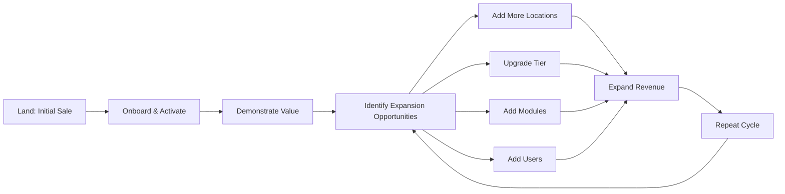

**Expansion Triggers:**

```yaml
Expansion Trigger: High Usage
  Indicator: Daily active users > 90%
  Action: CSM proposes additional modules or tier upgrade
  Timing: 90 days post-onboarding
  Expected uplift: +20-30% MRR

Expansion Trigger: New Locations Opened
  Indicator: Customer opens new franchise locations
  Action: Auto-email offering to add locations to subscription
  Timing: Within 7 days of location launch (monitor news/socials)
  Expected uplift: $100-150/location/month

Expansion Trigger: Feature Request
  Indicator: Customer requests feature in higher tier
  Action: CSM demos higher tier capabilities
  Timing: Real-time when request received
  Expected uplift: +30-100% MRR (tier upgrade)

Expansion Trigger: QBR Performance Review
  Indicator: Quarterly business review shows ROI
  Action: Discuss expansion based on demonstrated value
  Timing: 90, 180, 270 days post-onboarding
  Expected uplift: Variable (10-50% average)

Expansion Trigger: Multi-Brand Opportunity
  Indicator: Customer manages multiple franchise brands
  Action: Offer multi-brand management add-on
  Timing: 6+ months post-onboarding
  Expected uplift: +$2,000/month
```

---

#### 1.2 Pricing Optimization Tactics

**Strategy 1: Good-Better-Best Tier Positioning**

```
Current Problem: Too many customers in Starter tier (low ARPA)

Solution: Reposition tiers to push customers to Growth tier

Before (Current):
├─ Starter: 5-20 locations @ $150/loc
├─ Growth: 21-100 locations @ $100/loc
└─ Enterprise: 100+ locations @ $50-75/loc

After (Optimized):
├─ Starter: 5-10 locations @ $175/loc (increase price, reduce range)
├─ Growth: 11-100 locations @ $110/loc (start sooner, slight increase)
└─ Enterprise: 100+ locations @ $60-80/loc (increase floor)

Impact:
├─ Push 11-20 location customers to Growth (higher tier)
├─ Increase revenue from small customers
└─ Expected ARPA increase: +12%
```

---

**Strategy 2: Usage-Based Pricing Add-Ons**

```
Add-On: Transaction Volume Tier
  Base plan includes: Up to 50,000 transactions/month
  Overage pricing: $0.10 per transaction above limit
  Target: High-volume POS customers
  Expected adoption: 15% of customers
  Revenue impact: +$150-500/customer/month

Add-On: Storage Tier
  Base plan includes: 50GB storage
  Additional storage: $50/50GB/month
  Target: Customers with heavy media usage (auditing photos/videos)
  Expected adoption: 20% of customers
  Revenue impact: +$50-150/customer/month

Add-On: API Call Limits
  Base plan includes: 10,000 API calls/month (Growth tier only)
  Additional calls: $100/10,000 calls/month
  Target: Customers with heavy integrations
  Expected adoption: 10% of Growth/Enterprise customers
  Revenue impact: +$100-300/customer/month
```

---

### 2. Churn Reduction Strategies

#### 2.1 Early Warning System

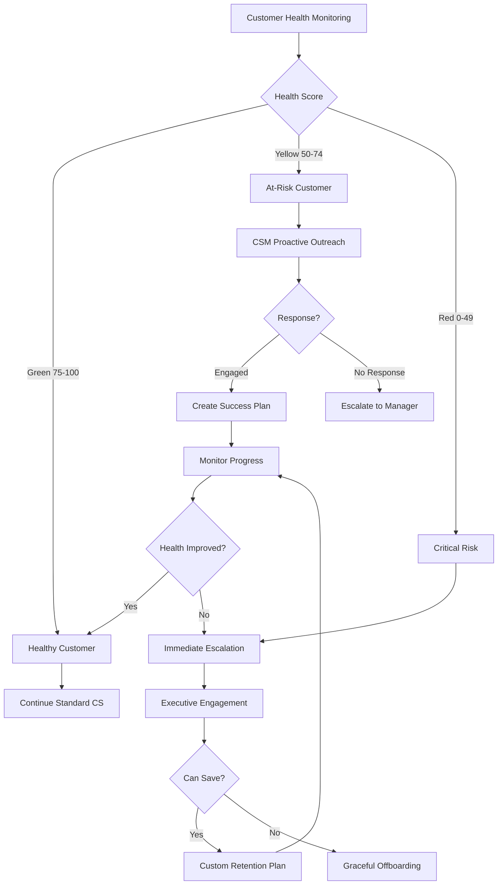

**Health Score Calculation:**

```python
def calculate_health_score(customer):
    """
    Calculate customer health score (0-100)
    Weighted average of multiple factors
    """

    # Usage (40% weight)
    usage_score = (
        (customer.daily_active_users / customer.total_users) * 40 +
        (customer.features_adopted / total_features) * 30 +
        (customer.login_frequency / 30) * 30  # logins per month
    ) * 0.4

    # Engagement (25% weight)
    engagement_score = (
        (customer.support_tickets_resolved / max(customer.support_tickets, 1)) * 40 +
        (1 if customer.attended_qbr else 0) * 30 +
        (customer.nps_score / 10) * 30
    ) * 0.25

    # Financial (20% weight)
    financial_score = (
        (1 if customer.payment_current else 0) * 50 +
        (customer.expansion_revenue / customer.base_revenue) * 50
    ) * 0.20

    # Product feedback (15% weight)
    feedback_score = (
        (customer.feature_requests / 10) * 40 +  # max 10
        (customer.positive_feedback / max(customer.total_feedback, 1)) * 60
    ) * 0.15

    health_score = usage_score + engagement_score + financial_score + feedback_score

    return min(100, max(0, health_score))
```

---

#### 2.2 Win-Back Campaign

**Churned Customer Re-Engagement:**

```
Phase 1: Immediate (Days 1-30 post-churn)
├─ Exit interview to understand reasons
├─ Send "Sorry to see you go" email
├─ Offer to export data
└─ Add to win-back nurture sequence

Phase 2: Short-Term Win-Back (Months 1-3)
├─ Month 1: Email showcasing new features released since they left
├─ Month 2: Share success story from similar customer
├─ Month 3: Offer "We want you back" discount (20% off 3 months)
└─ CSM personal outreach if high-value account

Phase 3: Long-Term Nurture (Months 4-12)
├─ Quarterly email with product updates
├─ Invite to webinars and events
├─ Industry insights and benchmarking reports
└─ Annual "check-in" call from CSM

Success Metrics:
├─ Win-back rate target: 15% within 12 months
├─ Average time to win-back: 4-6 months
└─ Win-back customer retention: 85% (vs. 95% overall)
```

---

### 3. Pricing Power & Monetization

#### 3.1 Value Metric Evolution

**Current: Per-Location Pricing**
- Pros: Simple, easy to understand, scales with customer growth
- Cons: Doesn't capture usage variance, high-usage customers underpay

**Future: Hybrid Pricing Model (Year 3+)**

```
Base Subscription (Per Location)
  └─ $75/location/month

Plus Usage-Based Components:
├─ Transactions: $0.05 per transaction (above 10K/month included)
├─ Users: $20/user/month (5 users per location included)
├─ Storage: $40/50GB/month (25GB per location included)
└─ API Calls: $0.01 per call (1K/month included)

Example Customer (50 locations, high usage):
├─ Base: 50 × $75 = $3,750/month
├─ Transactions: 800K @ $0.05 = $2,500/month (overages above 500K)
├─ Users: 300 users - 250 included = 50 × $20 = $1,000/month
├─ Storage: 200GB - 1,250GB included = 0 (within limit)
├─ API: 50K calls - 50K included = 0 (within limit)
└─ Total: $7,250/month (vs. $5,000 with pure per-location)

Benefits:
├─ Fair: Heavy users pay more
├─ Growth alignment: Revenue grows with customer usage
├─ Predictability: Base fee provides revenue floor
└─ Expansion: Automatic revenue growth without sales touchpoint
```

---

## Conclusion

This revenue management strategy provides a comprehensive framework for:

✅ **Predictable Growth**: Recurring subscription model with clear pricing tiers
✅ **Multiple Revenue Streams**: Subscriptions, onboarding, services, add-ons
✅ **Strong Unit Economics**: LTV:CAC >10:1, <15 month payback, 85%+ margins
✅ **Expansion Focus**: Land-and-expand strategy targeting 110% NRR
✅ **Financial Discipline**: Robust tracking, forecasting, and revenue recognition
✅ **Optimization Mindset**: Continuous testing and improvement

### Key Takeaways

1. **Revenue Model**: 69% recurring by Year 3 (subscription + add-ons)
2. **Growth Trajectory**: $430K → $2.8M → $7M (3-year plan)
3. **Customer Economics**: $120K LTV, $10K CAC, 11.8:1 ratio
4. **Retention Excellence**: 95% gross retention, 112% net revenue retention
5. **Operational Excellence**: Automated billing, dunning, and revenue recognition

### Next Steps

1. **Implement Revenue Dashboard** (Month 1)
2. **Establish Monthly/Weekly Reporting Cadence** (Month 1)
3. **Launch Cohort Analysis** (Month 2)
4. **Build Expansion Playbook** (Month 3)
5. **Optimize Pricing Tiers** (Month 6)
6. **Test Usage-Based Components** (Month 9)

---

**Document Control:**
- **Version**: 1.0
- **Last Updated**: October 28, 2025
- **Next Review**: November 28, 2025
- **Owner**: CFO / VP Finance

*End of Revenue Management Documentation*
